# Sejam bem-vindos.
Grupo de estudo Python - COVID-19

### Pacote scipy.stats possui diversos módulos:
* Possui diversas distribuições de probabilidade implementadas, tanto contínuas como discretas.
* Sumários estatísticos (estatística descritiva): média, desvio padrão, média aparada, momentos etc.
* Estudo de frequência: generalizações de histogramas.
* Correlações
* Testes estatísticos.
* Etc, etc.

* Testes
* https://docs.scipy.org/doc/scipy/reference/stats.html


# Distribuições contínuas

```python
import scipy.stats as st
import numpy as np
import matplotlib.pyplot as plt
from matplotlib.patches import Polygon
```


# Distribuições de densidade de probabilidade normal e $\chi^2_{\nu}$.

```python
# Distribuição normal e chi2

fig, (ax1, ax2) = plt.subplots(1, 2)

### Normal
x = np.linspace(-5, 5, 200)
y = st.norm.pdf(x)
ax1.plot(x, y)

# área
a = -5
b = -1
x = np.linspace(a, b)
y = st.norm.pdf(x)
verts = [(a, 0), *zip(x, y), (b, 0)]
poly = Polygon(verts, facecolor='0.9', edgecolor='0.5')
ax1.add_patch(poly)


### Chi2
x = np.linspace(0.02, 2, 200)
y = st.chi2.pdf(x, 1)
ax2.plot(x, y)

# Área
b = 0.7
x = np.linspace(x[0], b)
y = st.chi2.pdf(x, 1)
verts = [(0, 0), (0, y[0]), *zip(x, y), (b, 0)]
poly = Polygon(verts, facecolor='0.9', edgecolor='0.5')
ax2.add_patch(poly)


# Definições de eixos
for ax in [ax1, ax2]:
    ax.spines['right'].set_visible(False)
    ax.spines['top'].set_visible(False)
    ax.xaxis.set_ticks_position('bottom')
    ax.set_ylim(bottom=0)
ax2.set_xlim(left=0)
ax2.set_ylim(top=2.5)

#
fig.suptitle('Gráficos da distribuição de densidade de probabilidade (pdf) da normal'\
             ' e da $\chi^2_1$.\n'
             'Hachuradas as distribuições de probabilidade acumuladas (cdf).',
             fontsize=14, y=1.2)

# Annotate
ax1.annotate('st.norm.pdf(x)', xy=(2, st.norm.pdf(2)), xytext=(2.75, 0.15),
             arrowprops={'arrowstyle':'->'}, fontsize = 13, ha='left' )

ax1.annotate('st.norm.cdf(x)', xy=(-1.25, 0.1), xytext=(-2, 0.15),
             arrowprops={'arrowstyle':'->'}, fontsize = 13, ha='right' )

ax2.annotate('st.chi2.pdf(x, 1)', xy=(1, st.chi2.pdf(1, 1)), xytext=(1.1, 0.8),
             arrowprops={'arrowstyle':'->'}, fontsize = 13, ha='center' )

ax2.annotate('st.chi2.cdf(x, 1)', xy=(0.25, 0.5), xytext=(0.45, 1.1),
             arrowprops={'arrowstyle':'->'}, fontsize = 13, ha='center' )


fig.set_facecolor('white')
fig.set_size_inches(15, 3)
plt.show()
```
> 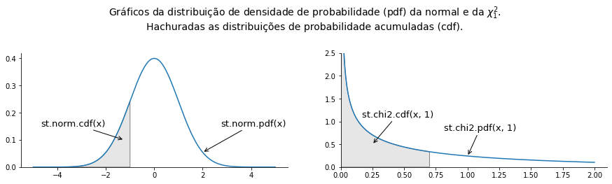

```python
# Distribuição normal e chi2

fig, (ax1, ax2) = plt.subplots(1, 2)

### Normal
x = np.linspace(-5, 5, 200)
y = st.norm.pdf(x)
ax1.plot(x, y)

# área
a = 1
b = 5
x = np.linspace(a, b)
y = st.norm.pdf(x)
verts = [(a, 0), *zip(x, y), (b, 0)]
poly = Polygon(verts, facecolor='0.9', edgecolor='0.5')
ax1.add_patch(poly)


### Chi2
x = np.linspace(0.02, 2, 200)
y = st.chi2.pdf(x, 1)
ax2.plot(x, y)

# Área
a = 1
x = np.linspace(a, x[-1])
y = st.chi2.pdf(x, 1)
verts = [(a, 0), (a, y[0]), *zip(x, y), (x[-1], 0)]
poly = Polygon(verts, facecolor='0.9', edgecolor='0.5')
ax2.add_patch(poly)


# Definições de eixos
for ax in [ax1, ax2]:
    ax.spines['right'].set_visible(False)
    ax.spines['top'].set_visible(False)
    ax.xaxis.set_ticks_position('bottom')
    ax.set_ylim(bottom=0)
ax2.set_xlim(left=0)
ax2.set_ylim(top=2.5)

#
fig.suptitle('Gráficos da distribuição de densidade de probabilidade (pdf) da normal'\
             ' e da $\chi^2_1$.\n'
             'Hachuradas as funções de distribuição cumulativa complementar (Survival function) (sf).',
             fontsize=14, y=1.2)

# Annotate
ax1.annotate('st.norm.sf(x)', xy=(1.8, .02), xytext=(2, 0.1),
             arrowprops={'arrowstyle':'->'}, fontsize = 13, ha='left' )

ax2.annotate('st.chi2.sf(x, 1)', xy=(1.1, 0.05), xytext=(1.2, 0.5),
             arrowprops={'arrowstyle':'->'}, fontsize = 13, ha='center' )


fig.set_facecolor('white')
fig.set_size_inches(15, 3)
plt.show()
```
> 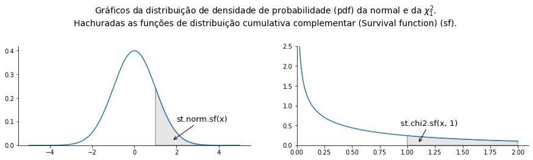


# Exemplos

* Se X uma variável aleatória normalmente distribuida com média 0 e desvio padrão 1.
** a) Calcule P(X < 0.5)
** b) P(X > 0.1)
** c) P(-1< X < 2)

```python
# Exemplos

# Se X uma variável aleatória normalmente distribuida com média 0 e desvio padrão 1.
# a) Calcule P(X < 0.5)
# b) P(X > 0.1)
# c) P(-1< X < 2)

print(f'a) P(X < 0.5)    = {st.norm.cdf(0.5)}')
print(f'b) P(X > 0.1)    = {st.norm.sf(0.5)}') # 1-cdf
print(f'c) P(-1 < X < 2) = {st.norm.cdf(2) - st.norm.cdf(-1)}')
```
> a) P(X < 0.5)    = 0.6914624612740131  
> b) P(X > 0.1)    = 0.3085375387259869  
> c) P(-1 < X < 2) = 0.8185946141203637


# Exemplos

* Se X uma variável aleatória normalmente distribuida com média 1 e desvio padrão 2.
** a) Calcule P(X < 3)
** b) P(X > 3)
** c) P(-5< X < 5)

```python
# Exemplos

# Se X uma variável aleatória normalmente distribuida com média 1
# e desvio padrão 2.
# a) Calcule P(X < 3)
# b) P(X > 3)
# c) P(-5< X < 5)

print(f'a) P(X < 0.5)    = {st.norm.cdf(3, loc=1, scale=2)}')
print(f'b) P(X > 0.1)    = {st.norm.sf(0.1, loc=1, scale=2)}')
print(f'c) P(-1 < X < 2) = {st.norm.cdf(2, loc=1, scale=2) - st.norm.cdf(-1, loc=1, scale=2)}')
```
> a) P(X < 0.5)    = 0.8413447460685429  
> b) P(X > 0.1)    = 0.67364477971208  
> c) P(-1 < X < 2) = 0.532807207342556


# Exemplos:

* Se X uma variável aleatória normalmente distribuida com média 0 e desvio padrão 1.
** a) Qual o valor de x tal que P(X < x) = 0.05?
** b) Qual o valor de x tal que P(X > x) = 0.10?

```python
# Exemplos:

# Se X uma variável aleatória normalmente distribuida com média 0
# e desvio padrão 1.
# a) Qual o valor de x tal que P(X < x) = 0.05?
# b) Qual o valor de x tal que P(X > x) = 0.10?

print(f'a) x = {st.norm.ppf(.05)}')
print(f'a) x = {st.norm.isf(.10)}')
```
> a) x = -1.6448536269514729  
> a) x = 1.2815515655446004


# Exemplos:

* Seja X uma V.A. distribuida conforme a distribuição chi-quadrado com nu = 2.
** a) Qual o valor de $P(X < 1)$
** b) Qual o valor de $P(X > 2)$
** c) Qual o valor de $P(1< X < 2)$

```python
# Exemplos:
# Seja X uma V.A. distribuida conforme a distribuição chi-quadrado com nu = 2.
# a) Qual o valor de $P(X < 1)$
# b) Qual o valor de $P(X > 2)$
# c) Qual o valor de $P(1< X < 2)$

print(f'a) P(X < 1)    = {st.chi2.cdf(3, 2)}')
print(f'b) P(X > 2)    = {st.chi2.sf(3, 2) }')
print(f'c) P(1 < X < 2) = {st.chi2.cdf(2, 2) - st.chi2.cdf(1, 2)}')
```
> a) P(X < 1)    = 0.7768698398515702  
> b) P(X > 2)    = 0.22313016014842982  
> c) P(1 < X < 2) = 0.23865121854119115


# Distribuições discretas

```python
fig, ax = plt.subplots()

n = 16
p = 1/6
k = np.arange(n)
probabilidades = st.binom.pmf(k, n, p)  # Probability mass function
ax.bar(k, probabilidades)

fig.set_facecolor('white')
fig.suptitle(f'Probabilidade de se obter exatamente k números 5 um\nlançamento '
             f'de {n} dados. (st.binom.pmf(k, n, p))')
plt.show()
```
> 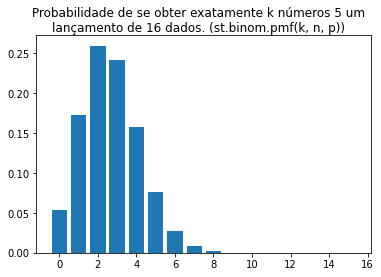


# Distribuição binomial
* Modela sequência de n ensaios.
* Ensaios podem ser sucessos ou fracassos.
* A probalidade de sucesso é constante igual a p.
* Os ensaios são independentes.
* Probabilidade de obter x sucessos ao longo dos n ensaios é denota e dada por:
$$b(x;n,p) = {n \choose x}p^x(1-p)^{n-x}.$$

## Exemplo
* No lançamento de 12 dados honestos de seis faces, qual a probabilidade de obtermos exatamente 5 vezes a face 1?
** Defina a obtenção da face 1 como sucesso com $p=1/6$.
$$P(x=5) = b(5;12,1/6).$$

```python
# No lançamento de 12 dados honestos de seis faces, qual a probabilidade de obtermos exatamente 5 vezes a face 1?
# $P(x=5) = b(5;12,1/6)$

p = 1/6 # Probabilidade de obter a face 1 em um lançamento.
n = 12  # Número de lançamentos
x = 5   # Número de sucessos (obter a face 1)

P = st.binom.pmf(x, n, p) # Probability mass function

print(f'b({x};{n},{p:.5f}) = {P:.5f}')
```
> b(5;12,0.16667) = 0.02842


# Exemplo
## Distribuição binomial

* No lançamento de 12 dados honestos de seis faces, qual a probabilidade de obtermos no máximo 5 vezes a face 1?
** Usaremos a distribuição de probabilidade acumulada:
$$P(X\leq x) = \sum_{j=0}^xb(x,n,p)=B(x,n,p).$$

```python
# Exemplo: Distribuição binomial

# No lançamento de 12 dados honestos de seis faces, qual a probabilidade de
# obtermos no máximo 5 vezes a face 1.

p = 1/6 # Probabilidade de obter a face 1 em um lançamento.
n = 12  # Número de lançamentos
x = 5   # Número de sucessos (obter a face 1)

P = st.binom.cdf(x, n, p)  # Cumulative distribution function

print(f'b({x};{n},{p:.5f}) = {P:.5f}')
```
> b(5;12,0.16667) = 0.99207


# Distribuição binomial
## Exemplo

* No lançamento de 12 dados honestos de seis faces, qual a probabilidade de obtermos mais de 5 vezes a face 1.
* Usaremos a função distribuição de probabilidade acumulada complementar (survival function - sf).

```python
# Exemplo: Distribuição binomial

# No lançamento de 12 dados honestos de seis faces, qual a probabilidade de
# obtermos mais de 5 vezes a face 1.

p = 1/6 # Probabilidade de obter a face 1 em um lançamento.
n = 12  # Número de lançamentos
x = 5   # Número de sucessos (obter a face 1)

P = st.binom.sf(x, n, p)  # Survival function P(b>x), não inclui x. Obs: sf+cdf=1

print(f'b({x};{n},{p:.5f}) = {P:.5f}')
```
> b(5;12,0.16667) = 0.00793


# Distribuição binomial
## Exemplo

* No lançamento de 12 dados honestos de seis faces, contamos o número de vezes que aparece a face 1. Qual o resultado mais provável?

```python
# Exemplo: Distribuição binomial

# No lançamento de 12 dados honestos de seis faces, contamos o número de
# vezes que aparece a face 1. Qual o resultado mais provável?

p = 1/6 # Probabilidade de obter a face 1 em um lançamento.
n = 12  # Número de lançamentos
x = range(13)  # Número de sucessos (obter a face 1)

P = st.binom.pmf(x, n, p)
P_max = P.max()
i_P_max = P.argmax() # recupera apenas o primeiro índice. Cuidado.

print(f'b({i_P_max};{n},{p:.5f}) = {P_max:.5f}')
```
> b(2;12,0.16667) = 0.29609


# Distribuição binomial

## Gráficos da distribuição de probabilidade e probabilidade acumulada.

```python
fig, (ax1, ax2) = plt.subplots(1, 2)

p = 1/6
n = 12
x = np.arange(n)

probabilidades = st.binom.pmf(x, n, p)  # Probability mass function
ax1.bar(x, probabilidades)

probabilidades_acumuladas = st.binom.cdf(x, n, p)  # Probability mass function
ax2.bar(x, probabilidades_acumuladas)


fig.set_facecolor('white')
ax1.set_title(f'Probabilidade de se obter x vezes a face 3 em \n'
             f'{n} tentativas. (st.binom.pmf(x, n, p))')

ax2.set_title(f'Probabilidade de se obter no máximo x vezes a face 3 em \n'
             f' {n} tentativas. (st.binom.cdf(x, n, p))')

fig.set_size_inches(15, 3)
plt.show()
```
> 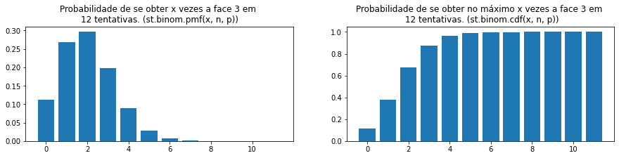


# Distribuição binomial negativa

* Modela sequência de ensaios.
* Ensaios podem ser sucessos ou fracassos.
* A probalidade de sucesso é constante igual a p.
* Os ensaios são independentes.
* O experimento acaba quando são obtidos r sucessos.
* Conta-se x, isto é, o número de fracassos. (O número total de ensaios é r+x.)
* Probabilidade de obter x fracasso antes dos r sucessos é denota e dada por:
$$nb(x;r,p) = {n+r-1 \choose r-1}p^r(1-p)^x.$$

```python
## Exemplo
# Um dado honesto de seis faces é lançado até que a face 3 apareça 2 vezes
# (não necessariamente me sequência).
# Qual a probabilidade de isso acontecer na décima jogada
#(i.e. depois de 8 fracassos = face diferente de 3).

p = 1/6
x = 8
r = 2
P = st.nbinom.pmf(x, r, p)

print(f'nb({x};{r},{p:.5f}) = {P:.5f}')
```
> nb(8;2,0.16667) = 0.05814


# Distribuição binomial negativa

## Gráficos da distribuição de probabilidade e distribuição de probabilidade acumulada.

```python
fig, (ax1, ax2) = plt.subplots(1, 2)

p = 1/6
r = 2
x = np.arange(26)

probabilidades = st.nbinom.pmf(x, r, p)  # Probability mass function
ax1.bar(x, probabilidades)

probabilidades_acumuladas = st.nbinom.cdf(x, r, p)  # Probability mass function
ax2.bar(x, probabilidades_acumuladas)


fig.set_facecolor('white')
ax1.set_title(f'Probabilidade de se obter {r} vezes a face 3 depois de \n'
             f'r falhas. (st.nbinom.pmf(k, n, p))')

ax2.set_title(f'Probabilidade de se obter {r} vezes a face 3 depois de \n'
             f' no máximo r falhas. (st.nbinom.cdf(k, n, p))')

fig.set_size_inches(15, 3)
plt.show()
```
> 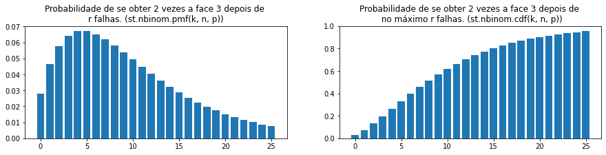

```python
# Se você não acredita, simule o problema.
alea = np.random.default_rng()

r = 2
n_s = 1000 # número de simulações

S = 0
F = 0
valores = np.zeros(n_s)
for k in range(n_s):
    S = 0
    F = 0
    while S<r:
        if alea.integers(6)==0:
            S += 1
        else:
            F += 1
    valores[k] = F

print(np.mean(valores), np.std(valores, ddof=1))  
```
> 9.871 7.3344497512187745


# Obtendo média, desvio padrão e outras características de uma distribuição.

```python
# Você pode obter média e desvio padrão da distribuição
print (st.nbinom.mean(r, 1/6), st.nbinom.std(r, 1/6))
```
> 10.0 7.745966692414834


# Gerando números aleatórios

```python
valores = st.norm.rvs(size=2000, random_state=alea), #random_state é opcional

fig, ax = plt.subplots()
ax.hist(valores[0], density = True, bins='sqrt')
x = np.linspace(-3, 3)
ax.plot(x, st.norm.pdf(x))
fig.set_facecolor('white')
fig.suptitle('Histograma de uma amostra vs função densidade de probalidade (normal)')
plt.show()
```
> 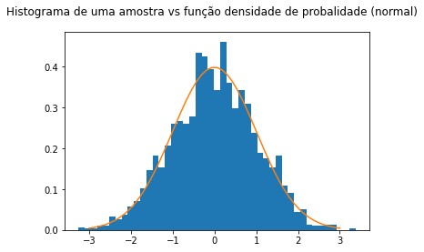

```python
valores = st.chi2.rvs(3, size=200, random_state=alea), #random_state é opcional

fig, ax = plt.subplots()
ax.hist(valores[0], density = True, bins='sqrt')
x = np.linspace(0, max(valores[0]), 100)

ax.plot(x, st.chi2.pdf(x, 3))

fig.set_facecolor('white')

fig.suptitle('Histograma de uma amostra vs função densidade de probalidade (chi2)')
plt.show()
```
> 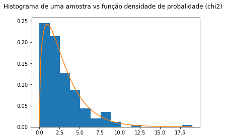

```python
valores = st.t.rvs(3, size=200, random_state=alea), #random_state é opcional

nu = 3
fig, ax = plt.subplots()
ax.hist(valores[0], density = True, bins='sqrt')
x = np.linspace(-3, 3, 100)
ax.plot(x, st.t.pdf(x, nu))
fig.set_facecolor('white')

fig.suptitle(f'Histograma de uma amostra vs função densidade de probalidade\n (t-student com {nu} graus de liberdade)')
plt.show()
```
> 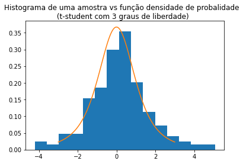


# Regressão linear
* Temos um conjunto de pontos $(x_i, y_i)$ para $i=1,\ldots, n$
e queremos "a melhor" reta $y = ax +b$ que aproxima os dados.
* O critério dos mínimos quadrados consite em minimizar a soma:
$$\sum_{i=1}^n [(ax_i+b) - y_i]^2$$
** Ver gráfico abaixo.

* A função scipy.stats.linregress(x, y) retorna para um conjuntos de pontos x e y:
* slope : a
* intercept : b
* r-value : Coeficiente de correlação
* p-value : Valor p para um teste de hipóteses bilateral cuja hipótese nula é a=0.
* stderr : Erro padrão do slope.

```python
# Gera dados
tamanho = 15
x = np.linspace(0, 2, tamanho)
y = -5 + 2*x + st.norm.rvs(size=tamanho, scale=2) # produz dados.


# Faz ajuste de uma reta
slope, intercept, r_value, p_value, std_err = st.linregress(x, y)

yest = intercept + slope*x

fig, ax = plt.subplots()

ax.scatter(x, y, color='blue')
ax.plot(x, yest, '-', color='green', linewidth=2)

for i in range(tamanho):
    ax.vlines(x[i], ymin=y[i], ymax=yest[i], color='red')

fig.suptitle(f'Conjuntos de pontos e reta ajustada. ($R^2={r_value**2:.3f}$)')
ax.grid()
fig.set_facecolor('white')
fig.set_size_inches(10, 4)
plt.show()

print(p_value)
```
> 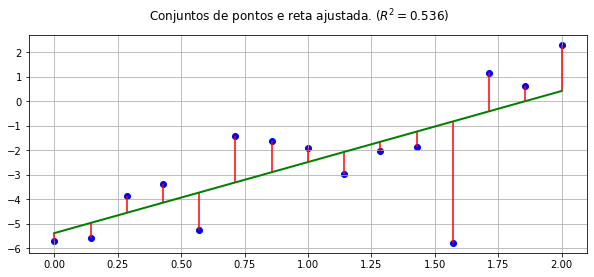  
> 0.0019102935622701488


# Ajuste polinomial

* Ajuste pelos critério dos mínimos quadrados de uma função polinomial.
* Podemos usar a função numpy.polyfit(x, y, deg) que retorna os coeficientes de um polinômio. Mais alto grau antes.
* É possível inserir pesos aos pontos.

```python
tamanho = 15
x = np.linspace(0, 2, tamanho)

y = 5*np.sin(x) + 7*np.cos(x) + st.norm.rvs(size=tamanho, scale=1) # produz dados.


# Faz ajuste de um polinômio quadrático

coeff = np.polyfit(x, y, 2)
yest = np.polyval(coeff, x) #Equilavente yest = coeff[0]*x**2 + coeff[1]*x + coeff[2]


fig, ax = plt.subplots()

ax.scatter(x, y, color='blue')
ax.plot(x, yest, '-', color='green', linewidth=2)

for i in range(tamanho):
    ax.vlines(x[i], ymin=y[i], ymax=yest[i], color='red')

fig.suptitle(f'Conjuntos de pontos e parábola ajustada.')
ax.grid()
fig.set_facecolor('white')
fig.set_size_inches(10, 4)
plt.show()
```
> 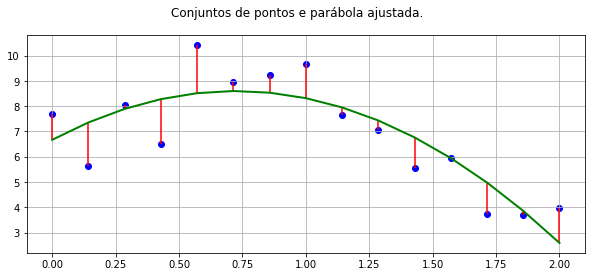

```python
x = [0, 1, 2, 3]
y = [4, 6.4, 6, 8]

coeff = np.polyfit(x,y,deg=2)
yest = np.polyval(coeff, x)
plt.plot(x, yest)
plt.plot(x,y,'o')
plt.show()
```
> 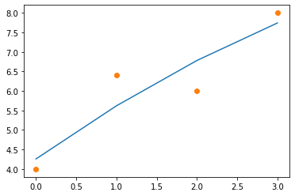

```python
print(coeff)
```
> [-0.1   1.46  4.26]


# Ajuste de uma função exponencial.

Em alguns casos, os dados são melhor descritos por uma função exponencial da forma:

$$y(x) = Ae^{bx}$$
Aqui $A$ e $b$ são constantes e $e$ é a base do logaritmo natural.

* Neste caso, uma possibilidade consiste em olha para o logaritmo dos dados (que devem ser positivos):
$$\ln(y(x)) = \ln(A) + b x.$$
Definindo $a = \ln(A)$, recaímos no problema de ajusta uma função do primeiro grau:
$$\ln(y(x)) = a + b x.$$

```python
# Gera dados
tamanho = 15
x = np.linspace(0, 2, tamanho)
y = 2*np.exp(1.5*x) + 4*x* st.norm.rvs(size=tamanho) # produz dados.


# Faz ajuste de uma reta
b, a, r_value, p_value, std_err = st.linregress(x, np.log(y))

A = np.exp(a)
yest = np.exp(a + b*x)

fig, ax = plt.subplots()

ax.scatter(x, y, color='blue')
ax.plot(x, yest, '-', color='green', linewidth=2)

for i in range(tamanho):
    ax.vlines(x[i], ymin=y[i], ymax=yest[i], color='red')

fig.suptitle(f'Conjuntos de pontos e exponencial ajustada.')

# ax.set_yscale('log')
ax.grid()
fig.set_facecolor('white')
fig.set_size_inches(10, 4)
plt.show()

print(p_value)
```
> 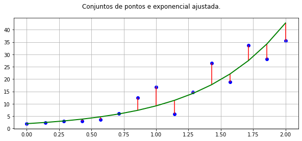  
> 8.107812012618628e-08
