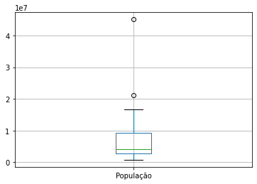
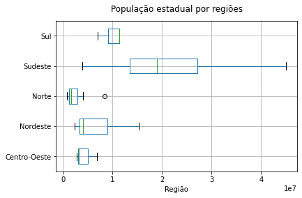
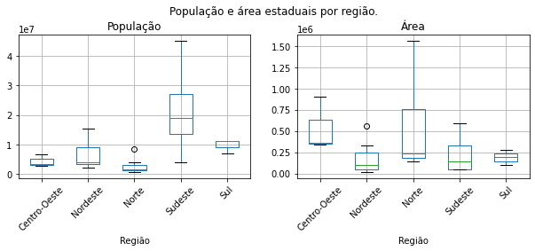
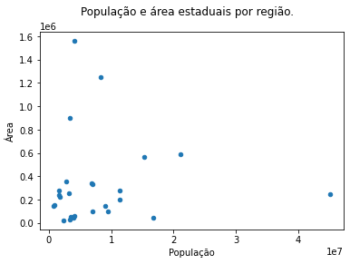
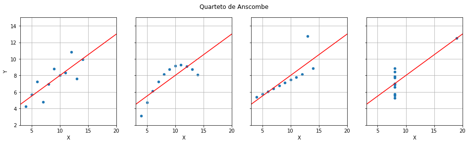

# Sejam bem-vindos.
Grupo de estudo Python - COVID-19

### Pandas é um pacote para manipulação de dados.
* Implementa a classe Series e a classe DataFrame.
* Possui diversas funções para entrada e saída de dados (IO).
* Implementa algoritmos de manipulação de dados.

```python
import pandas as pd
import numpy as np
import scipy.stats as st
```

```python
# Você pode criar um objeto da classe Serie.

governadores = pd.Series(['Eduardo Leite', 'Carlos Moisés', 'Ratinho Júnior'])

print(governadores)
```
> 0     Eduardo Leite  
> 1     Carlos Moisés  
> 2    Ratinho Júnior  
> dtype: object

```python
# Você pode inserir um índice

governadores.index = ['RS', 'SC', 'PR']
print(governadores)
```
> RS     Eduardo Leite  
> SC     Carlos Moisés  
> PR    Ratinho Júnior  
> dtype: object

```python
# Recuperando itens.

governadores['PR']
```
> 'Ratinho Júnior'

```python
# Alterando ou acrescentando itens
governadores['SP'] = 'João Dória'
governadores
```
> RS     Eduardo Leite  
> SC     Carlos Moisés  
> PR    Ratinho Júnior  
> SP        João Dória  
> dtype: object

```python
# Convertendo em array
governadores.values
```
> array(['Eduardo Leite', 'Carlos Moisés', 'Ratinho Júnior', 'João Dória'], dtype=object)

```python
# Ordenando
print(governadores.sort_values(inplace=False)) # Retorna nova série, mas não altera a série
# Teste inplace=True
print()
print(governadores)
```
> SC     Carlos Moisés  
> RS     Eduardo Leite  
> SP        João Dória  
> PR    Ratinho Júnior  
> dtype: object  
>
> RS     Eduardo Leite  
> SC     Carlos Moisés  
> PR    Ratinho Júnior  
> SP        João Dória
> dtype: object

```python
# Ordenando
print(governadores.sort_index()) # Retorna nova série, mas não altera a série
# Veja inplace=True
```
> PR    Ratinho Júnior  
> RS     Eduardo Leite  
> SC     Carlos Moisés  
> SP        João Dória
> dtype: object

```python
# Pegando pedaços

governadores[ ['RS', 'SC'] ]
```
> RS    Eduardo Leite  
> SC    Carlos Moisés  
> dtype: object

```python
# Acessando pela posição
print(governadores.iat[1])
print(governadores.iloc[0])
```
> Carlos Moisés  
> Eduardo Leite

```python
# Acessando vários valores
print(governadores.iloc[ [0, 3] ])
```
> RS    Eduardo Leite  
> SP       João Dória  
> dtype: object

```python
# Acessando fatias (slices)
print(governadores.iloc[0:2])
```
> RS    Eduardo Leite  
> SC    Carlos Moisés  
> dtype: object

```python
# Acessando via booleanos
print(governadores.iloc[[True, True, False, True]])
```
> RS    Eduardo Leite  
> SC    Carlos Moisés  
> SP       João Dória  
> dtype: object

```python
# Comparando
dados = pd.Series([1, 2, 3, 4, 3, 2, 1, 0])
print(dados>2) # Retorna uma série de booleanos
```
> 0    False  
> 1    False  
> 2     True  
> 3     True  
> 4     True  
> 5    False  
> 6    False  
> 7    False  
> dtype: bool

```python
# Aninhando comandos de comparação e seleção
print(dados[ dados>2 ])  
# Dentro dos colchetes, há uma série de booleanos que indexa a Série dados
```
> 2    3  
> 3    4  
> 4    3  
> dtype: int64

```python
# Outro exemplo
print(dados[dados==2])
```
> 1    2  
> 5    2  
> dtype: int64


# A classe DataFrame

* Como como matrizes (ou tabelas, planilhas).
* Linhas e colunas podem receber rótulos.
* São indexados pelas linhas.

```python
cabecalho = ['População', 'Superfície', 'Municípios']
estados = ['RS', 'SC', 'PR']
dados = [[11_290_000, 281_748, 497],
         [ 6_727_000,  95_346, 295],
         [ 11_080_000, 199_315, 399]]

df = pd.DataFrame(dados, index=estados, columns=cabecalho )

# Observe o CamelCase

df  # Experimente as duas visualizações
# print(df)
```
> |    	| População 	| Superfície 	| Municípios 	|
> |---:	|----------:	|-----------:	|-----------:	|
> | RS 	|  11290000 	|     281748 	|        497 	|
> | SC 	|   6727000 	|      95346 	|        295 	|
> | PR 	|  11080000 	|     199315 	|        399 	|

```python
# Selecionando uma coluna, geramos um objeto da classe Serie (especie de array).
serie = df['Superfície']
print(serie)

# Séries possuem nome e índices.
# print(type(serie))
```
> RS    281748  
> SC     95346  
> PR    199315  
> Name: Superfície, dtype: int64

```python
# Podemos selecionar uma ou mais colunas, gerando um novo DataFrame
df2 = df[ ['Superfície', 'População'] ] # A ordem pode ser trocada
print(df2)
# print(type(df2))
```
>    Superfície  População  
> RS      281748   11290000  
> SC       95346    6727000  
> PR      199315   11080000

```python
# Note a diferença entre df['Superfície'] e df[['Superfície']]

print(df['Superfície'])
print(df[['Superfície']])

print(type(df [  'Superfície'  ] ))
print(type(df [ ['Superfície'] ] ))
```
> RS    281748  
> SC     95346  
> PR    199315  
> Name: Superfície, dtype: int64  
>     Superfície  
> RS      281748  
> SC       95346  
> PR      199315  
> <class 'pandas.core.series.Series'>  
> <class 'pandas.core.frame.DataFrame'>

```python
# DataFrames iteram sobre colunas

for i in df:
    print(i)
```
> População  
> Superfície  
> Municípios

```python
# Recuperando elementos

print(df['Municípios'] ['RS']) # Coluna, linha
```
> 497

```python
# Observe que você está acessando a série.
serie = df['Municípios']
print(serie['RS']) #
# Note que, na verdade, você recupera um item da série, oriunda da coluna.
```
> 497

```python
# Método at
df.at['RS', 'Municípios']  # Observe a ordem!!!
```
> 497

```python
# Criando uma nova coluna
df['Governador'] = ['Eduardo Leite', 'Carlos Moisés', 'Ratinho Júnior']
df
```
> |    	| População 	| Superfície 	| Municípios 	|     Governador 	|
> |---:	|----------:	|-----------:	|-----------:	|---------------:	|
> | RS 	|  11290000 	|     281748 	|        497 	|  Eduardo Leite 	|
> | SC 	|   6727000 	|      95346 	|        295 	|  Carlos Moisés 	|
> | PR 	|  11080000 	|     199315 	|        399 	| Ratinho Júnior 	|

```python
# Inserindo uma coluna na posição desejada
df.insert(2, 'Densidade', df['População'] / df['Superfície']) # Insere na segunda posição
df
```
> |    	| População 	| Superfície 	| Densidade 	| Municípios 	|     Governador 	|
> |---:	|----------:	|-----------:	|----------:	|-----------:	|---------------:	|
> | RS 	|  11290000 	|     281748 	| 40.071269 	|        497 	|  Eduardo Leite 	|
> | SC 	|   6727000 	|      95346 	| 70.553563 	|        295 	|  Carlos Moisés 	|
> | PR 	|  11080000 	|     199315 	| 55.590397 	|        399 	| Ratinho Júnior 	|

```python
df2 = df.transpose() # Retorna novo DataFrame transposto.
df2
```
> |            	|            RS 	|            SC 	|             PR 	|
> |-----------:	|--------------:	|--------------:	|---------------:	|
> |  População 	|      11290000 	|       6727000 	|       11080000 	|
> | Superfície 	|        281748 	|         95346 	|         199315 	|
> |  Densidade 	|       40.0713 	|       70.5536 	|        55.5904 	|
> | Municípios 	|           497 	|           295 	|            399 	|
> | Governador 	| Eduardo Leite 	| Carlos Moisés 	| Ratinho Júnior 	|

```python
# Acessando linhas pelo método loc retorna Serie.
print(df,'\n')
df.loc['RS']
```
>    População  Superfície  Densidade  Municípios      Governador  
> RS   11290000      281748  40.071269         497   Eduardo Leite  
> SC    6727000       95346  70.553563         295   Carlos Moisés  
> PR   11080000      199315  55.590397         399  Ratinho Júnior  
>  
> População          11290000  
> Superfície           281748  
> Densidade           40.0713  
> Municípios              497  
> Governador    Eduardo Leite  
> Name: RS, dtype: object

```python
# Você pode pegar um item
print(df.loc['RS']['População']) # Recupera um item da série df.loc['RS']
print(df.at['RS', 'População']) # Melhor
```
> 11290000  
> 11290000

```python
# Acessando por índice numérico
print(df, '\n')
df.iat[1, 2]  # Linha, coluna. Rótulos NÃo são contados.
```
>    População  Superfície  Densidade  Municípios      Governador  
> RS   11290000      281748  40.071269         497   Eduardo Leite  
> SC    6727000       95346  70.553563         295   Carlos Moisés  
> PR   11080000      199315  55.590397         399  Ratinho Júnior   
>
> 70.55356281333249

```python
# Alterando um único item
df.iat[0, 0] = 11290001
print(df,'\n')

# df['População']['RS'] = 11290000  # Evitar
# print(df)

```
>    População  Superfície  Densidade  Municípios      Governador  
> RS   11290001      281748  40.071269         497   Eduardo Leite  
> SC    6727000       95346  70.553563         295   Carlos Moisés  
> PR   11080000      199315  55.590397         399  Ratinho Júnior

```python
# Inserindo e eliminando colunas
df['Erro']=1
print(df)
print()

df.drop('Erro', axis='columns', inplace=True)
print(df)
#estados
```
>    População  Superfície  Densidade  Municípios      Governador  Erro  
> RS   11290001      281748  40.071269         497   Eduardo Leite     1  
> SC    6727000       95346  70.553563         295   Carlos Moisés     1  
> PR   11080000      199315  55.590397         399  Ratinho Júnior     1  
>
>    População  Superfície  Densidade  Municípios      Governador  
> RS   11290001      281748  40.071269         497   Eduardo Leite  
> SC    6727000       95346  70.553563         295   Carlos Moisés  
> PR   11080000      199315  55.590397         399  Ratinho Júnior

```python
# Inserindo e eliminando linhas
df.loc['LL'] = ['Central', 'Lugar nenhum', 0, 10, 20]

print(df.tail(2))
print()

df.drop('LL',  axis='rows', inplace=True)
print(df.tail())
```
>    População    Superfície  Densidade  Municípios      Governador  
> PR  11080000        199315  55.590397         399  Ratinho Júnior  
> LL   Central  Lugar nenhum   0.000000          10              20  
>
>    População Superfície  Densidade  Municípios      Governador  
> RS  11290001     281748  40.071269         497   Eduardo Leite  
> SC   6727000      95346  70.553563         295   Carlos Moisés  
> PR  11080000     199315  55.590397         399  Ratinho Júnior

```python
# Ondenando
df.sort_index() # Retorna novo dataframe, mas não altera df
# Veja inplace=True
```
> | População 	| Superfície 	| Densidade 	| Municípios 	| Governador 	|                	|
> |:----------:	|-----------:	|----------:	|-----------:	|-----------:	|----------------	|
> |     PR    	|   11080000 	|    199315 	|  55.590397 	|        399 	| Ratinho Júnior 	|
> |     RS    	|   11290001 	|    281748 	|  40.071269 	|        497 	|  Eduardo Leite 	|
> |     SC    	|    6727000 	|     95346 	|  70.553563 	|        295 	|  Carlos Moisés 	|

```python
# Ordenando por valor
df.sort_values(by='População')  # Retorna novo dataframe, mas não altera df
# Pode-se usar by=['População', 'Municípios']
```
> |    	| População 	| Superfície 	| Densidade 	| Municípios 	|     Governador 	|
> |:--:	|----------:	|-----------:	|----------:	|-----------:	|---------------:	|
> | SC 	|   6727000 	|      95346 	| 70.553563 	|        295 	|  Carlos Moisés 	|
> | PR 	|  11080000 	|     199315 	| 55.590397 	|        399 	| Ratinho Júnior 	|
> | RS 	|  11290001 	|     281748 	| 40.071269 	|        497 	|  Eduardo Leite 	|

```python
# Selecionando com comando de comparação
# lembre o que faz df['População']>10_000_000
print( df[    df['População']>10_000_000     ] )
```
>    População Superfície  Densidade  Municípios      Governador  
> RS  11290001     281748  40.071269         497   Eduardo Leite  
> PR  11080000     199315  55.590397         399  Ratinho Júnior

```python
# Salvando em arquivo. (Suporta diversos formatos)
# https://pandas.pydata.org/pandas-docs/stable/user_guide/io.html

df.to_csv('dados.csv')
df.to_json('dados.json')
# df.to_clipboard() # Não funciona no google colab
```

```python
# Lendo do arquivo
df2 = pd.read_csv('dados.csv', index_col=0)
print(df2)
print()
df3 = pd.read_json('dados.json')
print(df3)
```
>    População  Superfície  Densidade  Municípios      Governador  
> RS   11290001      281748  40.071269         497   Eduardo Leite  
> SC    6727000       95346  70.553563         295   Carlos Moisés  
> PR   11080000      199315  55.590397         399  Ratinho Júnior  
>   
>    População  Superfície  Densidade  Municípios      Governador  
> RS   11290001      281748  40.071269         497   Eduardo Leite  
> SC    6727000       95346  70.553563         295   Carlos Moisés  
> PR   11080000      199315  55.590397         399  Ratinho Júnior

```python
# Lendo csv url
estados = pd.read_csv('https://raw.githubusercontent.com/fazedo/testes/master/estados.csv', index_col=0)
print(estados) # experimente .head(), .tail(), .head(N) e .tail(N)

# https://w.wiki/SWy
```
>    Região         Capital  ...         Área  População  
> São Paulo                 Sudeste       São Paulo  ...   248209.400   45094866  
> Paraná                        Sul        Curitiba  ...   199314.900   11320892  
> Paraíba                  Nordeste     João Pessoa  ...    56584.600    4025558  
> Minas Gerais              Sudeste  Belo Horizonte  ...   586528.290   21119536  
> Pará                        Norte           Belém  ...  1247689.515    8366628  
> Rio Grande do Sul             Sul    Porto Alegre  ...   281737.888   11322895  
> Amazonas                    Norte          Manaus  ...  1559159.000    4063614  
> Ceará                    Nordeste       Fortaleza  ...   146348.300    9020460  
> Amapá                       Norte          Macapá  ...   142814.600     797722  
> Bahia                    Nordeste        Salvador  ...   564692.000   15344447  
> Acre                        Norte      Rio Branco  ...   152581.000     881935  
> Alagoas                  Nordeste          Maceió  ...    27767.000    3375823  
> Pernambuco               Nordeste          Recife  ...    98937.800    9473266  
> Santa Catarina                Sul   Florianópolis  ...    95346.181    7001161  
> Rio de Janeiro            Sudeste  Rio de Janeiro  ...    43696.100   16718956  
> Goiás                Centro-Oeste         Goiânia  ...   340086.000    6778772  
> Maranhão                 Nordeste        São Luís  ...   331983.200    7000229  
> Roraima                     Norte       Boa Vista  ...   224298.980    1805788  
> Piauí                    Nordeste        Teresina  ...   251529.000    3219257  
> Mato Grosso          Centro-Oeste          Cuiabá  ...   903357.000    3344544  
> Espírito Santo            Sudeste         Vitória  ...    46077.500    3885049  
> Rondônia                    Norte     Porto Velho  ...   238512.000    1590011  
> Rio Grande do Norte      Nordeste           Natal  ...    53306.800    3507003  
> Mato Grosso do Sul   Centro-Oeste    Campo Grande  ...   358158.700    2713147  
> Tocantins                   Norte          Palmas  ...   278420.700    1550194  
> Sergipe                  Nordeste         Aracaju  ...    22050.300    2288116  
>
> [26 rows x 5 columns]

```python
# Ver colunas
print(estados.columns)
```
> Index(['Região', 'Capital', 'Governador', 'Área', 'População'], dtype='object')

```python
# Filtrar
print(estados[ estados['Região']=='Nordeste' ])
```
>    Região      Capital  ...      Área  População  
> Paraíba              Nordeste  João Pessoa  ...   56584.6    4025558  
> Ceará                Nordeste    Fortaleza  ...  146348.3    9020460  
> Bahia                Nordeste     Salvador  ...  564692.0   15344447  
> Alagoas              Nordeste       Maceió  ...   27767.0    3375823  
> Pernambuco           Nordeste       Recife  ...   98937.8    9473266  
> Maranhão             Nordeste     São Luís  ...  331983.2    7000229  
> Piauí                Nordeste     Teresina  ...  251529.0    3219257  
> Rio Grande do Norte  Nordeste        Natal  ...   53306.8    3507003  
> Sergipe              Nordeste      Aracaju  ...   22050.3    2288116  
>
> [9 rows x 5 columns]

```python
# Filtrar
print(estados[estados['População']>10_000_000])
```
>    Região         Capital  ...        Área  População  
> São Paulo           Sudeste       São Paulo  ...  248209.400   45094866  
> Paraná                  Sul        Curitiba  ...  199314.900   11320892  
> Minas Gerais        Sudeste  Belo Horizonte  ...  586528.290   21119536  
> Rio Grande do Sul       Sul    Porto Alegre  ...  281737.888   11322895  
> Bahia              Nordeste        Salvador  ...  564692.000   15344447  
> Rio de Janeiro      Sudeste  Rio de Janeiro  ...   43696.100   16718956  
>
> [6 rows x 5 columns]

```python
# Filtrar
print(estados[ estados['População']/estados['Área']>50 ])
```
>    Região         Capital  ...        Área  População  
> São Paulo             Sudeste       São Paulo  ...  248209.400   45094866  
> Paraná                    Sul        Curitiba  ...  199314.900   11320892  
> Paraíba              Nordeste     João Pessoa  ...   56584.600    4025558   
> Ceará                Nordeste       Fortaleza  ...  146348.300    9020460  
> Alagoas              Nordeste          Maceió  ...   27767.000    3375823  
> Pernambuco           Nordeste          Recife  ...   98937.800    9473266  
> Santa Catarina            Sul   Florianópolis  ...   95346.181    7001161  
> Rio de Janeiro        Sudeste  Rio de Janeiro  ...   43696.100   16718956  
> Espírito Santo        Sudeste         Vitória  ...   46077.500    3885049  
> Rio Grande do Norte  Nordeste           Natal  ...   53306.800    3507003  
> Sergipe              Nordeste         Aracaju  ...   22050.300    2288116  
>
> [11 rows x 5 columns]

```python
# Filtrar (#np.array([True, False, True, False]) & np.array([True, True, False, False]))

print(estados[(estados['População']>10_000_000) & (estados['Área']<200_000)])

# Teste &, |, ^, ~
```
>    Região         Capital  ...      Área  População  
> Paraná              Sul        Curitiba  ...  199314.9   11320892  
> Rio de Janeiro  Sudeste  Rio de Janeiro  ...   43696.1   16718956  
>
> [2 rows x 5 columns]

```python
x = estados['População']>10_000_000
y = estados['Área']<200_000

print(x | ~y)
```
> São Paulo               True  
> Paraná                  True  
> Paraíba                False  
> Minas Gerais            True  
> Pará                    True  
> Rio Grande do Sul       True  
> Amazonas                True  
> Ceará                  False  
> Amapá                  False  
> Bahia                   True  
> Acre                   False  
> Alagoas                False  
> Pernambuco             False  
> Santa Catarina         False  
> Rio de Janeiro          True  
> Goiás                   True  
> Maranhão                True  
> Roraima                 True  
> Piauí                   True  
> Mato Grosso             True  
> Espírito Santo         False  
> Rondônia                True  
> Rio Grande do Norte    False  
> Mato Grosso do Sul      True  
> Tocantins               True  
> Sergipe                False  
> dtype: bool

```python
# Contando resultados filtrados
d=estados[ (estados['População']>5_000_000) ].count() #Tente max, min, mean
d
```
> Região        12  
> Capital       12  
> Governador    12  
> Área          12  
> População     12  
> dtype: int64

```python
# Filtrar por 'is in' # Pode-se usar ~
estados[estados['Região'].isin(['Sul', 'Sudeste'])]
```
> |                   	|  Região 	|        Capital 	|             Governador 	|       Área 	| População 	|
> |------------------:	|--------:	|---------------:	|-----------------------:	|-----------:	|----------:	|
> |     São Paulo     	| Sudeste 	|      São Paulo 	|      João Doria Júnior 	| 248209.400 	|  45094866 	|
> |       Paraná      	|     Sul 	|       Curitiba 	|         Ratinho Júnior 	| 199314.900 	|  11320892 	|
> |    Minas Gerais   	| Sudeste 	| Belo Horizonte 	|             Romeu Zema 	| 586528.290 	|  21119536 	|
> | Rio Grande do Sul 	|     Sul 	|   Porto Alegre 	|          Eduardo Leite 	| 281737.888 	|  11322895 	|
> |   Santa Catarina  	|     Sul 	|  Florianópolis 	| Carlos Moisés da Silva 	|  95346.181 	|   7001161 	|
> |   Rio de Janeiro  	| Sudeste 	| Rio de Janeiro 	|     Wilson José Witzel 	|  43696.100 	|  16718956 	|
> |   Espírito Santo  	| Sudeste 	|        Vitória 	|      Renato Casagrande 	|  46077.500 	|   3885049 	|

```python
# Filter - atual nos rótulos
# print(estados.filter(regex='[mM]a', axis='rows')) # Casa qualquer parte
print(estados.filter(regex='o$', axis='rows'))
#estados
```
>    Região         Capital  ...      Área  População  
> São Paulo            Sudeste       São Paulo  ...  248209.4   45094866  
> Pernambuco          Nordeste          Recife  ...   98937.8    9473266  
> Rio de Janeiro       Sudeste  Rio de Janeiro  ...   43696.1   16718956  
> Maranhão            Nordeste        São Luís  ...  331983.2    7000229  
> Mato Grosso     Centro-Oeste          Cuiabá  ...  903357.0    3344544  
> Espírito Santo       Sudeste         Vitória  ...   46077.5    3885049  
>
> [6 rows x 5 columns]

```python
# Listando únicos
estados['Região'].unique()
```
> array(['Sudeste', 'Sul', 'Nordeste', 'Norte', 'Centro-Oeste'],  
> dtype=object)

```python
# Ordenar
estados.sort_values(by='Área', ascending=False).head(3)
```
> |             	|       Região 	| Capital 	|            Governador 	|        Área 	| População 	|
> |:-----------:	|-------------:	|--------:	|----------------------:	|------------:	|----------:	|
> |   Amazonas  	|        Norte 	|  Manaus 	|           Wilson Lima 	| 1559159.000 	|   4063614 	|
> |     Pará    	|        Norte 	|   Belém 	|       Helder Barbalho 	| 1247689.515 	|   8366628 	|
> | Mato Grosso 	| Centro-Oeste 	|  Cuiabá 	| Mauro Mendes Ferreira 	|  903357.000 	|   3344544 	|

```python
# Ordenar
estados.sort_values(by=['Região', 'Área'], ascending=False).head()
```
> |                   	|  Região 	|        Capital 	|             Governador 	|       Área 	| População 	|
> |:-----------------:	|--------:	|---------------:	|-----------------------:	|-----------:	|----------:	|
> | Rio Grande do Sul 	|     Sul 	|   Porto Alegre 	|          Eduardo Leite 	| 281737.888 	|  11322895 	|
> |       Paraná      	|     Sul 	|       Curitiba 	|         Ratinho Júnior 	| 199314.900 	|  11320892 	|
> |   Santa Catarina  	|     Sul 	|  Florianópolis 	| Carlos Moisés da Silva 	|  95346.181 	|   7001161 	|
> |    Minas Gerais   	| Sudeste 	| Belo Horizonte 	|             Romeu Zema 	| 586528.290 	|  21119536 	|
> |     São Paulo     	| Sudeste 	|      São Paulo 	|      João Doria Júnior 	| 248209.400 	|  45094866 	|

```python
# Agrupar
# https://pandas.pydata.org/pandas-docs/stable/user_guide/groupby.html
estados.groupby('Região').count() # .mean(), .last(), .first(), .std(), .var(), etc
```
> |              	| Capital 	| Governador 	| Área 	| População 	|
> |-------------:	|--------:	|-----------:	|-----:	|----------:	|
> |       Região 	|         	|            	|      	|           	|
> | Centro-Oeste 	|       3 	|          3 	|    3 	|         3 	|
> |   Nordeste   	|       9 	|          9 	|    9 	|         9 	|
> |     Norte    	|       7 	|          7 	|    7 	|         7 	|
> |    Sudeste   	|       4 	|          4 	|    4 	|         4 	|
> |      Sul     	|       3 	|          3 	|    3 	|         3 	|


# Visualização de dados

```python
import matplotlib.pyplot as plt
```

```python
estados.boxplot(column='População') # Teste  by='Região'
plt.show()
```
> 

```python
# Controlando melhor o gráfico
fig, ax = plt.subplots()

estados.boxplot(column='População', by='Região', ax=ax, vert=False)  
# Obs: Passar o eixo como parâmetro

fig.set_facecolor('white')
fig.suptitle('População estadual por regiões')
ax.set_title('')
plt.show()
```
> 

```python
fig, ax = plt.subplots(1, 2, sharex=False, sharey=False)

estados.boxplot(column=['População', 'Área'], by='Região', ax=ax, rot=45)  

fig.set_size_inches(10, 3)
fig.set_facecolor('white')
fig.suptitle('População e área estaduais por região.', y=1.05)
plt.show()
```
> 

```python
# Espalhamento
fig, ax = plt.subplots()
estados.plot.scatter(x='População', y='Área', ax=ax)

fig.suptitle('População e área estaduais por região.')
fig.set_facecolor('white')
plt.show()
```
> 

```python
anscombe = pd.read_json('sample_data/anscombe.json')
anscombe
```
> |    	| Series 	|  X 	|     Y 	|
|---:	|-------:	|---:	|------:	|
|  0 	|      I 	| 10 	|  8.04 	|
|  1 	|      I 	|  8 	|  6.95 	|
|  2 	|      I 	| 13 	|  7.58 	|
|  3 	|      I 	|  9 	|  8.81 	|
|  4 	|      I 	| 11 	|  8.33 	|
|  5 	|      I 	| 14 	|  9.96 	|
|  6 	|      I 	|  6 	|  7.24 	|
|  7 	|      I 	|  4 	|  4.26 	|
|  8 	|      I 	| 12 	| 10.84 	|
|  9 	|      I 	|  7 	|  4.81 	|
| 10 	|      I 	|  5 	|  5.68 	|
| 11 	|     II 	| 10 	|  9.14 	|
| 12 	|     II 	|  8 	|  8.14 	|
| 13 	|     II 	| 13 	|  8.74 	|
| 14 	|     II 	|  9 	|  8.77 	|
| 15 	|     II 	| 11 	|  9.26 	|
| 16 	|     II 	| 14 	|  8.10 	|
| 17 	|     II 	|  6 	|  6.13 	|
| 18 	|     II 	|  4 	|  3.10 	|
| 19 	|     II 	| 12 	|  9.13 	|
| 20 	|     II 	|  7 	|  7.26 	|
| 21 	|     II 	|  5 	|  4.74 	|
| 22 	|    III 	| 10 	|  7.46 	|
| 23 	|    III 	|  8 	|  6.77 	|
| 24 	|    III 	| 13 	| 12.74 	|
| 25 	|    III 	|  9 	|  7.11 	|
| 26 	|    III 	| 11 	|  7.81 	|
| 27 	|    III 	| 14 	|  8.84 	|
| 28 	|    III 	|  6 	|  6.08 	|
| 29 	|    III 	|  4 	|  5.39 	|
| 30 	|    III 	| 12 	|  8.15 	|
| 31 	|    III 	|  7 	|  6.42 	|
| 32 	|    III 	|  5 	|  5.73 	|
| 33 	|     IV 	|  8 	|  6.58 	|
| 34 	|     IV 	|  8 	|  5.76 	|
| 35 	|     IV 	|  8 	|  7.71 	|
| 36 	|     IV 	|  8 	|  8.84 	|
| 37 	|     IV 	|  8 	|  8.47 	|
| 38 	|     IV 	|  8 	|  7.04 	|
| 39 	|     IV 	|  8 	|  5.25 	|
| 40 	|     IV 	| 19 	| 12.50 	|
| 41 	|     IV 	|  8 	|  5.56 	|
| 42 	|     IV 	|  8 	|  7.91 	|
| 43 	|     IV 	|  8 	|  6.89 	|

```python
anscombe.groupby('Series').describe()
```
> |        	| X     	|      	|          	|     	|     	|     	|      	|      	| Y     	|          	|          	|      	|       	|      	|      	|       	|
> |:------:	|-------	|------	|----------	|-----	|-----	|-----	|------	|------	|-------	|----------	|----------	|------	|-------	|------	|------	|-------	|
> |        	| count 	| mean 	| std      	| min 	| 25% 	| 50% 	| 75%  	| max  	| count 	| mean     	| std      	| min  	| 25%   	| 50%  	| 75%  	| max   	|
> | Series 	|       	|      	|          	|     	|     	|     	|      	|      	|       	|          	|          	|      	|       	|      	|      	|       	|
> |    I   	|  11.0 	|  9.0 	| 3.316625 	| 4.0 	| 6.5 	| 9.0 	| 11.5 	| 14.0 	|  11.0 	| 7.500000 	| 2.032890 	| 4.26 	| 6.315 	| 7.58 	| 8.57 	| 10.84 	|
> |   II   	|  11.0 	|  9.0 	| 3.316625 	| 4.0 	| 6.5 	| 9.0 	| 11.5 	| 14.0 	|  11.0 	| 7.500909 	| 2.031657 	| 3.10 	| 6.695 	| 8.14 	| 8.95 	|  9.26 	|
> |   III  	|  11.0 	|  9.0 	| 3.316625 	| 4.0 	| 6.5 	| 9.0 	| 11.5 	| 14.0 	|  11.0 	| 7.500000 	| 2.030424 	| 5.39 	| 6.250 	| 7.11 	| 7.98 	| 12.74 	|
> |   IV   	|  11.0 	|  9.0 	| 3.316625 	| 8.0 	| 8.0 	| 8.0 	|  8.0 	| 19.0 	|  11.0 	| 7.500909 	| 2.030579 	| 5.25 	| 6.170 	| 7.04 	| 8.19 	| 12.50 	|

```python
fig, ax = plt.subplots(1, 4, sharex=True, sharey=True)
for eixo, serie in zip(ax, ['I', 'II', 'III', 'IV']):
    df=anscombe[anscombe['Series']==serie]
    df.plot.scatter(x='X', y='Y', ax=eixo)

    # Regressão y = ax + b (a = slope, b = intercept)
    slope, intercept, r_value, p_value, std_err = \
                st.linregress(df['X'], df['Y'])

    eixo.plot([3, 20], [intercept + slope*3, intercept + slope*20], color='Red')

    eixo.grid(True)
    eixo.set(xlim=(3 , 20), ylim=(2, 15))

fig.set_size_inches(16, 4)
fig.set_facecolor('white')
fig.suptitle('Quarteto de Anscombe')
plt.show()
```
> 


# Combinando DataFrames

* É possível construir um nome DataFrame a partir de dois, relacionando colunas com mesmo valor.

* Usamos o comando merge. Semelhante ao join do SQL.

```python
df1 = pd.DataFrame([['Gato',     'Cat'], ['Pássaro', 'Bird'],
                    ['Cachorro', 'Dog'], ['Cavalo',    'Horse']],
                   columns=['Português', 'Inglês'])

df2 = pd.DataFrame([['Gato',      'Chat'], ['Pássaro', 'Oiseau'],
                    ['Cachorro', 'Chien'], ['Galinha', 'Poule']],
                    columns=['Português', 'Francês'])

print(pd.merge(df1, df2, on='Português'))  

# inner = interseção, outer = união,

# Usar minúsculas em how
# Aqui how é opcional. Padrão = intersecção das colunas.
# on pode conter uma lista de colunas.
# Experimente indicator=True
# NaN = Not a Number    
```
>   Português Inglês Francês  
> 0      Gato    Cat    Chat  
> 1   Pássaro   Bird  Oiseau  
> 2  Cachorro    Dog   Chien

```python
print(df1, '\n\n', df2)
```
>   Português Inglês  
> 0      Gato    Cat  
> 1   Pássaro   Bird  
> 2  Cachorro    Dog  
> 3    Cavalo  Horse   
>
>    Português Francês  
> 0      Gato    Chat  
> 1   Pássaro  Oiseau  
> 2  Cachorro   Chien  
> 3   Galinha   Poule
