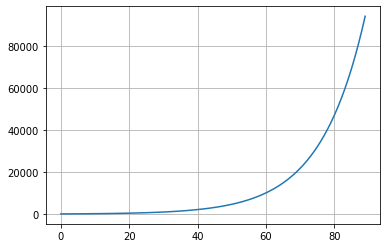
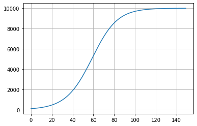
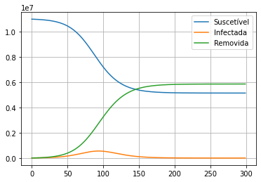
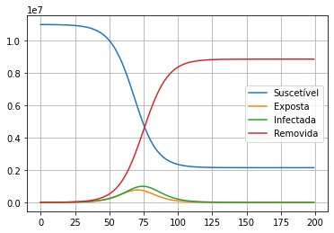

# Sejam bem-vindos.
Grupo de estudo Python - COVID-19

# Modelos discretos

# Crescimento exponencial

Seja $N_k$ uma determinada quantidade no dia $k$ para $k=0,1,2,\ldots$

O número $N_k$ pode representar o número de pessoas infectadas por uma doença, o número de bactérias em uma colônia, o número de usuários em uma rede social etc.

$N_0$ é o número no dia 0 (início); $N_1$, no dia 1; $N_2$ no dia 2.

No modelo exponencial, supomos que a taxa de crescimento é proporcial ao tamanho da polução $N_k$, isto é:
$$N_{k+1} = \underbrace{N_k}_{\tiny\hbox{Dia anterior}} + \underbrace{cN_k}_{\tiny\hbox{quantidade adicional}}.$$
Aqui $c$ é uma constante de proporcionalidade.
Observe que:
$$N_{k+1} = (1+c)N_k.$$

Complementamos este problema com a quantidade no dia $k=0$, isto é, $N_0$.

Veja mais detalhes em:
* https://pt.wikipedia.org/wiki/Crescimento_exponencial

* Obs: A solução deste problema é $N_k=N_0(1+c)^k$ e daí o nome crescimento exponencial, mas vamos proceder com o cálculo dia por dia.


```python
import numpy as np
import matplotlib.pyplot as plt

dias_a_simular = 90
constante = 0.08  # 8% ao dia
quantidade_inicial = 100

N = np.zeros(dias_a_simular) #Inicia array do np
N[0] = quantidade_inicial

for k in range(0, dias_a_simular-1):
    N[k+1] = (1+constante) * N[k]

fig, ax = plt.subplots(1, 1)

ax.plot(range(dias_a_simular), N)
ax.grid(True)
# ax.set_yscale('log') # Escala log?
fig.patch.set_facecolor('white')
plt.show()
```
> 


# Crescimento sigmóide

Seja $N_k$ uma determinada quantidade no dia $k$ para $k=0,1,2,\ldots$

Neste modelo, supomos que a taxa de crescimento é proporcional ao tamanho da polução $N_k$ e também à disponibilidade de recursos. Os recursos são limitados disputados pelos indivíduos, de forma que o crescimento diária é dado por:
$$N_{k+1}-N_k = c N_k (R-N_k).$$
Aqui $R$ é capacidade do ambiente. Se $N_k>R$, o crescimento é negativo, isto é, o ambiente não suporta tal quantidade de indivíduos.

Aqui $c$ é uma constante de proporcionalidade.
Observe que:
$$N_{k+1} = N_k +cN_k\left(R-N_k\right).$$

Complementamos este problema com a quantidade no dia $k=0$, isto é, $N_0$.

* Obs: O acréscimo no primeiro dia é:
$$N_1-N_0=cN_0(R-N_0),$$
portanto, o acréscimo relativo é dado por:
$$\frac{N_1-N_0}{N_0}=c(R-N_0),$$

Veja mais detalhes em:
* https://pt.wikipedia.org/wiki/Fun%C3%A7%C3%A3o_log%C3%ADstica

```python
import numpy as np
import matplotlib.pyplot as plt

dias_a_simular = 150
quantidade_inicial = 100
R = 10_000
constante = 0.08/(R - quantidade_inicial)  # 8% ao dia no primeiro dia

N = np.zeros(dias_a_simular)
N[0] = quantidade_inicial

for k in range(0, dias_a_simular-1):
    N[k+1] = N[k] * (1 + constante*(R-N[k]))

fig, ax = plt.subplots(1, 1)

ax.plot(range(dias_a_simular), N)
ax.grid(True)
# ax.set_yscale('log') # Escala log?
fig.patch.set_facecolor('white')
plt.show()
```
> 


# Modelo SIR

O SIR é um modelo simples para descrever o crescimento de doenças infecciosas. Ele divide a polução em três clases (compartimentos):
1. Suscetíveis: Pessoas não imunizadas e passíveis de contrair a doença. O tamanho desta população no dia $k$ é $S_k$.
2. Infectados: Pessoas infectadas e passíveis de transmitir a doença para pessoas suscetíveis. O tamanho desta população no dia $k$ é $I_k$.
3. Removidos: Pessoas que contraíram a doença e se recuperaram e pessoas que morreram. Estas pessoas não contraem nem transmitem a doença. O tamanho desta população no dia $k$ é $R_k$.

* Obs: Neste modelos, todos os infectados são infecciosos.

O fluxo é o seguinte:
$$\mathcal{S} \rightarrow  \mathcal{I} \rightarrow \mathcal{R}$$

O modelo pressupõe que o número de novos casos é proporcional ao tamanho da população suscetível e ao tamanho da população infectada:
$$\hbox{Novos casos do dia k} = \frac{\beta}{N}S_k I_k.$$
Aqui $N$ é o tamanho inicial da população de suscetíveis e $\beta$ é uma constante relacionada com a probabilidade de transmissão da doença quando duas pessoas se encontram.

A cada dia uma certa quantidade de pessoas é retirada da polução da infectados, seja porque se curou, seja porque morreu:
$$\hbox{Removidos no dia k} = \gamma I_k.$$
A constante $\gamma$ é o inverso do tempo médio de duração da doença. Se a doença dura em média 10 dias, então a cada dia 1/10 dos infectados são removidos.

Assim temos:
$$
\begin{align}
S_{k+1}&=S_{k} - \frac{\beta}{N}S_k I_k \\[0.2cm]
I_{k+1}&=I_{k} + \frac{\beta}{N}S_k I_k - \gamma I_k\\[0.2cm]
R_{k+1}&=R_{k} + \gamma I_k
\end{align}
$$

* Obs: Eu desprezei a natalidade e mortalidade por outras causas neste modelo.

* Mais informações: https://en.wikipedia.org/wiki/Compartmental_models_in_epidemiology#The_SIR_model

* Obs. No primeiro dia, temos:
$$\frac{I_1-I_0}{I_0} =\frac{\beta}{N}S_0-\gamma=\beta-\gamma$$

$$
\begin{align}
I_{k+1}-I_{k}&=  \left(\frac{\beta}{N}S_k - \gamma\right) I_k\\[0.2cm]
\end{align}
$$
```python
import numpy as np
import matplotlib.pyplot as plt

dias_a_simular = 300
S = np.zeros(dias_a_simular)
I = np.zeros(dias_a_simular)
R = np.zeros(dias_a_simular)

N = 11_000_000
S[0] = N             # Tamanho inicial da população suscetível
I[0] = 10_000        # Tamanho inicial da população infectada
R[0] = 0             # Tamanho inicial da população removida

gamma = 1/7          # Taxa de remoção ao dia
beta = gamma + 0.06   # gamma + crescimento percentual diário para N=S

for k in range(dias_a_simular-1):
    novos_casos = beta * S[k]/N * I[k]
    removidos = gamma * I[k]
    S[k+1] = S[k] - novos_casos
    I[k+1] = I[k] + novos_casos - removidos
    R[k+1] = R[k] + removidos
#    if S[k+1] < 0.02 * S[0]:
#        break


max_infectados = np.max(I)
data_max = np.where(I == max_infectados)[0][0]

max_infectados = int(round(max_infectados))

fig, ax = plt.subplots(1, 1)

ax.plot(S[:k+2])
ax.plot(I[:k+2])
ax.plot(R[:k+2])
ax.legend(['Suscetível', 'Infectada', 'Removida'])

ax.grid(True)
# ax.set_yscale('log') # Escala log?
fig.patch.set_facecolor('white')

plt.show();
print("I Máximo = {:,} em {} dias".format(max_infectados, data_max).replace(',', '.'))
print("Removidos ao final = ", R[-1]/S[0]*100)
print("Suscetíveis =", S[-1]/S[0]*100)
```
> 


# Modelo SEIR

O SEIR é uma aprimoramento do modelo SIR. Ele divide a população dos infectados em duas parcelas: aqueles que ainda não são infecciosos e e são chamados de expostos e aqueles que já são infecciosos.

Portanto, o modelos SEIR divide a polução em quatro compartimentos:
1. Suscetíveis: Pessoas não imunizadas e passíveis de contrair a doença. O tamanho desta população no dia $k$ é $S_k$.
2. Expostos: Pessoas infectadas que ainda não transmitem a doença. O tamanho desta população no dia $k$ é $E_k$.
2. Infecciosos: Pessoas infectadas e passíveis de transmitir a doença para pessoas suscetíveis. O tamanho desta população no dia $k$ é $I_k$.
3. Removidos: Pessoas que contraíram a doença e se recuperaram e pessoas que morreram. Estas pessoas não contraem nem transmitem a doença.


O fluxo é o seguinte:
$$\mathcal{S} \rightarrow \mathcal{E} \rightarrow \mathcal{I} \rightarrow \mathcal{R}$$

Novamente, o modelo pressupõe que o número de novos casos é proporcional ao tamanho da população suscetível e ao tamanho da população infectada:
$$\begin{align}
\# (\mathcal{S}\rightarrow \mathcal{E}) &= \frac{\beta}{N}S_k I_k,\\[0.2cm]
\# (\mathcal{E}\rightarrow \mathcal{I}) &= \frac{1}{T_E} E_k,\\[0.2cm]
\# (\mathcal{I}\rightarrow \mathcal{R}) &= \gamma I_k.
\end{align}
$$
Aqui $T_E$ é o tempo médio para um exposto evoluir para infecciso. Para o COVID-19 é em torno de 5 dias.

Assim temos:
$$
\begin{align}
S_{k+1}&=S_{k} - \frac{\beta}{N}S_k I_k \\[0.2cm]
E_{k+1}&=E_{k} + \frac{\beta}{N}S_k I_k - \frac{1}{T_E} E_k\\[0.2cm]
I_{k+1}&=I_{k} + \frac{1}{T_E} E_k - \gamma I_k\\[0.2cm]
R_{k+1}&=R_{k} + \gamma I_k
\end{align}
$$

Obs: Mais uma vez, eu desprezei a natalidade e mortalidade por outras causas neste modelo.

* Mais informações: https://en.wikipedia.org/wiki/Compartmental_models_in_epidemiology#The_SEIR_model

* Veja um modelo mais completo (para tuberculose) em https://www.ncbi.nlm.nih.gov/pmc/articles/PMC3330831/

```python
import numpy as np
import matplotlib.pyplot as plt

dias_a_simular = 200
S = np.zeros(dias_a_simular)
E = np.zeros(dias_a_simular)
I = np.zeros(dias_a_simular)
R = np.zeros(dias_a_simular)

N = 11_000_000
S[0] = N             # Tamanho inicial da população suscetível
E[0] = 1000             # Tamanho inicial da população exposta
I[0] = 1000             # Tamanho inicial da população infecciosa
R[0] = 0             # Tamanho inicial da população removida

gamma = 1/4          # Taxa de cura ao dia
T_E = 3              # Tempo médio em dias para evolução da população E para I
beta = 0.5

for k in range(dias_a_simular-1):
    novos_casos = beta * S[k]/N * I[k]
    E_para_I = E[k] / T_E
    curados = gamma * I[k]

    S[k+1] = S[k]  - novos_casos
    E[k+1] = E[k] + novos_casos - E_para_I
    I[k+1] = I[k] + E_para_I - curados
    R[k+1] = R[k] + curados


max_infectados = np.max(I)
data_max = np.where(I == max_infectados)[0]

max_infectados = int(round(max_infectados))

fig, ax = plt.subplots(1, 1)

ax.plot(S[:k+2])
ax.plot(E[:k+2])
ax.plot(I[:k+2])
ax.plot(R[:k+2])
#ax.plot(I[:k+2]/E[:k+2])
ax.legend(['Suscetível', 'Exposta', 'Infectada', 'Removida'])


ax.grid(True)
#ax.set_yscale('log') # Escala log?
fig.patch.set_facecolor('white')

# ax.annotate(max_infectados, (data_max, max_infectados), (data_max, max_infectados+S[0]*.05))
plt.show()

print("I Máximo = {:,} em {} dias".format(max_infectados, data_max).replace(',', '.'))
```
> 
