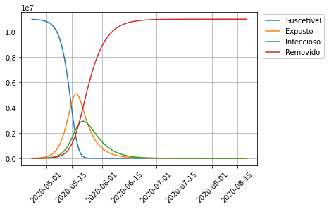

# Modelo SEIR discreto

O modelo SEIR  divide a população em quatro grupos: suscetíveis, expostos, infecciosos e removidos.

A população infectada é formada pelos expostos e infecciosos. Os expostos são os infectados que ainda não trasmitem a doença.

Portanto, o modelos SEIR divide a polução em quatro compartimentos:
1. Suscetíveis: Pessoas não imunizadas e passíveis de contrair a doença. O tamanho desta população no dia $k$ é $S_k$.
2. Expostos: Pessoas infectadas que ainda não transmitem a doença. O tamanho desta população no dia $k$ é $E_k$.
2. Infecciosos: Pessoas infectadas e passíveis de transmitir a doença para pessoas suscetíveis. O tamanho desta população no dia $k$ é $I_k$.
3. Removidos: Pessoas que contraíram a doença e se recuperaram ou morreram. Estas pessoas não contraem nem transmitem a doença.


O fluxo é o seguinte:
$$\mathcal{S} \rightarrow \mathcal{E} \rightarrow \mathcal{I} \rightarrow \mathcal{R}$$

O modelo pressupõe que o número de novos casos é proporcional ao tamanho da população suscetível e ao tamanho da população infectada:
$$\begin{align}
\# (\mathcal{S}\rightarrow \mathcal{E}) &= \frac{\beta}{N}S_k I_k,\\[0.2cm]
\# (\mathcal{E}\rightarrow \mathcal{I}) &= \frac{1}{T_E} E_k,\\[0.2cm]
\# (\mathcal{I}\rightarrow \mathcal{R}) &= \frac{1}{T_I} I_k.
\end{align}
$$
Aqui $T_E$ é o tempo médio para um exposto evoluir para infecciso, e $T_I$ é o tempo médio para um infeccioso evoluir para a população removida. $T_I$ é também chamado de $\gamma$.

Assim temos:
$$
\begin{align}
S_{k+1}&=S_{k} - \frac{\beta}{N}S_k I_k \\[0.2cm]
E_{k+1}&=E_{k} + \frac{\beta}{N}S_k I_k - \frac{1}{T_E} E_k\\[0.2cm]
I_{k+1}&=I_{k} + \frac{1}{T_E} E_k - \frac{1}{T_I} I_k\\[0.2cm]
R_{k+1}&=R_{k} + \frac{1}{T_I} I_k
\end{align}
$$

Obs: A natalidade e mortalidade por outras causas neste modelo foram desprezadas, o que é uma hipótese razoável períodos de tempo muito inferiores à dinâmica vital.

* Mais informações: https://en.wikipedia.org/wiki/Compartmental_models_in_epidemiology#The_SEIR_model


# O modelo EI

Ao longo de períodos curtos suficientes para considerar $S(t)$ e $\beta(t)$ constantes, como no início da infecção, temos o seguinte subsistema linear:

$$
\begin{align}
E_{k+1}&=E_{k} + \frac{\beta}{N}S I_k - \frac{1}{T_E} E_k\\[0.2cm]
I_{k+1}&=I_{k} + \frac{1}{T_E} E_k - \frac{1}{T_I} I_k\\[0.2cm]
\end{align}
$$
Podemos reescrever este sistema na forma matricial:


$$\left[
    \begin{array}{c}
        E_{n+1}\\
        I_{n+1}
    \end{array}
\right]=
\left[\begin{array}{c}
        1-\frac{1}{T_E}& \beta \frac{S}{N}\\
        \frac{1}{T_E}&1-\frac{1}{T_I}
    \end{array}
\right]
\left[
    \begin{array}{c}
        E_n\\
        I_n
    \end{array}
\right]
$$

Esta matriz tem dois autovalores reais e distintos dados por:

$\lambda_{1,2}=1+\frac{1}{2}\left(\frac{1}{T_E}+\frac{1}{T_I}\right)\pm \frac{1}{2}\sqrt{\left(\frac{1}{T_E}-\frac{1}{T_I}\right)^2+\frac{4\beta}{T_E}\frac{S}{N}}$.

Vemos também que:
* Se $\beta \frac{S}{N}<\frac{1}{T_I}$, então $\lambda_2<\lambda_1<1$,
* Se $\beta \frac{S}{N}=\frac{1}{T_I}$, então $\lambda_2<\lambda_1=1$,
* Se $\beta \frac{S}{N}>\frac{1}{T_I}$, então $\lambda_2<0$ e $\lambda_1>1$.


Além disso podemos isolar o termo $\beta \frac{S}{N}$:
$$\beta \frac{S}{N} = \frac{1}{T_I}\left[1+(\lambda_1-1)(T_I+T_E)+(\lambda_1-1)^2T_ET_I\right]$$

A forma geral da solução do problema EI é dada por:
$$I_n = A\lambda_1^n+B\lambda_2^n~~~~E_n = C\lambda_1^n+D\lambda_2^n.$$

Se estamos no caso $|\lambda_1|<1$ e $\lambda_2>0$, rapidamente vale:
$$\frac{I_n}{E_n} = \frac{A\lambda_1^n+B\lambda_2^n}{C\lambda_1^n+D\lambda_2^n}\approx \frac{A}{C}$$
e
$$\frac{I_{n+1}}{I_{n}} = \frac{A\lambda_1^{n+1}+B\lambda_2^{n+1}}{A\lambda_1^n+B\lambda_2^n}\approx \lambda_1$$


# Valores medidos
Olhando as séries temporais para Brasil e outros países no início da infecção, encontramos:
*  $\frac{I_{n+1}}{I_n} \approx 1.35 \Longrightarrow \beta \frac{S}{N}\approx 0.93$

Depois das medidas de isolamento, vemos valores em torno de $K=1.15$.

# Autofunção associada ao autovalor dominante do modelo EI
$\left[\begin{array}{c}
E(t)\\
I(t)
\end{array}\right] =
\left[\begin{array}{c}
T_E\left(\lambda_1-1+\frac{1}{T_I}\right)\\
1
\end{array}\right] e^{\lambda_1 t} $.


```python
#@title Entre com os dados de simulação:
tempo_na_fase_de_exposição =  7#@param {type:"number"}
tempo_na_fase_infeciosa =  5#@param {type:"number"}
taxa_de_crescimento_inicial = 1.35 #@param {type:"number"}
população_suscetível_inicial = 11000000 #@param {type:"number"}
população_exposta_inicial =  5000#@param {type:"number"}
população_infecciosa_inicial = 5000 #@param {type:"number"}
data_inicial = '2020-04-23' #@param {type:"date"}
dias_a_simular =  120#@param {type:"number"}
escala_log = False#@param {type:"boolean"}
plotar_suscetiveis = True#@param {type:"boolean"}
plotar_expostos = True#@param {type:"boolean"}
plotar_infecciosos = True#@param {type:"boolean"}
plotar_removidos = True#@param {type:"boolean"}
fazer_download_da_imagem = True#@param {type:"boolean"}

####
## Principal
####
import numpy as np
import matplotlib.pyplot as plt
import datetime
import matplotlib.dates as mdates

# Cria lista de datas
data_inicial = datetime.datetime.strptime(data_inicial, '%Y-%m-%d')
datas = [data_inicial + datetime.timedelta(days=t) for t in range(0, dias_a_simular)]

# Usa nomes de variáveis mais amigáveis
lambda_1 = taxa_de_crescimento_inicial
T_I = tempo_na_fase_infeciosa
T_E = tempo_na_fase_de_exposição
beta = (1 + (lambda_1-1)*(T_I + T_E) + (lambda_1-1)**2*T_E*T_I)/T_I
N = população_suscetível_inicial


# Inicializa variáveis
S = np.zeros(dias_a_simular)
E = np.zeros(dias_a_simular)
I = np.zeros(dias_a_simular)
R = np.zeros(dias_a_simular)

S[0] = população_suscetível_inicial          
E[0] = população_exposta_inicial             
I[0] = população_infecciosa_inicial             
# R[0] =          # Tamanho inicial da população removida

# Executa recursão

for k in range(dias_a_simular-1):
    novos_casos = beta * S[k]/N * I[k]
    E_para_I = E[k] / T_E
    removidos =  I[k] / T_I

    S[k+1] = S[k]  - novos_casos
    E[k+1] = E[k] + novos_casos - E_para_I
    I[k+1] = I[k] + E_para_I - removidos
    R[k+1] = R[k] + removidos


# Calcula o número máximo de infecciosos
max_infectados = np.max(I)
data_max = np.where(I == max_infectados)[0]

max_infectados = int(round(max_infectados))

fig, ax = plt.subplots(1, 1)


legenda = []
if plotar_suscetiveis: ax.plot(datas, S[:k+2]); legenda.append('Suscetível')
if plotar_expostos: ax.plot(datas, E[:k+2]); legenda.append('Exposto')
if plotar_infecciosos: ax.plot(datas, I[:k+2]); legenda.append('Infeccioso')
if plotar_removidos: ax.plot(datas, R[:k+2]); legenda.append('Removido')

ax.legend(legenda, loc = 'upper right',
          bbox_to_anchor=(1.3, 1.01),
          ncol=1, fancybox=True,
          framealpha=1, shadow=False)

# Ajusta ticks a 45 graus
plt.xticks(rotation=45)

# Adiciona grade ao gráfico
ax.grid(True)
if escala_log:
    ax.set_yscale('log')

if fazer_download_da_imagem:
    from google.colab import files
    arquivo = 'evolucao_SEIR.png'
    plt.savefig(arquivo, dpi=300)
    files.download(arquivo)
else:
    fig.set_facecolor('white')
    plt.show()
print("I Máximo = {:,} em {} dias".format(max_infectados, data_max).replace(',', '.'))
```
> 
