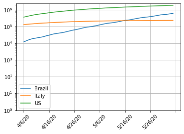

# Sejam bem-vindos.
# Grupo de estudos Python - Covid19

* Funções definidas pelo usuário, lambda.
* Loop while


# Funções definidas pelo usuário.

* Da mesma forma como existem as funções len(), max() e min(), é possível criar definir outras funções.
* Funções permitem dividir o código em partes funcionais, tornando mais claro e conciso.  

```python
def minha_primeira_funcao(x):           # Você deve colocar um ':' ao final.
    print("Recebi o argumento x =", x)  # Indentar
    return x**2     
                                        # Remover indentação no final do bloco
print(minha_primeira_funcao(10))
```
> Recebi o argumento x = 10  
> 100

```python
# Uma função não precisa retornar valores

def minha_segunda_funcao(x):           # Você deve colocar um ':' ao final.
    print("Recebi o argumento x =", x) # Indentar   

minha_segunda_funcao(10) # não retorna nada
# print(minha_segunda_funcao(10))
```
> Recebi o argumento x = 10

```python
# Uma função pode não receber argumentos

def sem_argumentos():
    print('passei por aqui.')
    return 3

print(sem_argumentos())
```
> passei por aqui.  
> 3

```python
# Uma função pode receber muitos argumentos

def muitos_argumentos(x, y, z):
    return x*y + z  

print(muitos_argumentos(1, 2, 3))
```
> 5

```python
# Pode-se colocar valores padrão para argumentos
def funcao(x=10, y=20, z=3):
    return x*y + z

print(funcao())     # Implícito funcao(10, 20, 3)
print(funcao(x=2, y=5)) # Implícito funcao(2, 5, 3)
print(funcao(z=5))  # Implícito funcao(10, 20, 5)
```
> 203  
> 13  
> 205

```python
# Você pode misturar, mas os valores padrão não podem vir antes.
def funcao(x, y=20, z=3):
    return x*y + z

print(funcao(10))       # Implícito funcao(10, 20, 3)
print(funcao(2, 5))     # Implícito funcao(2, 5, 3)
print(funcao(10, z=5))  # Implícito funcao(10, 20, 5)
# print(funcao())       # Erro
```
> 203  
> 13  
> 205

```python
# Uma função tem acesso às variáveis definidas no contexto de onde foi chamada

def minha_funcao():
    return x

x = 7

print(minha_funcao())
```
> 7

```python
# Mas variáveis criadas localmente são apenas locais e não se propagam.
# Atenção, se você atribui valor a uma variável dentro de uma função,
# ela se torna local.
def minha_funcao():
    # x = 2
    y = 3
    return x

x = 5
print(minha_funcao())
print(x)
# print(y) # erro
```
> 5  
> 5

```python
# Funções podem conter código estruturado

def fatorial(n):
    fat = 1
    for i in range(1, n+1): # 1, 2, 3, ..., n
        fat *= i

    return fat

print("5! =", fatorial(5))
```
> 5! = 120

```python
# Funções podem ter mais de um return

def testa(x):
    if x<10:
        return "é menor que 10."    # Acaba execução da função
    if x==10:
        return "é igual a 10."
    return "é maior que 10."

for i in range(1, 20, 3):
    print(i, testa(i))
```
> 1 é menor que 10.  
> 4 é menor que 10.  
> 7 é menor que 10.  
> 10 é igual a 10.  
> 13 é maior que 10.  
> 16 é maior que 10.  
> 19 é maior que 10.

```python
# Funções podem chamar outras funções.
import numpy as np

def f(x):
    return x**2 + 1

def g(x):
    return f(x) + 1 + np.sin(x)

print(g(2))
```
> 6.909297426825682

```python
# Funções podem chamar a si mesmas.
# Cuidado com recursões!

def fatorial (n):
    assert n>=0, 'n deve ser um inteiro não negativo.'
    if n==0 or n==1:
        return 1
    # print("Recebi ", n)
    return n*fatorial(n-1) #n! = n(n-1)(n-2)... 5! = 5.4.3.2.1 = 5.4!, n!  = n.(n-1)!

n = 5
print(n, "! =", fatorial(n))
```
> 5 ! = 120


# Funções lambda
* Uma forma de definir uma função "em linha".
* Funções lambda podem ser anônimas.

```python
# Exemplo

f = lambda x : x**2 + 1   # Define f(x) = x**2 + 1

print(f(3))

def f(x):
    return x**2 + 1
```
> 10

```python
# Outro exemplo com dois parâmetros
f = lambda x, y : x * y   # Define f(x,y) = x*y

print(f(10,2))
```
> 20

```python
# Função anônima (sem nome)

print((lambda x, y : x * y)(2,3))  
# Define a função de forma anônima e calcula em (2,3)
```
> 6

```python
# Aplicação: usando função lambda ao passar uma função como parâmetro.

nomes = ['Ana Maria', 'Daniel', 'Luís', 'Carla', 'Mariana']

# Coloca em ordem lexicográfica
nomes.sort()
print(nomes)

# Coloca em ordem de comprimento
nomes.sort(key=len) # A chave é a função usada para ordenar.
print(nomes)

# Coloca em ordem da contagem de letras 'a' ou 'A'
def chave(nome):
    return nome.count('a') + nome.count('A')

nomes.sort(key=chave)
print(nomes)

# Coloca em ordem de número de letras 'a' ou 'A' usando uma função lambda anônima
nomes.sort(key=lambda nome: nome.count('a') + nome.count('A'))
print(nomes)
```
> ['Ana Maria', 'Carla', 'Daniel', 'Luís', 'Mariana']  
> ['Luís', 'Carla', 'Daniel', 'Mariana', 'Ana Maria']  
> ['Luís', 'Daniel', 'Carla', 'Mariana', 'Ana Maria']  
> ['Luís', 'Daniel', 'Carla', 'Mariana', 'Ana Maria']


# Aplicações
* Quebrar o código em pedaços funcionais

```python
import urllib       # https://docs.python.org/3.8/library/urllib.html
import csv          # https://docs.python.org/3.8/library/csv.html
import io           # https://docs.python.org/3.8/library/io.html
import numpy as np
import matplotlib.pyplot as plt
import matplotlib.ticker as ticker

# Define uma função para buscar dados de um pais
def dados_pais(pais):
# O pais PODE estar listado dividido em regiões.
    numero_de_casos = np.zeros(len(lista[0]) - 4)
    for linha in lista:
        if linha[1] == pais:
            numero_de_casos += np.array(linha[4:], dtype='int')
    return numero_de_casos


#######################
### Principal
#######################

# https://github.com/CSSEGISandData/COVID-19/blob/master/csse_covid_19_data/csse_covid_19_time_series/time_series_covid19_confirmed_global.csv
url = 'https://raw.githubusercontent.com/CSSEGISandData/COVID-19/master/csse_covid_19_data/csse_covid_19_time_series/time_series_covid19_confirmed_global.csv'
lista = list(csv.reader(io.StringIO(urllib.request.urlopen(url).read().decode('utf-8'))))
datas = lista[0][4:]

dias_a_plotar = 60
datas = datas[-dias_a_plotar:]

fig, ax = plt.subplots(1, 1)
paises = ['Brazil', 'Italy', 'US']

for pais in paises:
    numero_de_casos = dados_pais(pais)[-dias_a_plotar:]
    ax.plot(datas, numero_de_casos)

# Legenda
ax.legend(paises)

# Ajusta ticks a 45 graus
plt.xticks(rotation=45)
ax.xaxis.set_major_locator(ticker.AutoLocator())

ax.set_yscale('log')
ax.set_ylim(bottom=1)
ax.grid(True)
fig.patch.set_facecolor('white')
plt.show()
```
> 


# Laço do tipo while (enquanto)
* Executa repetidas vez um bloco código enquanto uma dada condição é verdadeira

```python
x = 0
while x<10:   # Repete enquanto x<10
    print(x)
    x += 2
```
> 0  
> 2  
> 4  
> 6  
> 8


```python
import scipy as sp
#from scipy import random
alea = sp.random.default_rng() # Incializa gerador de números aleatórios

print(alea.integers(100)) # Distribuição uniforme
# dir(alea)
```
> 17

```python
x = 0
j = 0
while x<95:
    x = alea.integers(100)
    print(j, x, sep=':\t')
    j += 1
```
>

```python
s = ''
while s != 'a':
    s=input("Entre com uma palavra: ")
```

```python
#@title Testa se n é primo
import numpy as np

def teste_de_primalidade(n): # um número >1 é primo se for divisível apenas por 1 e por si mesmo
    raiz = int(np.sqrt(n))

    if n == 1:
         return False
    if n == 2:
        return True
    if n%2 == 0:        # % = resto da divisão inteira
        return False

    k = 3
    while (k<=raiz):  # testa divisibilidade por 3, 5, 7, 9, 11 etc
        if n%k == 0:
            return False
        k += 2
    return True

n = 0
itens_a_contar = 30
for i in range(1, itens_a_contar):
    if teste_de_primalidade(i):
        print(i, "é primo.")
        n += 1

print('Existem', n, 'primos até', itens_a_contar, '.')
```
> 2 é primo.  
> 3 é primo.  
> 5 é primo.  
> 7 é primo.  
> 11 é primo.  
> 13 é primo.  
> 17 é primo.  
> 19 é primo.  
> 23 é primo.  
> 29 é primo.  
> Existem 10 primos até 30 .

```python
# Pode-se colocar um else

n = 2
while n<4:  
    print(n, 'é menor que 4.')
    n += 1
else:  # Senão
    print(n, 'não é menor que 4.') # é executado quando a condição é falsa
```
> 2 é menor que 4.  
> 3 é menor que 4.  
> 4 não é menor que 4.

```python
# break evita o else
n = 1
while n<4:
    print(n, 'é menor que 4.')
    n += 1
    if n == 3:
        break
else:
    print(n, 'não é menor que 4.')
```
> 1 é menor que 4.  
> 2 é menor que 4.


# Exemplo
Considere o problema de calcular de calcular a soma de n termos a seguir:
$$H_n = \frac{1}{1} + \frac{1}{2}+ \frac{1}{3}+\frac{1}{4}\cdots + \frac{1}{n}. $$

* Escreva uma função que recebe n e calcula $H_n$.
* Escreva uma função que recebe h e encontra o primeiro n tal que $H_n\geq h$.

```python
def funcao_H(n):
    return sum(1/i for i in range(1, n+1))

def funcao_inv_H(h):
    S = 0
    n = 0
    while S<h:
        n += 1
        S += 1/n
    return n

print(funcao_H(1000000))
print(funcao_inv_H(10))
```
> 14.392726722864989
> 12367

```python
# Paradoxo?

x = 1.0
n = 0
while (x+1 > x):  # Loop sem fim?
    x *= 2
    n += 1

print(n)
```
> 53

```python
print(1.000_000_000_000_000_1 == 1)
```
> True
