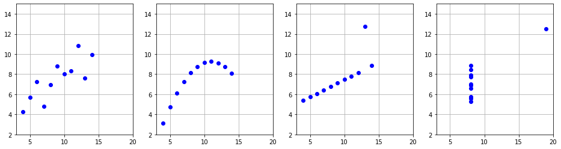
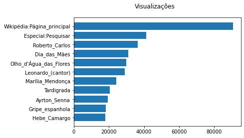

# Sejam bem-vindos.

# Grupo de estudos Python - Covid19

* Leitura e gravação de arquivos: csv, json etc.

```python
# Considere o sequinte extrato do poema Timidez de Cecília Meireles:
texto = \
"""
      Timidez

Basta-me um pequeno gesto,
feito de longe e de leve,
para que venhas comigo
e eu para sempre te leve...

- mas só esse eu não farei."""

print(texto)
```
>   
>    Timidez  
>         
> Basta-me um pequeno gesto,  
> feito de longe e de leve,  
> para que venhas comigo  
> e eu para sempre te leve...  
>   
> \- mas só esse eu não farei.

```python
# Abre arquivo
arquivo = open('timidez.txt', 'w') # r=read, w=write, a=append, r+ = read and write

# Grava conteúdo
arquivo.write(texto)

# Fecha arquivo
arquivo.close()
```

```python
# O arquivo foi criado no diretório local (máquina virtual)
import os
print(os.listdir(os.curdir))
```
> ['.config', 'timidez.txt', 'sample_data']

```python
# Você pode baixar o arquivo
from google.colab import files
files.download('timidez.txt')
```
> [timidez.txt](Arquivos/timidez.txt)

```python
# Leitura

arquivo = open('timidez.txt', 'r')
conteudo = arquivo.read()
arquivo.close()
print(conteudo)
```
>   
>    Timidez  
>         
> Basta-me um pequeno gesto,  
> feito de longe e de leve,  
> para que venhas comigo  
> e eu para sempre te leve...  
>   
> \- mas só esse eu não farei.

```python
# Modo append
texto = \
"""

Uma palavra caída
das montanhas dos instantes
desmancha todos os mares
e une as terras mais distantes...

- palavra que não direi."""

arquivo = open('timidez.txt', 'a')
arquivo.write(texto)
arquivo.close()

# Leia novamente o texto na célula acima.
```

```python
# A cláusula with

with open('timidez.txt', 'r') as arquivo:
    conteudo = arquivo.read()
# Fecha automaticamente, impede que o programador esqueça de fechar

print(conteudo)
```
>   
>   Timidez  
>      
> Basta-me um pequeno gesto,  
> feito de longe e de leve,  
> para que venhas comigo  
> e eu para sempre te leve...  
>   
> \- mas só esse eu não farei.  
>   
> Uma palavra caída  
> das montanhas dos instantes  
> desmancha todos os mares  
> e une as terras mais distantes...  
>   
> \- palavra que não direi.

```python
# Lendo linhas

with open('timidez.txt', 'r') as arquivo:
    for j, linha in enumerate(arquivo):
        print(j, linha, end='')

# Tente usar enumerate e end=''
```
> 0   
> 1       Timidez  
> 2       
> 3 Basta-me um pequeno gesto,  
> 4 feito de longe e de leve,  
> 5 para que venhas comigo  
> 6 e eu para sempre te leve...  
> 7   
> 8 - mas só esse eu não farei.  
> 9   
> 10 Uma palavra caída  
> 11 das montanhas dos instantes  
> 12 desmancha todos os mares  
> 13 e une as terras mais distantes...  
> 14   
> 15 - palavra que não direi.

```python
# Lendo linhas

with open('timidez.txt', 'r') as arquivo:
    linhas = arquivo.readlines()

print(linhas)
```
> ['\n', '      Timidez\n', '      \n', 'Basta-me um pequeno gesto,\n', 'feito de longe e de leve,\n', 'para que venhas comigo\n', 'e eu para sempre te leve...\n', '\n', '- mas só esse eu não farei.\n', '\n', 'Uma palavra caída\n', 'das montanhas dos instantes\n', 'desmancha todos os mares\n', 'e une as terras mais distantes...\n', '\n', '- palavra que não direi.']

```python
# É possível ler de uma url
import urllib
url = 'https://raw.githubusercontent.com/fazedo/testes/master/timidez.txt'
with urllib.request.urlopen(url) as req:
    conteudo_cru = req.read()

#print(conteudo_cru)
#print(req.info())
print(conteudo_cru.decode('utf-8'))
```
> Timidez  
>   
> Basta-me um pequeno gesto,  
> feito de longe e de leve,  
> para que venhas comigo  
> e eu para sempre te leve...  
>   
> — mas só esse eu não farei.  
>   
> Uma palavra caída  
> das montanhas dos instantes  
> desmancha todos os mares  
> e une as terras mais distantes...  
>   
> — palavra que não direi.  
>   
> Para que tu me adivinhes,  
> entre os ventos taciturnos,  
> apago meus pensamentos,  
> ponho vestidos noturnos,  
>   
> — que amargamente inventei.  
>   
> E, enquanto não me descobres,  
> os mundos vão navegando  
> nos ares certos do tempo,  
> até não se sabe quando...  
>   
> — e um dia me acabarei.  
>   
> Cecília Meireles


# Codificação de caracteres

* https://docs.python.org/3/howto/unicode.html
* Existem muitos caracteres diferentes para atender a necessidades diferentes, exemplo: ÑͼΣᵫἇ✎编程🌞😉.
* Python prioriza o unicode. https://docs.python.org/3/howto/unicode.html

```python
string = 'Aé ÑͼΣᵫἇ✎编程🌞😉'
for c in string:
    utf_string = c.encode('utf-8')
    print(c, ord(c), hex(ord(c)), utf_string, sep='\t', )
```
> A	65	0x41	b'A'  
> é	233	0xe9	b'\xc3\xa9'  
>  	32	0x20	b' '  
> Ñ	209	0xd1	b'\xc3\x91'  
> ͼ	892	0x37c	b'\xcd\xbc'  
> Σ	931	0x3a3	b'\xce\xa3'  
> ᵫ	7531	0x1d6b	b'\xe1\xb5\xab'  
> ἇ	7943	0x1f07	b'\xe1\xbc\x87'  
> ✎	9998	0x270e	b'\xe2\x9c\x8e'  
> 编	32534	0x7f16	b'\xe7\xbc\x96'  
> 程	31243	0x7a0b	b'\xe7\xa8\x8b'  
> 🌞	127774	0x1f31e	b'\xf0\x9f\x8c\x9e'  
> 😉	128521	0x1f609	b'\xf0\x9f\x98\x89'

```python
# Codecs
# https://docs.python.org/3/library/codecs.html

string = 'Época'
print(string.encode('latin-1'))     # mesmo que iso-8859-1
print(string.encode('utf-8'))
```
> b'\xc9poca'  
> b'\xc3\x89poca'

```python
# O que acontece se usamos o codec errado?

string = 'Ágora (do gr. ἀγείρω) é uma reunião. Às vezes, uma praça onde\
 se reuniam os cidadãos.'
utf_bstring = string.encode('utf-8')

print(string)
print(utf_bstring)
print(utf_bstring.decode('utf-8'))
print(utf_bstring.decode('latin-1'))
```
> Ágora (do gr. ἀγείρω) é uma reunião. Às vezes, uma praça onde se reuniam os cidadãos.  
> b'\xc3\x81gora (do gr. \xe1\xbc\x80\xce\xb3\xce\xb5\xce\xaf\xcf\x81\xcf\x89) \xc3\xa9 uma reuni\xc3\xa3o. \xc3\x80s vezes, uma pra\xc3\xa7a onde se reuniam os cidad\xc3\xa3os.'  
> Ágora (do gr. ἀγείρω) é uma reunião. Às vezes, uma praça onde se reuniam os cidadãos.  
> Ágora (do gr. ἀγείρω) é uma reunião. Às vezes, uma praça onde se reuniam os cidadãos.


# Arquivos em formato PDF
* É possível abrir arquivos em formato PDF, porém diversas podem acontecer, como imagens, encodings etc.
* Existe o pacote pypdf2, que deve ser instalado.

```python
%pip install pypdf2
import PyPDF2
```
> Successfully installed pypdf2-1.26.0

```python
import urllib
import io

url = 'https://www.companhiadasletras.com.br/trechos/14608.pdf'
with urllib.request.urlopen(url) as req:
    conteudo_cru = req.read()

pdf = PyPDF2.PdfFileReader(io.BytesIO(conteudo_cru))
```

```python
texto = pdf.getPage(11).extractText()
print(pdf.numPages )
print(texto[:500])
```
> 30  
> ˙˛daqui jura ele tem um capeta em casa, miúdo satanazim, preso obrigado a ajudar   
> em toda ganância que executa; razão que o Simpilício se empresa em vias de   
> completar de rico. Apre, por isso dizem também que a besta pra ele rupêia, nega   
> de banda, não deixando, quando ele quer amontar– Superstição. Jisé Simpilício   
> e Aristides, mesmo estão se engordando, de assim não-ouvir ou ouvir. Ainda o   
> senhor estude: agora mesmo, nestes dias de época, tem gente porfalando que   
> o Diabo próprio parou, de pa


# Lendo conteúdo da Wikipédia
* Existe o pacote wikipedia, que deve ser instalado.
* Fácil de usar e traz dados analisados, como lista de categorias, seções etc.
* https://www.mediawiki.org/wiki/Manual:Pywikibot/

```python
%pip install pywikibot
config ="""mylang = 'pt'
usernames['wikipedia']['pt'] = ''

console_encoding = 'utf-8'"""

with open ('user-config.py', 'w') as user_config:
    user_config.write(config)

import pywikibot
```
> Successfully installed pywikibot-3.0.20200508  

```python
site = pywikibot.Site('pt')
# print(type(site), site)

pagina = pywikibot.Page(site, 'Porto Alegre')

texto = pagina.text
wiki_texto = pagina.get()
# print(wiki_texto[:1000])

categorias = [*pagina.categories()]  # Experimente interwiki, imagelinks
print(categorias)
# dir(categorias[0])

sessoes = pywikibot.textlib.extract_sections(texto)
# The returned tuple contains the text parsed into three parts:
# The first part is a string containing header part above the first heading.
# The last part is also a string containing footer part after the last section.
# The middle part is a list of tuples, each tuple containing a string with
# section heading and a string with section content.

# for i in sessoes[1][3]:
#       print(i)
```
> [Category('Categoria:!Artigos com dados desatualizados'), Category('Categoria:!Artigos destacados'), Category('Categoria:!CS1 manut: Língua não reconhecida'), Category('Categoria:!Imagem local idêntica à do Wikidata'), Category('Categoria:!Infobox com geocoordenadas'), Category('Categoria:!Nome de usuário do Twitter igual ao Wikidata'), Category('Categoria:!Predefinição Webarchive wayback links'), Category('Categoria:!Páginas com erro de uso da predefinição Fmtn'), Category('Categoria:!Páginas com mapas'), Category('Categoria:!Website oficial diferente no Wikidata e na Wikipedia'), Category('Categoria:Capitais do Brasil'), Category('Categoria:Municípios do Rio Grande do Sul'), Category('Categoria:Municípios históricos do Brasil'), Category('Categoria:Porto Alegre')]


# Dados (semi-) estruturados

```python
import csv

cabecalho = ['Estado', 'Populacao', 'Superfície']
dados = [['RS', 11_290_000, 281_748],
         ['SC',  6_727_000,  95_346],
         ['PR', 11_080_000, 199_315]]

with open('regiao_sul.csv', 'w') as arquivo:
    gravador = csv.writer(arquivo, delimiter=',', quotechar='"') # Experimente mudar os parâmetros
    gravador.writerow(cabecalho)
    for i in dados:
         gravador.writerow(i)
```

```python
# Podemos ler o .csv como texto

with open('regiao_sul.csv', 'r') as arquivo:
    conteudo = arquivo.read()

print(conteudo)
```
> Estado,Populacao,Superfície
> RS,11290000,281748
> SC,6727000,95346
> PR,11080000,199315

```python
# Podemos baixar o arquivo para nosso computador
from google.colab import files

files.download('regiao_sul.csv')
```
> [regiao_sul.csv](Arquivos/regiao_sul.csv)

```python
with open('regiao_sul.csv', 'r') as arquivo:
    iterador = csv.reader(arquivo, delimiter=',', quotechar="'") # itera sobre as linhas
    cabecalho = next(iterador)
    conteudo = [*iterador]

print(cabecalho)
print(conteudo)
```
> ['Estado', 'Populacao', 'Superfície']  
> [['RS', '11290000', '281748'], ['SC', '6727000', '95346'], ['PR', '11080000', '199315']]

```python
with open('regiao_sul.csv', 'r') as arquivo:
    iterador = csv.DictReader(arquivo, delimiter=',', quotechar="'") # itera sobre as linhas
    for i in iterador:
        # print(i)
        print(i['Estado'])
```
> RS  
> SC  
> PR

```python
with open('exemplo.csv', 'w') as arquivo: # Experimente usar append
    campos = ['Nome', 'Idade']
    manipulador = csv.DictWriter(arquivo, fieldnames=campos,\
                                 delimiter=',', quotechar='"') # mude o quotechar
    manipulador.writeheader()
    manipulador.writerow({'Nome':'Ana Maria', 'Idade':20})
    manipulador.writerow({'Nome':'Beatriz "Bia"', 'Idade':33})
```

```python
with open('exemplo.csv', 'r') as arquivo:
    conteudo = arquivo.read()

print(conteudo)
```
> Nome,Idade  
> Ana Maria,20  
> "Beatriz ""Bia""",33

```python
with open('exemplo_excel.csv', 'w') as arquivo:
    campos = ['Nome', 'Idade']
    manipulador = csv.DictWriter(arquivo, dialect=csv.excel_tab, fieldnames=campos)
    # Experimente outros dialetos
    # https://docs.python.org/3/library/csv.html
    manipulador.writeheader()
    manipulador.writerow({'Nome':'Ana Maria', 'Idade':20})
    manipulador.writerow({'Nome':'Beatriz "Bia"', 'Idade':33})
```

```python
with open('exemplo_excel.csv', 'r') as arquivo:
    conteudo = arquivo.read()

print(conteudo)
```
> Nome	Idade  
> Ana Maria	20  
> "Beatriz ""Bia"""	33

```python
# Analisando strings
import io
import csv

string = """Estado;Populacao;Superfície
RS;11290000;281748
SC;6727000;95346
PR;11080000;199315"""

arquivo = io.StringIO(string)

iterador = csv.reader(arquivo, delimiter=';')
cabecalho = next(iterador)
conteudo = [*iterador]
print(conteudo)
```
> [['RS', '


# Arquivos JSON
>  JSON (pronúncia ['dʒejzən], J-son em inglês), um acrônimo de JavaScript Object Notation, é um formato compacto, de padrão aberto independente, de troca de dados simples e rápida (parsing) entre sistemas, especificado por Douglas Crockford em 2000, que utiliza texto legível a humanos, no formato atributo-valor (natureza auto-descritiva).  

Wikimedia Foundation, 2020. Disponível em: <https://pt.wikipedia.org/w/index.php?title=JSON&oldid=58054010>. Acesso em: 16 abr. 2020.


* Gera texto legível por humano. O que ajuda na depuração.
* Você não se preocupa com formatação de dados. Multiplataforma.
* Compatível com inteiros, floats, strings, booleanos, dicionários, listas e nulo.
* Inserção de novos campos mantém compatibilidade.'

```python
import json

dados = {'Ana Maria':{'Profissão':'Engenheira', 'Idade':28, 'Nacionalidade':'Brasileira'}, \
         'Beatrice'  :{'Profissão':'Jornalista', 'Idade':45, 'Nacionalidade':'Italiana'} }

json_string = json.dumps(dados) # Gera uma string que pode ser salva em arquivo de texto
print(json_string)

dados_lidos = json.loads(json_string)
print(dados_lidos['Ana Maria']['Profissão'])
```
> {"Ana Maria": {"Profiss\u00e3o": "Engenheira", "Idade": 28, "Nacionalidade": "Brasileira"}, "Beatrice": {"Profiss\u00e3o": "Jornalista", "Idade": 45, "Nacionalidade": "Italiana"}}  
> Engenheira

```python
# Podem-se usar outras estruturas de dados

dados = [1, 2, 3, 'UFRGS', [2, 3], ('irmã', 2, '🌞')]
json_string = json.dumps(dados) # Gera uma string que pode ser salva em arquivo de texto

print(json_string, type(json_string))

dados_lidos = json.loads(json_string)
print(dados_lidos[5])  # Pode haver alterações na estrutura de dados
```
> [1, 2, 3, "UFRGS", [2, 3], ["irm\u00e3", 2, "\ud83c\udf1e"]] <class 'str'>  
> ['irmã', 2, '🌞']

```python
# Pode-se salvar diretamente em arquivo usando IO
import io

with io.open('exemplo.json', 'w') as arquivo:
    json.dump(dados, arquivo)
```

```python
with open('exemplo.json', 'r') as arquivo:
    conteudo = arquivo.read()

print(conteudo)

print(json.loads(conteudo))
```
> [1, 2, 3, "UFRGS", [2, 3], ["irm\u00e3", 2, "\ud83c\udf1e"]]  
> [1, 2, 3, 'UFRGS', [2, 3], ['irmã', 2, '🌞']]

```python
# Pode-se ler diretamente em arquivo usado IO
import io

with io.open('exemplo.json', 'r') as arquivo:
    dados_lidos = json.load(arquivo)

print(dados_lidos)
```
> [1, 2, 3, 'UFRGS', [2, 3], ['irmã', 2, '🌞']]

```python
# Sample data
import io
import json
# import os
# print(os.listdir('sample_data'))

with io.open('sample_data/anscombe.json') as ans:
    pontos = json.load(ans)

print(pontos)
```
> [{'Series': 'I', 'X': 10.0, 'Y': 8.04}, {'Series': 'I', 'X': 8.0, 'Y': 6.95}, {'Series': 'I', 'X': 13.0, 'Y': 7.58}, {'Series': 'I', 'X': 9.0, 'Y': 8.81}, {'Series': 'I', 'X': 11.0, 'Y': 8.33}, {'Series': 'I', 'X': 14.0, 'Y': 9.96}, {'Series': 'I', 'X': 6.0, 'Y': 7.24}, {'Series': 'I', 'X': 4.0, 'Y': 4.26}, {'Series': 'I', 'X': 12.0, 'Y': 10.84}, {'Series': 'I', 'X': 7.0, 'Y': 4.81}, {'Series': 'I', 'X': 5.0, 'Y': 5.68}, {'Series': 'II', 'X': 10.0, 'Y': 9.14}, {'Series': 'II', 'X': 8.0, 'Y': 8.14}, {'Series': 'II', 'X': 13.0, 'Y': 8.74}, {'Series': 'II', 'X': 9.0, 'Y': 8.77}, {'Series': 'II', 'X': 11.0, 'Y': 9.26}, {'Series': 'II', 'X': 14.0, 'Y': 8.1}, {'Series': 'II', 'X': 6.0, 'Y': 6.13}, {'Series': 'II', 'X': 4.0, 'Y': 3.1}, {'Series': 'II', 'X': 12.0, 'Y': 9.13}, {'Series': 'II', 'X': 7.0, 'Y': 7.26}, {'Series': 'II', 'X': 5.0, 'Y': 4.74}, {'Series': 'III', 'X': 10.0, 'Y': 7.46}, {'Series': 'III', 'X': 8.0, 'Y': 6.77}, {'Series': 'III', 'X': 13.0, 'Y': 12.74}, {'Series': 'III', 'X': 9.0, 'Y': 7.11}, {'Series': 'III', 'X': 11.0, 'Y': 7.81}, {'Series': 'III', 'X': 14.0, 'Y': 8.84}, {'Series': 'III', 'X': 6.0, 'Y': 6.08}, {'Series': 'III', 'X': 4.0, 'Y': 5.39}, {'Series': 'III', 'X': 12.0, 'Y': 8.15}, {'Series': 'III', 'X': 7.0, 'Y': 6.42}, {'Series': 'III', 'X': 5.0, 'Y': 5.73}, {'Series': 'IV', 'X': 8.0, 'Y': 6.58}, {'Series': 'IV', 'X': 8.0, 'Y': 5.76}, {'Series': 'IV', 'X': 8.0, 'Y': 7.71}, {'Series': 'IV', 'X': 8.0, 'Y': 8.84}, {'Series': 'IV', 'X': 8.0, 'Y': 8.47}, {'Series': 'IV', 'X': 8.0, 'Y': 7.04}, {'Series': 'IV', 'X': 8.0, 'Y': 5.25}, {'Series': 'IV', 'X': 19.0, 'Y': 12.5}, {'Series': 'IV', 'X': 8.0, 'Y': 5.56}, {'Series': 'IV', 'X': 8.0, 'Y': 7.91}, {'Series': 'IV', 'X': 8.0, 'Y': 6.89}]

```python
# Quarteto de Anscombe
# https://pt.wikipedia.org/wiki/Quarteto_de_Anscombe

import matplotlib.pyplot as plt

fig, ax = plt.subplots(1, 4)

series_dict = {'I':0, 'II':1, 'III':2, 'IV':3}

for ponto in pontos:
    serie = series_dict[ponto['Series']]
    # print(ponto)
    x = ponto['X']
    y = ponto['Y']
    # print(serie, x, y)
    ax[serie].plot(x, y, 'o', color='blue')

for eixo in ax:
    eixo.grid(True)
    eixo.set(xlim=(3 , 20), ylim=(2, 15))

fig.set_size_inches(16, 4)
```
> 

```python
ax
```
> array([<matplotlib.axes.\_subplots.AxesSubplot object at 0x7fe04124e668>,  
> <matplotlib.axes.\_subplots.AxesSubplot object at 0x7fe0411eb160>,  
> <matplotlib.axes.\_subplots.AxesSubplot object at 0x7fe041149390>,  
> <matplotlib.axes.\_subplots.AxesSubplot object at 0x7fe0411775c0>],  
> dtype=object)

```python
import urllib
import json

url = 'https://wikimedia.org/api/rest_v1/metrics/pageviews/top/pt.wikipedia/all-access/2020/05/10'
#url = 'https://wikimedia.org/api/rest_v1/metrics/pageviews/top/pt.wikipedia/all-access/2020/04/all-days'

with urllib.request.urlopen(url) as req:
    conteudo = req.read()

# print(conteudo)
dados = json.loads(conteudo)['items'][0]['articles']
# Produz uma lista de dicionários

# print(dados)
artigos = []
visualizacoes = []
for i, artigo in enumerate(dados):
    print(i, artigo)
    artigos.append(artigo['article'])
    visualizacoes.append(artigo['views'])
    if i == 10:
        break
```
> 0 {'article': 'Wikipédia:Página_principal', 'views': 90639, 'rank': 1}  
> 1 {'article': 'Especial:Pesquisar', 'views': 41319, 'rank': 2}  
> 2 {'article': 'Roberto_Carlos', 'views': 36383, 'rank': 3}  
> 3 {'article': 'Dia_das_Mães', 'views': 31130, 'rank': 4}  
> 4 {'article': "Olho_d'Água_das_Flores", 'views': 29913, 'rank': 5}  
> 5 {'article': 'Leonardo_(cantor)', 'views': 29035, 'rank': 6}  
> 6 {'article': 'Marília_Mendonça', 'views': 24073, 'rank': 7}  
> 7 {'article': 'Tardigrada', 'views': 20457, 'rank': 8}  
> 8 {'article': 'Ayrton_Senna', 'views': 19269, 'rank': 9}  
> 9 {'article': 'Gripe_espanhola', 'views': 18338, 'rank': 10}  
> 10 {'article': 'Hebe_Camargo', 'views': 17917, 'rank': 11}


# Pickle

* Formato específico do Python.
* Compatível com: inteiros, floats, strings, tuples, listas, dicionários, conjuntos, funções etc.
* Não é "legível por humanos".
* Possui as funções load, loads, dump, dumps
* https://docs.python.org/3/library/pickle.html

```python
import pickle
x=[1, 2, 2.34, 'python', len, pickle.dumps]
pickle_string = pickle.dumps(x)
print(pickle_string)
```
> b'\x80\x03]q\x00(K\x01K\x02G@\x02\xb8Q\xeb\x85\x1e\xb8X\x06\x00\x00\x00pythonq\x01cbuiltins\nlen\nq\x02c_pickle\ndumps\nq\x03e.'

```python
dados_lidos = pickle.loads(pickle_string)
print(dados_lidos)
```
> [1, 2, 2.34, 'python', <built-in function len>, <built-in function dumps>]

```python
# Salvando em arquivo. Usar modo binário!

with open('exemplo_pickle.p', 'wb') as arquivo:
    arquivo.write(pickle_string)

# Ou diretamente usando a função dump em vez de dumps
#import io
#with io.open('exemplo_pickle.p', 'wb') as arquivo:
#    pickle.dump(pickle_string, arquivo)
```

```python
import io

with io.open('exemplo_pickle.p', 'rb') as arquivo:
    dados = pickle.load(arquivo)
print(dados)
```
> [1, 2, 2.34, 'python', <built-in function len>, <built-in function dumps>]

```python
import matplotlib.pyplot as plt

fig, ax = plt.subplots()

artigos.reverse()
visualizacoes.reverse()
ax.barh(artigos, visualizacoes)

# Altera cor de fundo
fig.patch.set_facecolor('white')

fig.suptitle('Visualizações')

plt.show()
```
> 


# Binário

* Formato compacto.
* Pode-se ter problemas de compatibilidade!!!

```python
# Exemplo usando o formato NPY (https://docs.scipy.org/doc/numpy/reference/generated/numpy.lib.format.html#module-numpy.lib.format)
import numpy as np
import os

x = np.array([np.sin(i) for i  in range(1000)], dtype='float64') # Experimente trocar o dtype para float64, int32, object etc

with open('array.npy', 'wb') as f:
    np.save(f,  x)

os.path.getsize('array.npy') # Tamanho em bytes
```
> 8128

```python
import json

with open ('array.json', 'w') as f:
    json.dump(list(x), f)

os.path.getsize('array.json') # Tamanho em bytes
```
> 20640

```python
with open ('array.bin', 'wb') as f:
    np.array(x, dtype=np.float64).tofile(f)

os.path.getsize('array.bin') # Tamanho em bytes
```
> 8000

```python
with open ('array.bin', 'rb') as f:
    x = np.fromfile(f, dtype=np.float32, count=-1, offset=0)

print(x[0:5])
```
> [ 0.0000000e+00  0.0000000e+00 -6.7571117e-30  1.8353677e+00  
>  -1.2675841e+26]
