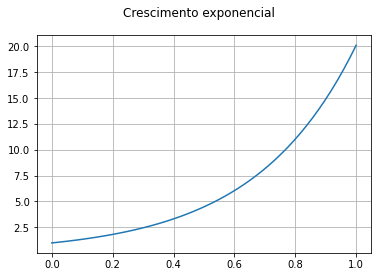
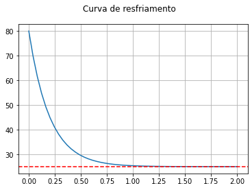
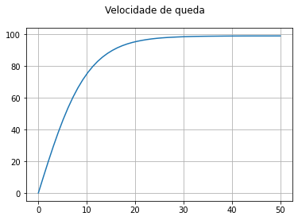
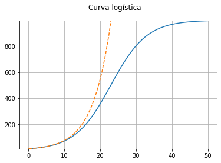
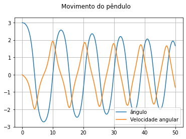
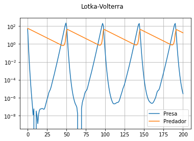
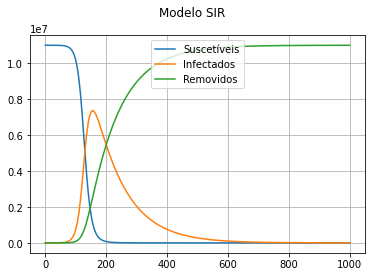
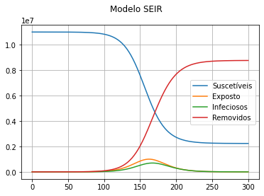
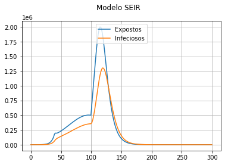

# Sejam bem-vindos.
Grupo de estudo Python - COVID-19

# Modelos contínuos

* No [terceiro notebook](https://colab.research.google.com/drive/1SQrVc0ytcw7Xn4p4R596fMWcUJZ09air), discutimos alguns modelos discretos: crescimento exponencial, sigmóide, modelo SIR e SEIR.
* Diferentemente dos modelos discretos, em que modelamos a variação diária, nos modelos contínuos, modelamos a *taxa instantânea de variação*.
* Se N(t) é uma grandeza que varia no tempo, por exemplo, a temperatura, a quantidade de indivíduos em uma população ou a velocidade de um objeto, denotamos a taxa de variação instantânea das seguintes formas:
$$\frac{d}{dt}N(t) = \frac{dN(t)}{dt}=  N'(t) = \dot{N}(t) = N_t(t).$$
* A taxa de variação também é chamada de *derivada*.

* Alguns conceitos:

1. A taxa de variação da posição é a velocidade.
2. A taxa de variação da velocidade é a aceleração.
3. A taxa de variação média dos preços é a inflação.
4. A taxa de variação da temperatura é positiva quando está aquecendo. E negativa quando está esfriando.
5. Se taxa de variação de uma grandeza é nula, então a grandeza é constante.
6. A taxa de variação da temperatura é medida em graus por segundo (ou minutos, horas, dias etc).
7. A taxa de variaçao de uma grandeza é medida em unidades da grandeza por unidade de tempo.


# Crescimento exponencial

Seja $N(t)$ uma determinada quantidade no instante $t$ para $t\geq 0.$

O número $N(t)$ pode representar o número de pessoas infectadas por uma doença, o número de bactérias em uma colônia, o número de usuários em uma rede social etc.

No modelo exponencial, supomos que a taxa de crescimento é proporcial ao tamanho da polução $N(t)$, isto é:
$$N'(t) = c N(t)$$
Aqui $c$ é uma constante de proporcionalidade.

Complementamos este problema com a quantidade no instante $t=0$, isto é, $N(0)$.

Veja mais detalhes em:
* https://pt.wikipedia.org/wiki/Crescimento_exponencial

* Obs: A solução deste problema com $c=1$ é $N(t)=N(0)e^t$. Aqui, $e$ denota o número de Euler:
$$e=2,71828182890...$$
A exponencial $e^t$ também é chamada de $\exp(t)$ e é chamada de *exponencial natural*.

* Um equação envolvendo uma função e sua derivada é chamada de equação diferencial. O problema de resolver uma equação diferencial quando conhecemento o valor da função em $t=0$ é chamado de problema de valor inicial.

* Usaremos o módulo solve_ivp da biblioteca from scipy.

* Considere o problema de valor inicial na forma:
$$\begin{eqnarray*}N'(y) &=& f(t,N(t)),\\
N(0)&=& \text{conhecido.}
\end{eqnarray*} $$

* Tudo o que precisamos fazer é escrever a função f(t, N)
* Exemplo:
$$\begin{eqnarray*}N'(y) &=& 3 N(t),\\
N(0)&=& 1
\end{eqnarray*} $$
então $f(t, N)=3 N.$

* https://docs.scipy.org/doc/scipy/reference/generated/scipy.integrate.solve_ivp.html

```python
from scipy.integrate import solve_ivp
import numpy as np
import matplotlib.pyplot as plt
```

```python
def funcao(t, N):   # N'(t) =  3*N(t), N(t) = exp(3*t)
    return 3 * N

solucao = solve_ivp(funcao, [0, 1], [1], dense_output=True)
# [0, 1] = tempo inicial e final. # [1] = condição inicial.

# Para recuperar o valor no instante t, use solucao.sol(t)
for t in np.linspace(solucao.t[0], solucao.t[-1], 11):
    print('{:0.1f}  {:0.6f}  {:0.6f}'.format(t, solucao.sol(t)[0], np.exp(3*t)))   # np.exp(3*t)

# Experimente trocar os , use constante negativa para produzir decrescimento exponencial
```
> 0.0  1.000000  1.000000  
> 0.1  1.349899  1.349859  
> 0.2  1.822120  1.822119  
> 0.3  2.459424  2.459603  
> 0.4  3.320186  3.320117  
> 0.5  4.482259  4.481689  
> 0.6  6.048351  6.049647  
> 0.7  8.163871  8.166170  
> 0.8  11.023144  11.023176  
> 0.9  14.879839  14.879732  
> 1.0  20.085662  20.085537

```python
fig, ax = plt.subplots()

t = np.linspace(solucao.t[0], solucao.t[-1], 50)
N = solucao.sol(t)[0]
ax.plot(t, N)
ax.grid(True)
fig.patch.set_facecolor('white')
fig.suptitle('Crescimento exponencial')
plt.show()
```
> 


# Resfriamento de corpos - Lei de Newton

* Considere a temperatura $T(t)$ de um corpo aquecido resfriando à temperatura ambiente.
* A taxa de variação de temperatura é negativa e proporcional à diferença entre a temperatura do corpo e a temperatura ambiente:
$$T'(t) = -c \left(T(t) - T_{amb}\right).$$

* Considere que o corpo está inicialmente à temperatura de $80^{\circ}$C e a temperatura ambiente é $25^{\circ}$C.
*O problema de valor inicial é dado por:
$$\begin{eqnarray*}
T'(t) &=& -c \left(T(t) - 25\right),\\
T(0) &=& 80.
\end{eqnarray*}$$
* A contante c vale $5^{\circ}C$ por hora por grau Celcius.

```python
def funcao(t, T):
    return -5*(T-25)

solucao = solve_ivp(funcao, [0, 2], [80], dense_output=True)
# [0, 2] = tempo inicial e final em horas. # [80] = condição inicial.

# Para recuperar o valor no instante t, use solucao.sol(t)
for t in np.linspace(solucao.t[0], solucao.t[-1], 11):
    print('{:0.1f}  {:0.6f}'.format(t, solucao.sol(t)[0]))    

# Experimente trocar os , use constante negativa para produzir decrescimento exponencial
```
> 0.0  80.000000  
> 0.2  45.227081  
> 0.4  32.451339  
> 0.6  27.742697  
> 0.8  26.007986  
> 1.0  25.370407  
> 1.2  25.140148  
> 1.4  25.049490  
> 1.6  25.020381  
> 1.8  25.005810  
> 2.0  25.005296

```python
fig, ax = plt.subplots()

t = np.linspace(0, 2)
N = solucao.sol(t)[0]

ax.plot(t, N)
ax.grid(True)
fig.patch.set_facecolor('white')
fig.suptitle('Curva de resfriamento')
ax.axhline(25, xmin=0, xmax=1, linestyle='--', color='red')
plt.show()
```
> 

```python
N
```
> array([80.        , 69.84675466, 61.56030055, 54.79064692, 49.28697841,  
>        44.82104045, 41.1820367 , 38.19241333, 35.75101803, 33.76673208,  
>        32.15497761, 30.83853396, 29.75741368, 28.87572762, 28.16071436,  
>        27.58136043, 27.10840034, 26.71774708, 26.39789666, 26.13866746,  
>        25.92986324, 25.76130286, 25.62282023, 25.50677094, 25.41119543,  
>        25.33388401, 25.27231297, 25.2236475 , 25.18474167, 25.1521384 ,  
>        25.12347661, 25.09929096, 25.07956904, 25.06407548, 25.052361  ,  
>        25.04376245, 25.03740278, 25.03219106, 25.02684738, 25.02140769,  
>        25.01654565, 25.0124789 , 25.00933596, 25.00715633, 25.00589042,  
>        25.00539957, 25.00545606, 25.00574309, 25.00585482, 25.0052963 ])


# Queda sob efeito da gravidade e resistência do ar

* Considere um objeto em queda com velocidade instantânea dada por $v(t)$. Convenção: positivo para baixo.

* A velocidade se alteração em função da força da gravidade e do atrito viscoso com o ar.

* A taxa de variação da velocidade, i.e., a aceleração é dada por:
$$v'(t) = g - \kappa v^2(t).$$

* A constante $g\approx 9.8~\!\text{m}/\text{s}^{2}$ é a aceleração da gravidade.
* A constante $\kappa$ é positiva e está relacionada com a interação do corpo com o ar. Usaremos $\kappa = 0.001$.

```python
def funcao(t, v):
    return 9.8 - 0.001 * v**2

solucao = solve_ivp(funcao, [0, 50], [0], dense_output=True)
# [0, 50] = tempo inicial e final em segundos. # [0] = condição inicial.

# Para recuperar o valor no instante t, use solucao.sol(t)
for t in np.linspace(solucao.t[0], solucao.t[-1], 11):
    print('{:0.1f}  {:0.6f}'.format(t, solucao.sol(t)[0]))
```
> 0.0  0.000000  
> 5.0  45.340830  
> 10.0  74.984957  
> 15.0  89.345359  
> 20.0  95.299502  
> 25.0  97.618942  
> 30.0  98.474466  
> 35.0  98.798703  
> 40.0  98.924777  
> 45.0  98.967225  
> 50.0  98.976653

```python
fig, ax = plt.subplots()

t = np.linspace(0, 50)
N = solucao.sol(t)[0]

ax.plot(t, N)
ax.grid(True)
fig.patch.set_facecolor('white')
fig.suptitle('Velocidade de queda')
plt.show()
```
> 


# Crescimento sigmóide

Seja $N(t)$ uma determinada quantidade no instante $t$ para $t\geq 0$

O número $N(t)$ pode representar o número de pessoas infectadas por uma doença, o número de bactérias em uma colônia, o número de usuários em uma rede social etc.

Neste modelo, supomos que a taxa de crescimento é proporcional ao tamanho da polução $N(t)$ e também à disponibilidade de recursos. Os recursos são limitados e disputados pelos indivíduos, de forma que o crescimento é dado por:
$$N'(t) = c N(t) (R-N(t)).$$
Aqui $R$ é capacidade do ambiente. Se $N(t)>R$, o crescimento é negativo, isto é, o ambiente não suporta tal quantidade de indivíduos.

Aqui $c$ é uma constante de proporcionalidade.

```python
def funcao(t, N):
    return 0.0002*N*(1_000 - N)

solucao = solve_ivp(funcao, [0, 50], [10], dense_output=True)
# [0, 50] = tempo inicial e final em segundos. # [10] = condição inicial.

# Para recuperar o valor no instante t, use solucao.sol(t)
for t in np.linspace(solucao.t[0], solucao.t[-1], 11):
    print('{:0.1f}  {:0.6f}'.format(t, solucao.sol(t)[0]))
```
> 0.0  10.000000  
> 5.0  26.722247  
> 10.0  69.434564  
> 15.0  168.565314  
> 20.0  355.857912  
> 25.0  600.271748  
> 30.0  803.292582  
> 35.0  917.398420  
> 40.0  967.984579  
> 45.0  988.186659  
> 50.0  995.469925

```python
fig, ax = plt.subplots()

t = np.linspace(solucao.t[0], solucao.t[-1])
N = solucao.sol(t)[0]
ax.plot(t, N)
ax.grid(True)
fig.patch.set_facecolor('white')
fig.suptitle('Curva logística')

# Traça exponencial inicial
t = np.linspace(solucao.t[0], solucao.t[-1])

ax.plot(t, solucao.sol(0)[0]* np.exp(0.2 * t), '--')

ax.set_ylim(N.min(), N.max())
# ax.set_yscale('log')
plt.show()
```
> 


# Sistemas de equações diferenciais


# Equação do pêndulo

$$\begin{eqnarray*}\theta'(t) &=& w(t) ,\\
w'(t) &=&-\sin(\theta(t)) - \alpha \omega.
\end{eqnarray*} $$

* $\theta(t)$ é o ângulo e $w(t)$ é a velocidade angular (taxa de variação do ângulo).

* $\alpha$ é o coeficiente de atrito.


```python
def funcao(t, y):
    theta = y[0]
    omega = y[1]
    return omega , -np.sin(theta) - 1e-2 * omega  # Testa coeficientes de atrito maiores.

solucao = solve_ivp(funcao, [0, 50], [3, 0], dense_output=True)
# [0, 50] = tempo inicial e final em segundos. # [ , ] = condição inicial.

# Para recuperar o valor no instante t, use solucao.sol(t)
for t in np.linspace(solucao.t[0], solucao.t[-1], 11):
    print('{:0.1f}  {:0.6f}  {:0.6f}'.format(t, solucao.sol(t)[0], solucao.sol(t)[1]))
```
> 0.0  3.000000  0.000000  
> 5.0  -1.628616  -1.314164  
> 10.0  0.000095  1.942360  
> 15.0  0.742517  -1.770480  
> 20.0  -0.792555  1.711227  
> 25.0  0.467662  -1.778100  
> 30.0  0.198794  1.791994  
> 35.0  -1.014199  -1.471241  
> 40.0  1.711325  0.822079  
> 45.0  -1.998835  -0.095252  
> 50.0  1.676053  -0.721710

```python
fig, ax = plt.subplots()

t = np.linspace(solucao.t[0], solucao.t[-1], 200)
theta, omega = solucao.sol(t)
ax.plot(t, theta)
ax.plot(t, omega)

ax.legend(['ângulo', 'Velocidade angular'], loc='lower right')
ax.grid(True)
fig.patch.set_facecolor('white')
fig.suptitle('Movimento do pêndulo')

plt.show()
```
> 


# Equações de Lotka-Volterra

* Descrever a dinâmica de duas espécies interagindo: uma como presa o outra como predadora.

* A população de presas é limitadas pela predação e não pela disponibilidade de recursos naturais.
* A predação é proporcional à população de presas e de predadores, i.e., proporcional ao produto delas.
* A natalidade e a mortalidade (por outras causas) de presas  são proporcionais à sua população.
* A população de predadores é limitada pelas possibilidades de predação.
* Durante o período de análises, alterações ambientais e genéticas são irrelavantes.

$$
\begin{align}
 \frac{dx}{dt} &= \alpha x - \beta x y, \\
 \frac{dy}{dt} &= \delta x y - \gamma y.
\end{align}
$$
Onde:
* $x(t)$ é o número de presas, por exemplo, coelhos.
* $y(t)$ é o número de predadores, por exemplo, raposas.

```python
alfa = 1
beta = 0.1
delta = 0.01
gama = 0.1

def funcao(t, xy):
    x = xy[0]
    y = xy[1]
    return alfa*x - beta*x*y, delta*x*y - gama*y


solucao = solve_ivp(funcao, [0, 200], [50, 50], dense_output=True)
# [0, 200] = tempo inicial e final. # [ , ] = condição inicial.

# Para recuperar o valor no instante t, use solucao.sol(t)
for t in np.linspace(solucao.t[0], solucao.t[-1], 11):
    print('{:0.1f}  {:0.6f}  {:0.6f}'.format(t, solucao.sol(t)[0], solucao.sol(t)[1]))
```
> 0.0  50.000000  50.000000  
> 20.0  0.000000  7.619109  
> 40.0  0.057072  1.033695  
> 60.0  0.000000  17.541461  
> 80.0  0.000132  2.376773  
> 100.0  0.077486  35.937742  
> 120.0  0.000002  4.866302  
> 140.0  13.423540  0.762312  
> 160.0  0.000000  9.356484  
> 180.0  0.042286  1.267461  
> 200.0  0.000003  17.364283

```python
fig, ax = plt.subplots()

t = np.linspace(solucao.t[0], solucao.t[-1], 200)
x, y = solucao.sol(t)
ax.plot(t, x)
ax.plot(t, y)

ax.legend(['Presa', 'Predador'], loc='lower right')
ax.grid(True)
fig.patch.set_facecolor('white')
fig.suptitle('Lotka-Volterra')
ax.set_yscale('log')
plt.show()
```
> 


# Modelo SIR

O SIR é um modelo simples para descrever o crescimento de doenças infecciosas. Ele divide a polução em três clases (compartimentos):
1. Suscetíveis: Pessoas não imunizadas e passíveis de contrair a doença. O tamanho desta população no instante $t$ é $S(t)$.
2. Infectados: Pessoas infectadas e passíveis de transmitir a doença para pessoas suscetíveis. O tamanho desta população no instant $t$ é $I(t)$.
3. Removidos: Pessoas que contraíram a doença e se recuperaram e pessoas que morreram. Estas pessoas não contraem nem transmitem a doença. O tamanho desta população no instante $t$ é $R(t)$.

* Obs: Neste modelos, todos os infectados são infecciosos.

O fluxo é o seguinte:
$$\mathcal{S} \rightarrow  \mathcal{I} \rightarrow \mathcal{R}$$

* O modelo pressupõe que o número de novos casos é proporcional ao tamanho da população suscetível e ao tamanho da população infectada, i.e., ao produto de tais populações:
Assim temos:
$$
\begin{align}
S'(t)&= - \frac{\beta}{N}S(t) I(t) \\[0.2cm]
I'(t)&= \frac{\beta}{N}S(t) I(t) - \gamma I(t)=(\frac{\beta}{N}S(t)  - \gamma )I(t)\\[0.2cm]
R'(t)&=R(t) + \gamma I(t)
\end{align}
$$

Aqui $N$ é o tamanho inicial da população de suscetíveis e $\beta$ é uma constante relacionada com a probabilidade de transmissão da doença quando duas pessoas se encontram.

A cada dia uma certa quantidade de pessoas é retirada da polução de infectados, seja porque se curou, seja porque morreu.

* Obs: Eu desprezei a natalidade e mortalidade por outras causas neste modelo.

* Mais informações: https://en.wikipedia.org/wiki/Compartmental_models_in_epidemiology#The_SIR_model

```python
beta_0 = 0.01
N = 11_000_000
gama = 0.01

def funcao(t, sir):
    S = sir[0]
    I = sir[1]
    R = sir[2]
    return -beta*S*I/N, beta*S*I/N- gama *I, gama*I


solucao = solve_ivp(funcao, [0, 1000], [N, 100, 0], dense_output=True)
# [0, 300] = tempo inicial e final. # [ , ] = condição inicial.

# Para recuperar o valor no instante t, use solucao.sol(t)
for t in np.linspace(solucao.t[0], solucao.t[-1], 11):
    print('{:0.1f}  {:0.1f}  {:0.1f}  {:0.1f}'.format(t, solucao.sol(t)[0], solucao.sol(t)[1], solucao.sol(t)[2]))
```
> 0.0  11000000.0  100.0  0.0  
> 100.0  10171638.1  742373.8  86088.2  
> 200.0  76733.5  5466691.8  5456674.8  
> 300.0  3203.6  2045154.9  8951741.6  
> 400.0  990.8  753424.5  10245684.7  
> 500.0  648.4  277380.3  10722071.3  
> 600.0  554.5  102215.1  10897330.4  
> 700.0  523.0  37663.0  10961914.0  
> 800.0  511.8  13878.1  10985710.0  
> 900.0  507.8  5113.8  10994478.4  
> 1000.0  506.3  1883.9  10997709.8

```python
fig, ax = plt.subplots()

t = np.linspace(solucao.t[0], solucao.t[-1], 200)
S, I, R = solucao.sol(t)
ax.plot(t, S)
ax.plot(t, I)
ax.plot(t, R)


ax.legend(['Suscetíveis', 'Infectados', 'Removidos'], loc='upper center')
ax.grid(True)
fig.patch.set_facecolor('white')
fig.suptitle('Modelo SIR')

plt.show()
```
> 


# Modelo SEIR

O SEIR é uma aprimoramento do modelo SIR. Ele divide a população dos infectados em duas parcelas: aqueles que ainda não são infecciosos e e são chamados de expostos e aqueles que já são infecciosos.

Portanto, o modelos SEIR divide a polução em quatro compartimentos:
1. Suscetíveis: Pessoas não imunizadas e passíveis de contrair a doença. O tamanho desta população no dia $k$ é $S_k$.
2. Expostos: Pessoas infectadas que ainda não transmitem a doença. O tamanho desta população no dia $k$ é $E_k$.
2. Infecciosos: Pessoas infectadas e passíveis de transmitir a doença para pessoas suscetíveis. O tamanho desta população no dia $k$ é $I_k$.
3. Removidos: Pessoas que contraíram a doença e se recuperaram e pessoas que morreram. Estas pessoas não contraem nem transmitem a doença.


O fluxo é o seguinte:
$$\mathcal{S} \rightarrow \mathcal{E} \rightarrow \mathcal{I} \rightarrow \mathcal{R}$$

Novamente, o modelo pressupõe que o número de novos casos é proporcional ao tamanho da população suscetível e ao tamanho da população infecciosa:

Sejam $S(t)$, $E(t)$, $I(t)$ e $R(t)$, o número de indivíduos na população suscetível, exposta, infecciosa e removida. Usamos o seguinte sistema de EDO's não-lineares:

$\begin{align}
\frac{dS}{dt} & = - \beta \frac{S}{N} I, \\[8pt]
\frac{dE}{dt} & = \beta \frac{S}{N} I - \frac{1}{T_E} E, \\[8pt]
\frac{dI}{dt} & = \frac{1}{T_E} E - \frac{1}{T_I}  I, \\[8pt]
\frac{dR}{dt} & = \frac{1}{T_I} I.
\end{align}
$

Aqui $N$ é o tamanho inicial de população suscetível, $\beta=\beta(t)$ está relacionado com a probabilidade por unidade de tempo de transmissão da doença. $T_E$ é a duração do período de incubação e $T_I$ é o tempo de recuperação.

# O modelo EI

Ao longo períodos curtos suficientes para considerar $S(t)$ e $\beta(t)$ constantes, como no início da infecção, temos o seguinte subsistema linear e invariante no tempo:

$\left[
    \begin{array}{c}
        E'(t)\\
        I'(t)
    \end{array}
\right]=
\left[\begin{array}{c}
        -\frac{1}{T_E}& \beta \frac{S}{N}\\
        \frac{1}{T_E}&-\frac{1}{T_I}
    \end{array}
\right]
\left[
    \begin{array}{c}
        E(t)\\
        I(t)
    \end{array}
\right]
$

Esta matriz tem dois autovalores reais e distintos dados por:

$\lambda_{1,2}=\frac{1}{2}\left(\frac{1}{T_E}+\frac{1}{T_I}\right)\pm \frac{1}{2}\sqrt{\left(\frac{1}{T_E}-\frac{1}{T_I}\right)^2+\frac{4\beta}{T_E}\frac{S}{N}}$.

Vemos também que:
* Se $\beta \frac{S}{N}<\frac{1}{T_I}$, então $\lambda_2<\lambda_1<0$,
* Se $\beta \frac{S}{N}=\frac{1}{T_I}$, então $\lambda_2<\lambda_1=0$,
* Se $\beta \frac{S}{N}>\frac{1}{T_I}$, então $\lambda_2<0$ e $\lambda_1>0$.


Além disso podemos isolar o termo $\beta \frac{S}{N}$:
* $\beta \frac{S}{N} = \frac{1}{T_I}\left(1+\lambda(T_I+T_E)+\lambda^2T_ET_I\right)$

Definimos também:

$K=\frac{d}{dt} \ln(I(t)) \approx \lambda_1$.

Obs: Mais uma vez, eu desprezei a natalidade e mortalidade por outras causas neste modelo.

* Mais informações: https://en.wikipedia.org/wiki/Compartmental_models_in_epidemiology#The_SEIR_model

```python
beta_0 = 0.4
N = 11_000_000
T_e = 7
T_i = 5

def funcao(t, seir):
    S, E, I, R = seir  
    x = beta_0 * I * S /N
    return [- x,
            -E/T_e + x,
             E/T_e - I/T_i,
             I/T_i,
            ]


solucao = solve_ivp(funcao, [0, 300], [N, 100, 0, 0], dense_output=True)
# [0, 300] = tempo inicial e final. # [N, 100, 0, 0] = condição inicial.

# Para recuperar o valor no instante t, use solucao.sol(t)
for t in np.linspace(solucao.t[0], solucao.t[-1], 11):
    print('{:0.1f}  {:0.1f}  {:0.1f}  {:0.1f}  {:0.1f}'.format(t, *solucao.sol(t)))
```
> 0.0  11000000.0  100.0  0.0  0.0  
> 30.0  10998830.2  447.5  237.3  584.9  
> 60.0  10989250.4  3577.1  1895.1  5377.4  
> 90.0  10913361.0  28220.6  15027.4  43491.0  
> 120.0  10350220.8  204160.1  110838.3  334880.8  
> 150.0  7583162.3  850061.0  521060.1  2045816.6  
> 180.0  3747271.0  734757.8  595310.5  5922760.8  
> 210.0  2505598.1  182142.6  175853.3  8136506.0  
> 240.0  2280237.7  32338.0  32651.2  8654873.1  
> 270.0  2242493.1  5413.8  5516.1  8746677.0  
> 300.0  2236232.3  898.6  915.3  8762053.8

```python
fig, ax = plt.subplots()

t = np.linspace(solucao.t[0], solucao.t[-1], 200)
S, E, I, R = solucao.sol(t)
ax.plot(t, S)
ax.plot(t, E)
ax.plot(t, I)
ax.plot(t, R)


ax.legend(['Suscetíveis', 'Exposto', 'Infeciosos', 'Removidos'])#, loc='upper center')
ax.grid(True)
fig.patch.set_facecolor('white')
fig.suptitle('Modelo SEIR')

plt.show()
```
> 


# SEIR com beta variando no tempo

```python
beta_0 = 0.5
N = 11_000_000
T_e = 7
T_i = 5

def beta(t, seir):
 #   return 1.0/( 1 + seir[1]/100_000 )
    if t<40:
        return 1.0
#    return 0.3

    if t< 100:
        return 0.3
    return 1.0

#1.0---.3---1.0

def funcao(t, seir):
    S, E, I, R = seir  
    x = beta(t, seir) * I * S /N
    return [- x,
            -E/T_e + x,
             E/T_e - I/T_i,
             I/T_i,
            ]

solucao = solve_ivp(funcao, [0, 300], [N, 100, 0, 0], dense_output=True)
# [0, 300] = tempo inicial e final. # [N, 100, 0, 0] = condição inicial.

# Para recuperar o valor no instante t, use solucao.sol(t)
for t in np.linspace(solucao.t[0], solucao.t[-1], 11):
    print('{:0.1f}  {:0.1f}  {:0.1f}  {:0.1f}  {:0.1f}'.format(t, *solucao.sol(t)))
```
> 0.0  11000000.0  100.0  0.0  0.0  
> 30.0  10954296.5  27127.0  9516.6  9159.9  
> 60.0  9864537.6  307576.7  192786.7  635198.9  
> 90.0  7891997.7  496166.3  340693.7  2271242.3  
> 120.0  1471360.5  1780313.9  1302309.6  6446116.0  
> 150.0  230909.5  102483.7  151422.6  10515284.2  
> 180.0  204104.6  3500.8  5681.7  10786812.9  
> 210.0  203200.1  119.5  195.4  10796585.0  
> 240.0  203169.2  4.1  6.7  10796920.1  
> 270.0  203168.1  0.1  0.2  10796931.5  
> 300.0  203168.1  0.0  0.0  10796931.9

```python
fig, ax = plt.subplots()

t = np.linspace(solucao.t[0], solucao.t[-1], 200)
S, E, I, R = solucao.sol(t)

legenda = []
# ax.plot(t, S); legenda.append('Suscetíveis')
ax.plot(t, E); legenda.append('Expostos')
ax.plot(t, I); legenda.append('Infeciosos')
# ax.plot(t, R); legenda.append('Removidos')


ax.legend(legenda, loc='upper center')
ax.grid(True)
fig.patch.set_facecolor('white')
fig.suptitle('Modelo SEIR')

plt.show()
```
> 
