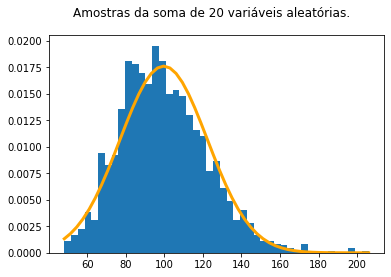

# Sejam bem-vindos.
Grupo de estudo Python - COVID-19

### Estatística descritiva
* Medidas de posição e dispersão
* Visualização de dados: histograma e boxplot

### Problemas estocásticos
* Geração de números aleatórios
* Simulação de problemas probabilísticos.


```python
import numpy as np
import matplotlib.pyplot as plt

# valores entre 5 e 37 incluindos os extremos
valores = np.array(
          [22, 30, 19, 14, 30, 18,  20, 19, 19, 27, 31, 20, 31, 24, 23,  5, 24,
           31, 19, 22, 22, 16, 20, 19, 21, 32, 31, 30, 26, 37,  9, 27, 12, 17,
           26, 28, 37, 18, 27, 30, 23, 35, 31, 30, 28, 20, 25, 32, 25, 11, 33,
           15, 25, 31, 26, 30, 37, 20, 33, 29, 28, 36,  5,  20, 21,  7, 16, 18,
            8, 32, 25, 13, 16, 34, 12, 24, 16, 11, 14, 22, 35, 29, 27, 19, 20,
           29, 19, 28, 22, 29, 33, 21, 16, 35, 20, 37, 22, 34, 31, 12]+[35]*10)

contagem, barras = np.histogram(valores, bins=32) # cesto

fig, ax = plt.subplots()

# ax.hist(valores, histtype='stepfilled', bins=32, color='lavender', zorder=0) #bins = 8, 16, 32
# ax.hist(valores, histtype='step', bins=32, color='blue', zorder=0) #bins = 8, 16, 32

for p in range(len(contagem)):
    for i in range(contagem[p]):
        ax.scatter(barras[p], i+1, color='blue', zorder=1)

#ax.set_ylim(bottom=-0.2)

plt.yticks(range(10))
fig.suptitle('Gráfico de pontos\nCada ponto é uma observação', y=1.15)
fig.set_size_inches(10, 2.4)
fig.patch.set_facecolor('white')
plt.show()
```
> 

```python
# Traçando o histograma
fig, ax = plt.subplots()
ax.hist(valores, bins=10, rwidth=.8, density=True, cumulative=True)   # , density=True, bins = .., cumulative=True
# ax.hist(valores, bins=8, histtype='step', color='black', linewidth=3)   

fig.patch.set_facecolor('white')
fig.suptitle('Histograma\nCada barra indica as observações dentro do intervalo',
             y=1.15)
# fig.set_size_inches(10, 2)
plt.show()
```
> 


# Média

* A média das amostras $x_1, x_2, \ldots, x_n$ é dada por:
$$\bar{x} = \frac{x_1+x_2+x_3+\cdots x_n}{n}=\frac{1}{n}\sum_{i=1}^nx_i $$

* Exemplo. A média entre 3, 4, 1 e 8 é:
$$\bar{x} = \frac{3+4+1+8}{4}=\frac{16}{4}=4.$$


* Obs: Média populacional ($\mu$) e amostral ($\bar{x}$).

```python
x = [3, 4, 1, 8]
xbar = sum(x)/4
print(xbar)
```
> 4.0

```python
# Usando numpy
import numpy as np

x = np.array([3, 4, 1, 8])

xbar = x.mean()
print(xbar)

# ou

xbar = np.mean(x)
print(xbar)
```
> 4.0  
> 4.0


# Mediana

* Mediana significa meio, ponto central.

* Exemplo. Se queremos calcular a mediana de $0, 2, 6, 10, 15$, primeiro colocamos em ordem crescente:
$$0,2,{\color{red} 6},10,15$$
* Neste caso, a mediana é o número central: 6.

* Quando o número de valores estão em quantidade ímpar, a mediana é média aritmética dos dois valores centrais. Por exemplo, a mediana de $0, 2, 6, 10, 13, 15$ é dada por:

$$0,2,\underbrace{\color{red} {6}, \color{red}{10}}_{(6+10)/2=8}, 13, 15$$

A mediana é denotada $\tilde{x}$:
$$\tilde{x}=8.$$

```python
# A mediana é calculada usando a função numpy.median

xtilde=np.median([0, 2, 6, 10, 15])
print(xtilde)

xtilde=np.median([0, 2, 6, 10, 13, 15])
print(xtilde)
```
> 6.0  
> 8.0

```python
print(np.median(valores))
print(np.mean(valores))
```
> 25.0  
> 24.70909090909091

```python
valores_assimetricos = np.array(
      [  33,  89,   7,  28,  10,  62,  14,  25,  38,  13,  92,  16,  90,
        13,  39,  11,  26,   4,  78,  86,  19,  24,  10,  52,  25,  12,
        19,  20,   2,  14,  15,  37,   5,  21,  21,  23,  50,  51,  18,
        27,  32,  10,  51,  12,  83,  32,  19,   3,  25,  23, 106,  23,
        15,  95,  42,  12,  16,  15,  27,  21,   3,   6,  13,  20,  78,
         6,  87,  29,  55,  91,  80,  76,  85,  49,  16,  10,  23,  19,
        18,  13,  34,  21,   8,  14,  13,   5,  67,  12,  27,  12,  11,
        26,  26,  22,  15,  14,  16,  28,  28,  27,  84,  84,  18,  15,
        10,  14,  47,  49,   0,  29,  74,  13,  89,  45,  60,  17, 100,
        17,  20,  11,  55,  26,  59,  10,  92,  21,  79,  33,   1,   4,
        18,  24,  85,  95,  87,  23,  18,  10,  50,  22,   1,  47,  24,
        38,  26,  66,  11,  91,  17,  69,  21,  18,  13,  41,  17,  25,
        10,  11,  35,  15, 100,  88,  30,  35,  10, 100,  98,  11,  37,
        34,  12,  72,  20,  79,  29,  22,  16,  15,  24,  19,  16])


contagem, barras = np.histogram(valores_assimetricos, bins=105)

fig, ax = plt.subplots()
media = np.mean(valores_assimetricos)
med =  np.median(valores_assimetricos)
maior = sum(1 if x else 0 for x in valores_assimetricos>media )
igual = sum(1 if x else 0 for x in valores_assimetricos==media )
menor = sum(1 if x else 0 for x in valores_assimetricos<media )


for p in range(len(contagem)):
    cor = 'red' if barras[p]<med else 'green' if barras[p] == med else 'blue'
    for i in range(contagem[p]):
        ax.scatter(barras[p], i+1, color=cor, zorder=1)

ax.axvline(x=media, ymin=0, ymax=1, linestyle='--')
ax.text (media+.5, 5, '$\\bar{x}='+'{:.2f}$'.format(media), fontsize=12)

fig.suptitle('Gráfico de pontos\nHá {} pontos abaixo da média, {} iguais à média e {} acima.'.format(menor, igual, maior), y=1.15)
fig.set_size_inches(20, 2.4)
fig.patch.set_facecolor('white')
plt.show()

print(np.median(valores_assimetricos))
```
> 


# Percentis e quartis

* Da mesma forma como a mediana divide os dados pela metada, podemos realizar divisões em quartos, quintos ou percentis arbitrários. Seja $x$ um número entre 0 e 100. Grosso modo, o percentil x divide os dados de forma que x% deles são menores ou iguais a x.

* Os quartis $Q_1, Q_2, Q_3$ são os percentis $25\%, 50\%, 75\%$.

* Para os dados dados acima, os percentis são dados na célula de código.

```python
tamanho_da_amostra = len(valores_assimetricos)
print('limiar | percentil | contagem | percentual real')
for limiar in range(10, 100, 10):
    percentil = np.percentile(valores_assimetricos, limiar) # Calcula percentis
    conta_menor = sum(1 if x else 0 for x in valores_assimetricos<=percentil)

    print('{0:>3}%   |  {1:>5.1f}    | {2:>4}     |    {3:>5.1%}'.format(limiar, percentil, conta_menor, conta_menor/tamanho_da_amostra))

print('total de valores: ', tamanho_da_amostra)
```
> limiar | percentil | contagem | percentual real  
>  10%   |   10.0    |   23     |    12.7%  
>  20%   |   13.0    |   42     |    23.2%  
>  30%   |   16.0    |   60     |    33.1%  
>  40%   |   19.0    |   75     |    41.4%  
>  50%   |   23.0    |   93     |    51.4%  
>  60%   |   27.0    |  110     |    60.8%  
>  70%   |   37.0    |  127     |    70.2%  
>  80%   |   59.0    |  145     |    80.1%  
>  90%   |   85.0    |  163     |    90.1%  
> total de valores:  181

```python
valores_assimetricos = np.array(
      [  33,  89,   7,  28,  10,  62,  14,  25,  38,  13,  92,  16,  90,
        13,  39,  11,  26,   4,  78,  86,  19,  24,  10,  52,  25,  12,
        19,  20,   2,  14,  15,  37,   5,  21,  21,  23,  50,  51,  18,
        27,  32,  10,  51,  12,  83,  32,  19,   3,  25,  23, 106,  23,
        15,  95,  42,  12,  16,  15,  27,  21,   3,   6,  13,  20,  78,
         6,  87,  29,  55,  91,  80,  76,  85,  49,  16,  10,  23,  19,
        18,  13,  34,  21,   8,  14,  13,   5,  67,  12,  27,  12,  11,
        26,  26,  22,  15,  14,  16,  28,  28,  27,  84,  84,  18,  15,
        10,  14,  47,  49,   0,  29,  74,  13,  89,  45,  60,  17, 100,
        17,  20,  11,  55,  26,  59,  10,  92,  21,  79,  33,   1,   4,
        18,  24,  85,  95,  87,  23,  18,  10,  50,  22,   1,  47,  24,
        38,  26,  66,  11,  91,  17,  69,  21,  18,  13,  41,  17,  25,
        10,  11,  35,  15, 100,  88,  30,  35,  10, 100,  98,  11,  37,
        34,  12,  72,  20,  79,  29,  22,  16,  15,  24,  19,  16])


contagem, barras = np.histogram(valores_assimetricos, bins=105)

fig, ax = plt.subplots()
media = np.mean(valores_assimetricos)
med =  np.median(valores_assimetricos)
maior = sum(1 if x else 0 for x in valores_assimetricos>media )
igual = sum(1 if x else 0 for x in valores_assimetricos==media )
menor = sum(1 if x else 0 for x in valores_assimetricos<media )


for p in range(len(contagem)):
    cor = 'red' if barras[p]<med else 'green' if barras[p] == med else 'blue'
    for i in range(contagem[p]):
        ax.scatter(barras[p], i+1, color=cor, zorder=1)

# Traça percentis
for limiar in range(10, 100, 10):
    percentil = np.percentile(valores_assimetricos, limiar)
    ax.axvline(x=percentil, ymin=0, ymax=1, linestyle='--')

fig.suptitle('Gráfico de pontos.\n Percentis de 10 a 90.', y=1.15)
fig.set_size_inches(20, 2.4)
fig.patch.set_facecolor('white')
plt.show()

print(np.median(valores_assimetricos))
```
> 

```python
np.percentile(valores_assimetricos, 30)
```
> 16.0


# Amplitude e intervalo interquartil

* A amplitude é a diferença entre o máximo e o mínimo valor dos dados. Exemplo: se os dados são $[5, 7, 10, 20]$, então a amplitude é
$$20-5=15.$$

* O intervalo interquartil é a diferença ente o terceiro e o primeiro quartis. No exemplo acima seria:
$$IIQ = Q_3-Q_1=10-7=3$$

```python
fig, ax = plt.subplots()

# Calcula percentis
percentis = [np.percentile(valores_assimetricos, limiar)\
             for limiar in [0, 25, 50, 75, 100]]

# Desenha as bolinhas
for p in range(len(contagem)):
    if barras[p] < percentis[1]:
        cor = 'red'
    elif barras[p] < percentis[2]:
        cor = 'blue'
    elif barras[p] < percentis[3]:
        cor = 'green'
    else:
        cor = 'orange'
    for i in range(contagem[p]):
        ax.scatter(barras[p], i+1, color=cor, zorder=1)

# Traça linhas tracejadas nos percentis
for percentil in percentis:
    ax.axvline(x=percentil, ymin=0, ymax=1, linestyle='--')

plt.arrow(percentis[2], 8, percentis[3]-percentis[2], 0,  head_width=1, \
          head_length=1, linewidth=1, color='g', length_includes_head=True)

plt.arrow(percentis[3], 8, percentis[1]-percentis[3], 0,  head_width=1, \
          head_length=1, linewidth=1, color='g', length_includes_head=True)

plt.text(s='Intervalo interquartil', x=(percentis[1]+percentis[3])/2, y=7,
         fontsize=13, ha='center', color='black')

plt.arrow(0, 10, 106, 0,  head_width=1, clip_on=False,\
          head_length=1, linewidth=1, color='blue', length_includes_head=True)

plt.arrow(106, 10, -106, 0,  head_width=1, clip_on=False,\
          head_length=1, linewidth=1, color='blue', length_includes_head=True)

plt.text(s='Amplitude', x=53, y=10.5, clip_on = False,
         fontsize=12, ha='center', color='black')


fig.suptitle('Gráfico de pontos.\n Amplitude e intervalo interquartil.'.format(menor, igual, maior),
             y=1.3)
fig.set_size_inches(20, 2.4)
fig.patch.set_facecolor('white')
plt.show()
```
> 


# Variância e desvio padrão

* A variância é uma medida do quanto os dados se distanciam da média.

* A variância amostral de um conjunto de dados $x=\left[x_1, x_2, \ldots, x_n\right]$ é dada por:
$$s^2(x) = \frac{1}{n-1}\sum_{i=1}^n\left(x_i-\bar{x}\right)^2.$$

* A variância populacional de um conjunto de dados $x=\left[x_1, x_2, \ldots, x_n\right]$ é dada por:
$$\sigma^2(x) = \frac{1}{n}\sum_{i=1}^n\left(x_i-\bar{x}\right)^2.$$

* Observe que a expressão para a variância amostra é maior ou igual à expressão para variância população. Esta correção vem do fato que a primeira é melhor estimador para variância populacional a partir de uma amostra.

* Cada termo do somatório contribui positivamente para a variância, pois o quadrado de qualquer real é não-negativo.

* O uso do expoente 2 em detrimento de outros traz diversas propriedades matemáticas interessantes. Observe a semelhança com a distância euclidiana.

* O desvio padrão amostral e populacional são definidos como a raiz quadrada da variância amostral e populacional, respectivamente:
$$s = \sqrt{s^2}~~~\text{e}~~~\sigma = \sqrt{\sigma^2}.$$

* Exemplo a média e variância do conjunto de dados $[1, 4, 5, 7, 13]$ é dada por:
$$\bar{x}=\frac{1+4+5+7+13}{5}=6$$
$$s^2 = \frac{\left(1-6\right)^2+\left(4-6\right)^2+\left(5-6\right)^2+\left(7-6\right)^2+\left(13-6\right)^2}{5-1}=\frac{80}{4}=20$$

```python
x=np.array([1, 4, 5, 7, 13])
print(np.mean(x), np.var(x, ddof=1), np.std(x, ddof=1))
# ddof = difference of degrees of freedom
```
> 6.0 20.0 4.47213595499958


# Boxplot

* O boxplot é um diagrama formado por:
1. Uma caixa indicando a região interquartil.
2. Uma linha cortando a caixa e indicando a mediana.
3. Linhas chamadas de bigodes, indicando a mínima e a máxima observação, excluindo *outliers*.
4. Indicação dos *outliers*.

* *Outliers* ou discrepantes são observações que distam do quarto mais próximo por mais de $1.5(Q_3-Q_1)$.
* Um *Outliers* é chamado de extremo se dista do quarto mais próximo por mais de $3(Q_3-Q_1)$.

```python
fig, ax = plt.subplots(1, 4)
ax[0].boxplot(valores, vert=False, widths=.5) # widths = [..]
ax[1].boxplot(valores_assimetricos, vert=False)
ax[2].boxplot([valores, valores_assimetricos], vert=False)
ax[3].boxplot([valores, valores_assimetricos], vert=True)

ax[0].set_title('Primeiro conjuto de dados')
ax[1].set_title('Segundo conjuto de dados')
ax[2].set_title('Boxplot comparativo')
ax[3].set_title('Boxplot comparativo vertical')

fig.suptitle('Traçado de boxplots com e sem outliers.', y=1.1, fontsize=14)
fig.patch.set_facecolor('white')
fig.set_size_inches(15, 3)
plt.show()
```
> 

```python
# Como ficam o box plot para os valores_assimetricos?

valores_assimetricos = np.array(
      [  33,  89,   7,  28,  10,  62,  14,  25,  38,  13,  92,  16,  90,
        13,  39,  11,  26,   4,  78,  86,  19,  24,  10,  52,  25,  12,
        19,  20,   2,  14,  15,  37,   5,  21,  21,  23,  50,  51,  18,
        27,  32,  10,  51,  12,  83,  32,  19,   3,  25,  23, 106,  23,
        15,  95,  42,  12,  16,  15,  27,  21,   3,   6,  13,  20,  78,
         6,  87,  29,  55,  91,  80,  76,  85,  49,  16,  10,  23,  19,
        18,  13,  34,  21,   8,  14,  13,   5,  67,  12,  27,  12,  11,
        26,  26,  22,  15,  14,  16,  28,  28,  27,  84,  84,  18,  15,
        10,  14,  47,  49,   0,  29,  74,  13,  89,  45,  60,  17, 100,
        17,  20,  11,  55,  26,  59,  10,  92,  21,  79,  33,   1,   4,
        18,  24,  85,  95,  87,  23,  18,  10,  50,  22,   1,  47,  24,
        38,  26,  66,  11,  91,  17,  69,  21,  18,  13,  41,  17,  25,
        10,  11,  35,  15, 100,  88,  30,  35,  10, 100,  98,  11,  37,
        34,  12,  72,  20,  79,  29,  22,  16,  15,  24,  19,  16])


contagem, barras = np.histogram(valores_assimetricos, bins=105)

fig, (ax, ax2) = plt.subplots(2, sharex=True)

# Calcula percentis
percentis = [np.percentile(valores_assimetricos, limiar) for limiar in range(0, 125, 25)]

# Desenha as bolinhas
for p in range(len(contagem)):
    if barras[p] < percentis[1]:
        cor = 'red'
    elif barras[p] < percentis[2]:
        cor = 'blue'
    elif barras[p] < percentis[3]:
        cor = 'green'
    else:
        cor = 'orange'
    for i in range(contagem[p]):
        ax.scatter(barras[p], i+1, color=cor, zorder=1)

# Traça linhas tracejadas nos percentis
for percentil in percentis:
    ax.axvline(x=percentil, ymin=0, ymax=1, linestyle='--')

ax.arrow(percentis[2], 8, percentis[3]-percentis[2], 0,  head_width=1, \
          head_length=1, linewidth=1, color='g', length_includes_head=True)

ax.arrow(percentis[3], 8, percentis[1]-percentis[3], 0,  head_width=1, \
          head_length=1, linewidth=1, color='g', length_includes_head=True)

ax.text(s='Intervalo interquartil', x=(percentis[1]+percentis[3])/2, y=7,
         fontsize=13, ha='center', color='black')

ax.arrow(0, 10, 106, 0,  head_width=1, clip_on=False,\
          head_length=1, linewidth=1, color='blue', length_includes_head=True)

ax.arrow(106, 10, -106, 0,  head_width=1, clip_on=False,\
          head_length=1, linewidth=1, color='blue', length_includes_head=True)

ax.text(s='Amplitude', x=53, y=10.5, clip_on = False,
         fontsize=12, ha='center', color='black')

ax2.boxplot(valores_assimetricos, vert=False, widths=1.7)

fig.suptitle('Gráfico de pontos e boxplot.'.format(menor, igual, maior),
             y=1.05, fontsize=14, ha ='center')
fig.set_size_inches(20, 4.4)
fig.patch.set_facecolor('white')
plt.show()
```
> 

```python
# Resumo
print(np.min(valores_assimetricos))
print(np.max(valores_assimetricos))
print(np.mean(valores_assimetricos))   # Média
print(np.median(valores_assimetricos)) # Mediana

print(np.var(valores_assimetricos, ddof=1)) # Variância
print(np.std(valores_assimetricos, ddof=1)) # Desvio padrão

Q1 = np.percentile(valores_assimetricos, 25)  
Q2 = np.percentile(valores_assimetricos, 55)
Q3 = np.percentile(valores_assimetricos, 75)

# IIQ = Q3 - Q1 : Intervalo interquartil
print(f'Q1 = {Q1:.2g}, Q2 = {Q2:.2g}, Q3 = {Q3:.2g}') # Quartis
```
> 0  
> 106  
> 34.11602209944751  
> 23.0  
> 785.3364640883979  
> 28.023855268117515  
> Q1 = 14, Q2 = 25, Q3 = 49


# Geradores de números aleatórios

* Usaremos o módulo random da bibliteca numpy.

* https://numpy.org/doc/1.18/reference/random/index.html

```python
import numpy as np

# Inicializa gerador de números aleatórios
# Será usado por outras funções
alea = np.random.default_rng() # pode-se usar seed.

for i in range(10):
    print(alea.integers(0, 10), end=' ')  
    # Gera inteiros aleatórios entre 0 e 10.
    # Os inteiros são produzidos com a mesma probabilidade.
```
> 6 6 4 0 1 4 0 8 2 6

```python
# Pode-se produzir um array.
# Se você rodar novamente esta célula o resultado muda,
# pois o gerador não foi inicializado.

print(alea.integers(0, 100, 20)) # Retorna um numpy.array
```
> [37 12 48 61 81 87  8 84 59  7 86  0 55 42 66 90 17 88 24 26]

```python
# Se você não semeia o gerador, ele é semeado com um valor do OS=Sistema Operacional.

alea = np.random.default_rng()

print(alea.integers(0, 10, 20))
```
> [8 5 0 5 0 7 4 0 1 9 4 8 5 1 9 0 4 3 1 7]

```python
# Vamos traçar o histograma.

valores = alea.integers(0, 50, 500) # Muitos dados

fig, ax = plt.subplots()

ax.hist(valores)

fig.suptitle('Histograma sem graça porque a distribuição é uniforme.')
fig.patch.set_facecolor('white')
plt.show()
```
> 

```python
# Simulando um dado

lancamentos = alea.integers(1, 7, 50)
print(lancamentos)

fig, ax = plt.subplots()
ax.hist(lancamentos, bins=6, width=.8)
fig.suptitle('Dado honesto de 6 lados.')
fig.patch.set_facecolor('white')
plt.show()
```
> [5 2 6 6 4 5 4 4 3 1 1 1 4 4 2 2 6 1 3 6 2 4 6 2 1 1 5 1 2 2 2 1 3 1 4 6 2
 4 2 3 5 5 5 5 6 6 4 5 5 1]  
> 

```python
# E se você somar o resultado de 2 dados?

N = 2000  # Número de lançamentos

lancamentos = alea.integers(1, 7, N)
lancamentos += alea.integers(1, 7, N)

fig, ax = plt.subplots()
ax.hist(lancamentos, bins=11)
fig.suptitle('Soma de 2 dados honestos.')
fig.patch.set_facecolor('white')
plt.show()
```
> 


# Por que acontece isso?

* $2= 1+1$.
* $3= 1+2 = 2+1 $.
* $4= 1+3 = 2+2 = 3 +1 $.
* $5= 1+4 = 2+3 = 3+2 = 4+1 $.
* $6= 1+5 = 2+4 = 3+3 = 4+2 = 5+1 $.
* $7= 1+6 = 2+5 = 3+4 = 4+3 = 5+2 = 6+1 $.
* $8= 2+6 = 3+5 = 4+4 = 5+3 = 6+2$.
* $9 =3+6 = 4+5 = 5+4 = 6+3$.
* $10 =4+6 = 5+4 = 6+4 $.
* $11 =5+6 = 6+5 $.
* $12 =6+6 $.

```python
# E se você somar o resultado de vários dados?

k = 4   # Número de dados
N = 10_000  # Número de lançamentos

lancamentos = np.zeros(N)
for i in range(k):
    lancamentos += alea.integers(1, 7, N)

fig, ax = plt.subplots()
ax.hist(lancamentos, density=True, bins=int(max(lancamentos)-min(lancamentos)+1))

# Traça gráfico da normal
media = np.mean(lancamentos)
desvpad = np.std(lancamentos, ddof=1)
x = (np.linspace(min(lancamentos), max(lancamentos)))
z = (x - media)/desvpad

ax.plot(x,  np.exp( -z**2 / 2 ) / (desvpad * np.sqrt(2 * np.pi)),
        zorder=1, linewidth=3, color='orange')

fig.suptitle(f'Soma de {k} dados honestos em {N} lançamentos.\nHistograma de densidade.')
fig.patch.set_facecolor('white')
plt.show()
```
> 


# Interlúdio: Teorema Central do Limite

* Grosseiramente falando, o Teorema Central do Limite estabelece que distribuição da soma de muitas amostras independentes (não importa a distribuição original) se aproxima da distribuição normal dada por:
$$f(x) = \frac{1}{\sigma \sqrt{2\pi} } e^{-\frac{1}{2}\left(\frac{x-\mu}{\sigma}\right)^2}
$$
* Aqui $\mu$ é a média e $\sigma$ é o desvio padrão. Isto acontece para qualquer distribuição.

* Este resultado é muito importante, pois permite tratar amostras grandes usando a normal.


# Outras funções e distribuições para geração de número aleatórios

* https://numpy.org/doc/stable/reference/random/generator.html

```python
# Gerando floats

floats_sorteados = alea.random(5)
# Produz 5 floats aleatórios entre 0 e 1 com distribuição uniforme

print(floats_sorteados)
```
> [0.45652761 0.71300511 0.84278042 0.43962321 0.8754208 ]

```python
# Gerando floats com distribuição normal

floats_sorteados = alea.standard_normal(50)
# Produz 5 floats aleatórios entre 0 e 1 com distribuição normal

#print(floats_sorteados)
print(np.mean(floats_sorteados))
print(np.std(floats_sorteados, ddof=1))
print(np.min(floats_sorteados))
print(np.max(floats_sorteados))
```
> -0.002424138785803408  
> 0.907676142806984  
> -2.074782698174656  
> 2.17524572592116

```python
# Escolhendo da uma lista

sorteados = alea.choice(['A', 'B', 'C', 'D'], 2) # Com reposição

print(sorteados)

sorteados = alea.choice(['A', 'B', 'C', 'D'], 10) # Com reposição

print(sorteados)
```
> ['C' 'C']  
> ['D' 'A' 'B' 'B' 'C' 'A' 'A' 'B' 'B' 'B']

```python
# Escolhendo da uma lista sem reposição

sorteados = alea.choice(['A', 'B', 'C', 'D'], 4, replace=False) # Com reposição

print(sorteados)
```
> ['A' 'D' 'C' 'B']

```python
# Criando nova lista com elementos embaralhados.

lista = ['A', 'B', 'C', 'D']
lista2 = alea.permutation(lista)  # Não modifica a lista

print(lista, lista2, sep='\t')
```
> ['A', 'B', 'C', 'D']	['D' 'C' 'B' 'A']

```python
# Distribuição normal
# A gaussiana é totalmente descrita pela média e desvio padrão.

media = 5
desvpad = 2
N = 100
lancamentos = alea.normal(media, desvpad, N) #  N amostras

fig, ax = plt.subplots()
ax.hist(lancamentos, density=True, bins='sqrt')

# Traça gráfico da normal
x = (np.linspace(min(lancamentos), max(lancamentos)))
z = (x - media)/desvpad

ax.plot(x,  np.exp( -z**2 / 2 ) / (desvpad * np.sqrt(2 * np.pi)),
        zorder=1, linewidth=3, color='orange')

fig.suptitle(f'Amostras de uma distribuição normal.')
fig.patch.set_facecolor('white')
plt.show()
```
> 

```python
# Distribuição exponencial
# Totalmente descrita pela média, que é igual ao desvio padrão.

media = 5
#
N = 2000
lancamentos = alea.exponential(media, N) #  N amostras


fig, ax = plt.subplots()
ax.hist(lancamentos, density=True, bins=int(np.sqrt(N)+1))

# Traça gráfico da distribuição exponencial
x = (np.linspace(min(lancamentos), max(lancamentos)))

ax.plot(x,  np.exp( -x / media ) / media,
        zorder=1, linewidth=3, color='orange')

fig.suptitle(f'Amostras de uma v.a. exponencialmente distribuída.')
fig.patch.set_facecolor('white')
plt.show()
```
> 

```python
# A soma de variáveis aleatórias exponencialmente distribuidas

media = 5
#
N = 2000
k = 20
lancamentos = np.zeros(N)
for j in range(k):
    lancamentos += alea.exponential(media, N) #  N amostras


fig, ax = plt.subplots()
ax.hist(lancamentos, density=True, bins=int(np.sqrt(N)+1))

# Traça gráfico da normal
media = np.mean(lancamentos)
desvpad = np.std(lancamentos, ddof=1)
x = (np.linspace(min(lancamentos), max(lancamentos)))
z = (x - media)/desvpad

ax.plot(x,  np.exp( -z**2 / 2 ) / (desvpad * np.sqrt(2 * np.pi)),
        zorder=1, linewidth=3, color='orange')

fig.suptitle(f'Amostras da soma de {k} variáveis aleatórias.')
fig.patch.set_facecolor('white')
plt.show()
```
> 


# Aplicação: Simulação do paradoxo do aniversário

* Quantas pessoas aleatóriamente escolhidas precisam estar em uma sala para que a probabilidade de haver duas que fazem aniversário no mesmo dia?

* https://pt.wikipedia.org/wiki/Paradoxo_do_anivers%C3%A1rio

```python
# Vamos simular uma sala.
import numpy as np

#Inicializa gerador de números aleatórios
#alea = np.random.default_rng()

pessoas_na_sala = 23
aniversarios = alea.integers(0, 365, pessoas_na_sala)

if len( {*aniversarios} ) != pessoas_na_sala:
    print('Há repetição.')
else:
    print('Não há repetição.')
```
> Há repetição.

```python
# Vamos simular diversas vezes e contar ocorrências

pessoas_na_sala = 50
numero_de_simulacoes = 10_000
contagem = 0 # número de ocorrências positivas

for k in range(numero_de_simulacoes):
    if len({*alea.integers(0, 365, pessoas_na_sala)}) != pessoas_na_sala:
        contagem += 1

print(f'{contagem} de {numero_de_simulacoes}, i.e., {contagem/numero_de_simulacoes:.2%}')
```
> 9709 de 10000, i.e., 97.09%


# Aplicação: Paradoxo de Monty Hall


* Considere o jogo televisivo:

1. O apresentador mostra três portas. Atrás de uma delas está um prêmio e, atrás das outras duas, dois bodes.

2. O participante escolhe uma das três portas (que ainda não é aberta).

3. Uma das portas das outras duas portas é aberta e revela um bode.

4. O apresentador pergunta ao concorrente se quer permanecer com a porta originalmente escolhida ou se ele prefere mudar para a outra porta que ainda está fechada.

* Com qual das duas portas ainda fechadas o concorrente tem mais probabilidades de ganhar? Por quê?
<figure><center></center></figure>

```python
# Simulando o paradoxo de Monty Hall

# Quando acontece vitória sem troca?
# Quando a escolha original está correta.

# Quando acontece vitória com troca?
# Quando a escolha original está errada.


jogos_a_simular = 100 # Número de jogos a simular
vitorias_sem_troca = 0
vitorias_com_troca = 0


for k in range(jogos_a_simular):
    premio = alea.integers(3)
    escolha = alea.integers(3)  # Poderia manter fixa  a escolha original?
    if premio==escolha:
        vitorias_sem_troca += 1  
        # Se a porta correta foi originalmente escolhida, ganha quem não trocou.
    else:
        vitorias_com_troca += 1
        # Se a porta correta não foi originalmente escolhida, ganha quem trocou.


print(f'Vitorias com troca: {vitorias_com_troca}   vitorias sem troca: {vitorias_sem_troca}.')
```
> Vitorias com troca: 68   vitorias sem troca: 32.


# Aplicação: Simulação da urna de Polya

* Em um modelo de urna, objetos de interesse real (como átomos, pessoas, carros etc.) são representados como bolas coloridas em uma urna. Considere o seguinte modelo básico:

1. A urna contém inicialmente uma bola branca e uma preta.

2. Uma bola é retirada aleatoriamente da urna e sua cor é observada; ela é recolocada à urna e uma bola adicional da mesma cor é adicionada à urna.

3. O processo de seleção é repetido.

* Questões de interesse são a evolução da população da urna e a seqüência de cores das bolas desenhadas.

* OBS: Você pode generalizar para: adicionar c novas bolas da mesma cor.

```python
# Vamos simular a composição final da urna

numero_de_simulacoes = 1000
numero_de_sorteios = 10  # A urna terminará com 2 + numero_de_sorteios bolas
contagens = []

for k in range(numero_de_simulacoes):
    urna = [0, 1]  # 0 = branca, 1 = preta
    for j in range(numero_de_sorteios):
        cor = alea.choice(urna)
        urna.extend([cor]*1)

    contagem_de_pretas = sum(urna)
    contagens.append(contagem_de_pretas)
    print(f'Pretas: {contagem_de_pretas}\t Brancas: {numero_de_sorteios+2-contagem_de_pretas}')
```
> Pretas: 3	 Brancas: 9  
> Pretas: 4	 Brancas: 8  
> Pretas: 3	 Brancas: 9  
> ...  
> Pretas: 10	 Brancas: 2  
> Pretas: 8	 Brancas: 4  
> Pretas: 9	 Brancas: 3

```python
# Traça histograma

fig, ax = plt.subplots()
ax.hist(contagens, density=True, bins=numero_de_sorteios+1)

# Traça gráfico da normal


#fig.suptitle(f'Amostras da soma de {k} variáveis aleatórias.')
fig.patch.set_facecolor('white')
plt.show()
```
> 


# Aplicação: Simulação do problema do amigo secreto

* Se N pessoas realizam um sorteio de amigo secreto. Qual a probabilidade de ninguém retirar seu próprio nome?

* https://pt.wikipedia.org/wiki/Desarranjo

```python
# Amigo secreto

numero_de_simulacoes = 1000
numero_de_amigos = 50   # Que será que acontece com um número grande de amigos?
contagem = 0            # Contagem de casos com alguém sorteando seu próprio nome.

amigos = [*range(numero_de_amigos)]  # Lista de amigos, cada um é um número

for k in range(numero_de_simulacoes):
    sorteio = alea.permutation(amigos)   # Poderia ter fundido estas duas linhas?
    for i in range(numero_de_amigos):
        if sorteio[i] == i:
            contagem += 1
            break
        # Achou alguém que sorteou seu próprio nome.

print(f'Alguém se sorteou em {contagem} de {numero_de_simulacoes} simulações, i.e., {contagem/numero_de_simulacoes:.2%}')
```
> Alguém se sorteou em 665 de 1000 simulações, i.e., 66.50%


# Aplicação: Simulação do problema do colecionador

* Quantas figurinhas é necessário comprar para completar um álbum com 200 posições?
* E se o objetivo for atingir a marca de 40 cromos faltantes?

* Hipóteses: As figurinhas são vendidas com igual frequência e a aparição de uma é independente das outras. Não há trocas.

* https://pt.wikipedia.org/wiki/Problema_do_colecionador_de_cupons

```python
import numpy as np

def preenche_album(tamanho=200, meta=None):  # Teste o comando help
    """Entradas:
            tamanho: Número de cromos diferentes na coleção.
                     Padrão = 200
            meta:    número de cromos diferentes a serem encontrados até
                     parar de comprar.
                     Padrão = tamanho

        Retorna:
            Número de cromos adquiridos.

        OBS: Supõe variável alea definida."""

    if meta == None:
        meta = tamanho

    colecao = np.zeros(tamanho, dtype=int)
    # Este array indica quantas figurinhas de cada número já compramos.
    # Quando a figurinha de número k é adquirida, colecao[k] é incrementado.

    n_diferentes = 0
    # Este inteiro indica quantas figurinhas diferentes já foram adquiridas.
    # O loop para quando n_diferentes==meta.

    n_compradas = 0
    # Este inteiro indica quantas figurinhas já foram compradas no total.

    while (n_diferentes<meta):
        n_compradas += 1
        cromo = alea.integers(tamanho)

        if colecao[cromo]==0:  # Nova figurinha, oba!
            n_diferentes += 1

        colecao[cromo] += 1

    return n_compradas
```

```python
#help(preenche_album)
print(preenche_album(tamanho=200, meta=160), 200*np.log(200/40)) # tamanho*log(tamanha/(tamanho-meta))
```
> 309 321.88758248682007

```python
# Vamos calcular muitas vezes?

tamanho = 200
meta = tamanho - 40
numero_de_simulacoes = 200
quantidades_compradas = np.zeros(numero_de_simulacoes, dtype='int')

for i in range(numero_de_simulacoes):
    quantidades_compradas[i] = preenche_album(tamanho, meta)

for limiar, nome in zip([0, 25, 50, 75, 100], ['Min', 'Q1', 'Q2', 'Q3', 'Max']):
    print(f'{nome:<5} = {np.percentile(quantidades_compradas, limiar):g}')

print(f'Média = {np.mean(quantidades_compradas):g}')
print(f'DesvP = {np.std(quantidades_compradas, ddof=1):g}')
print(f'IIQ   = {np.percentile(quantidades_compradas, 75)-np.percentile(quantidades_compradas, 25):g}')
```
> Min   = 265  
> Q1    = 306  
> Q2    = 321  
> Q3    = 336.25  
> Max   = 377  
> Média = 321.25  
> DesvP = 22.1593  
> IIQ   = 30.25

```python
# Histograma e boxplot
contagem, barras = np.histogram(quantidades_compradas, bins=int(max(quantidades_compradas)-min(quantidades_compradas)))

fig, (ax, ax2, ax3) = plt.subplots(3, sharex=True)

# Calcula percentis
percentis = [np.percentile(quantidades_compradas, limiar) for limiar in range(0, 125, 25)]
# Desenha as bolinhas
for p in range(len(contagem)):
    if barras[p] < percentis[1]:
        cor = 'red'
    elif barras[p] < percentis[2]:
        cor = 'blue'
    elif barras[p] < percentis[3]:
        cor = 'green'
    else:
        cor = 'orange'
    for i in range(contagem[p]):
        ax.scatter(barras[p], i+1, color=cor, zorder=1)

# Traça linhas tracejadas nos percentis
for percentil in percentis:
    ax.axvline(x=percentil, ymin=0, ymax=1, linestyle='--')

ax2.boxplot(quantidades_compradas, vert=False, widths=1.7)

ax3.hist(quantidades_compradas, bins=int(np.sqrt(numero_de_simulacoes)))

fig.suptitle('Gráfico de pontos e boxplot.\n'\
             f'Q2 = {percentis[1]}, Q3={percentis[2]}',
             fontsize=14, ha ='center')

fig.set_size_inches(20, 7.4)
fig.patch.set_facecolor('white')
plt.show();
```
> 


# Aplicação: Simulação de dados não transitivos

* Considere dois jogadores e quatro dados, cada um com uma combinação  de números nas faces.

* Cada jogador escolhe um dado e o vencedor é quem obtém pontuação superior em mais lançamentos depois de vários confrontos.

* O desafiante é o segundo a escolher o dado.

* Cada face é equiprovável.

* As faces são numerados conforme a seguir:
```python
dados = [[3, 3, 3, 3, 3, 3],
           [0, 0, 4, 4, 4, 4],
           [1, 1, 1, 5, 5, 5],
           [2, 2, 2, 2, 6, 6]]
# Não pode haver empate
```

* https://impa.br/noticias/bill-gates-nao-caiu-na-pegadinha-de-warren-buffett/

```python
dados = [[3, 3, 3, 3, 3, 3],
         [0, 0, 4, 4, 4, 4],
         [1, 1, 1, 5, 5, 5],
         [2, 2, 2, 2, 6, 6]]

numero_de_confrontos = 100

lances = np.zeros((numero_de_confrontos, 4))

# Vamos simular os quatro dados e depóis filtramos o resultado dois-a-dois.
for k in range(numero_de_confrontos):
    lances[k] = [alea.choice(dado) for dado in dados]
```

```python
lances
```
> array([[3., 4., 5., 6.],  
>        [3., 4., 1., 6.],  
>        [3., 0., 1., 2.],  
> ...  
>        [3., 0., 5., 2.],  
>        [3., 0., 5., 2.],  
>        [3., 0., 5., 6.]])

```python
import itertools as it
nomes = [*'ABCD']

# for i, j in it.combinations(range(3, -1, -1), 2):
for i, j in [(1, 0), (2, 1), (3, 2), (0, 3)]:
    print(f'{nomes[i]} ganha de {nomes[j]} em  {sum(1 if lance[i]>lance[j] else 0 for lance in lances)} de {numero_de_confrontos} confrontos.')
```
> B ganha de A em  63 de 100 confrontos.  
> C ganha de B em  69 de 100 confrontos.  
> D ganha de C em  68 de 100 confrontos.  
> A ganha de D em  65 de 100 confrontos.


# Aplicação: A distribuição $\chi^2$.

* Como é a distribuição do quadrado dos valores de uma variável aleatória normalmente distribuida?

```python
# Normal ao quadrado
import scipy.stats as st


numero_de_simulacoes = 200

valores  = alea.standard_normal(numero_de_simulacoes)**2;  nu = 1
valores += alea.standard_normal(numero_de_simulacoes)**2;  nu += 1
valores += alea.standard_normal(numero_de_simulacoes)**2;  nu += 1
valores += alea.standard_normal(numero_de_simulacoes)**2;  nu += 1
valores += alea.standard_normal(numero_de_simulacoes)**2;  nu += 1
valores += alea.standard_normal(numero_de_simulacoes)**2;  nu += 1
valores += alea.standard_normal(numero_de_simulacoes)**2;  nu += 1
valores += alea.standard_normal(numero_de_simulacoes)**2;  nu += 1
valores += alea.standard_normal(numero_de_simulacoes)**2;  nu += 1
valores += alea.standard_normal(numero_de_simulacoes)**2;  nu += 1

# Posso usar um loop?


fig, ax = plt.subplots()

hist = ax.hist(valores, bins = int(np.sqrt(numero_de_simulacoes)), density=True)

x = np.linspace(3/4*hist[1][0] + 1/4*hist[1][1], max(valores), 100)
y = st.chi2.pdf(x, nu)

ax.plot(x, y)

if nu>1:
    fig.suptitle(f'Histograma da soma dos quadrados dos valores de {nu} amostras\n'\
                  'de uma população normalmente distribuida.')
else:
    fig.suptitle(f'Histograma do quadrado dos valores de uma amostra\n'\
                  'de uma população normalmente distribuida.')

fig.set_size_inches(10, 5)
fig.patch.set_facecolor('white')
plt.show()
```
> 
