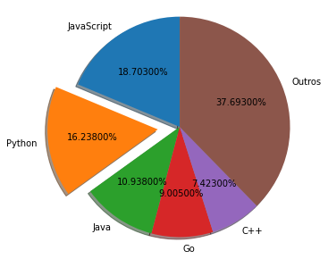
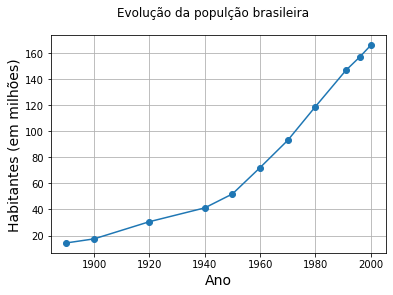
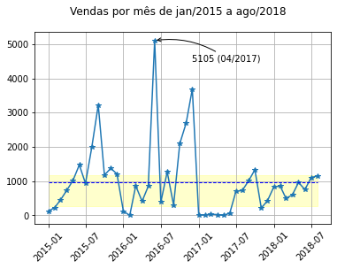

# Lista 4 - Traçado de gráficos

# Questão 1

Entre em https://madnight.github.io/githut/#/pull_requests/2020/1

Trace um gráfico de pizza (pie chart) mostrando o percentual de uso das cinco linguagens mais populares no github (use o critério pull requests). Crie uma sexta fatia chamada 'outros'.

```python
# Espaço para trabalhar
import matplotlib.pyplot as plt

linguagens =  ['JavaScript', 'Python', 'Java', 'Go', 'C++', 'Outros']
percentagem = [18.703, 16.238, 10.938, 9.005, 7.423]
percentagem.append(100 - sum(percentagem))

fig, ax = plt.subplots()

explode = (0.0, 0.2, 0.0, 0, 0, 0)  
ax.pie(percentagem, explode=explode, labels=linguagens, autopct='%1.5f%%',
        shadow=True, startangle=90)

ax.axis('equal')  
plt.gcf().set_size_inches(6, 5)
fig.set_facecolor('white')
plt.show()
```
> 


# Questão 2
As listas abaixos indicam a população do Brasil entre 1890 e 2000. Trace um gráfico mostrando a evolução

```python
import matplotlib.pyplot as plt

anos = [1890, 1900, 1920, 1940, 1950, 1960, 1970, 1980, 1991, 1996, 2000]
contagens = [14.333915, 17.438434, 30.635605, 41.236315, 51.944397, 72.191370,
             93.139037, 119.002706, 146.825475, 157.070163, 166.112500]

fig, ax = plt.subplots(1,1)

ax.plot(anos, contagens, 'o-')
fig.suptitle('Evolução da populção brasileira')

# Adiciona rótulo aos eixos
plt.xlabel("Ano", fontsize=14)
plt.ylabel("Habitantes (em milhões)", fontsize=14)

fig.patch.set_facecolor('white')

ax.grid(True)
plt.show()
```
> 


# Questão 3

O primeiro formulário abaixo pede o upload do arquivo vendas.csv, logo em seguida o arquvo é aberto do espaço virtual. A lista gerada traz as vendas de uma indústria entre janeiro de 2015 e agosto de 2018. Explore o arquivo e trace um gráfico mostrando a evolução.

```python
from google.colab import files
upfiles = files.upload()
```
> Saving vendas.csv to vendas.csv

```python
import csv
with open('vendas.csv') as csvfile:
    conteudo = csv.reader(csvfile, delimiter=',', quotechar="'")
    vendas_ano_mes = [*conteudo] # [i for i in conteudo]
print(vendas_ano_mes)
```
> [['121', '2015', '1'], ['227', '2015', '2'], ['446', '2015', '3'], ['731', '2015', '4'], ['1017', '2015', '5'], ['1473', '2015', '6'], ['933', '2015', '7'], ['2004', '2015', '8'], ['3224', '2015', '9'], ['1176', '2015', '10'], ['1375', '2015', '11'], ['1206', '2015', '12'], ['123', '2016', '1'], ['0', '2016', '2'], ['863', '2016', '3'], ['412', '2016', '4'], ['851', '2016', '5'], ['5105', '2016', '6'], ['387', '2016', '7'], ['1270', '2016', '8'], ['298', '2016', '9'], ['2092', '2016', '10'], ['2693', '2016', '11'], ['3688', '2016', '12'], ['8', '2017', '1'], ['12', '2017', '2'], ['34', '2017', '3'], ['23', '2017', '4'], ['0', '2017', '5'], ['66', '2017', '6'], ['703', '2017', '7'], ['729', '2017', '8'], ['1013', '2017', '9'], ['1333', '2017', '10'], ['215', '2017', '11'], ['425', '2017', '12'], ['833', '2018', '1'], ['854', '2018', '2'], ['498', '2018', '3'], ['598', '2018', '4'], ['961', '2018', '5'], ['754', '2018', '6'], ['1098', '2018', '7'], ['1158', '2018', '8']]

```python
import matplotlib.pyplot as plt
import datetime
import numpy as np

vendas = [int(i[0]) for i in vendas_ano_mes]
anos = [int(i[1]) for i in vendas_ano_mes]
meses = [int(i[2]) for i in vendas_ano_mes]
datas = [datetime.date(ano, mes, 1) for ano, mes in zip(anos, meses)]

media_de_vendas = np.mean(vendas)
Q1 = np.percentile(vendas, 25)
Q3 = np.percentile(vendas, 75)

fig, ax = plt.subplots(1,1)

ax.plot(datas, vendas, '*-') # traça gráfico

#
ax.annotate("5105 (04/2017)", (datas[17], vendas[17]), xytext=(datas[23], 4500), arrowprops={'arrowstyle':'->', 'connectionstyle':'arc3,rad=.2'})
# Marca média e regian interquartil  
ax.plot([datas[0], datas[-1]], [media_de_vendas, media_de_vendas], '--', color='blue', linewidth=1 )
ax.fill_between([datas[0], datas[-1]], [Q1, Q1], [Q3, Q3], alpha=0.2, color='yellow')

ax.grid(True) # Grade
fig.suptitle('Vendas por mês de jan/2015 a ago/2018') # Título
plt.xticks(rotation=45) # Gira em 45 graus os ticks

fig.patch.set_facecolor('white') # Fundo branco

plt.show()
```
> 
