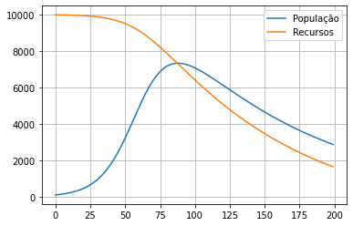

# Questão de modelos discretos
Considere o modelos de crescimento sigmóide. Insira o fenômeno de consumo de recursos do meio considerando que o parâmetro $R$ não é mais constante, mas uma variável que descresce no tempo conforma o tamanho da populção $N_k$:
$$
\begin{align}
N_{k+1}&=N_{k} + cN_k(R_k-N_k) \\[0.2cm]
R_{k+1}&=R_{k} -a N_k
\end{align}
$$
onde $a$ é a constante que relaciona o consumo de recursos com o tamanho da população. Realize a simulação para os dados abaixo e trace os resultados.


```python
import numpy as np
import matplotlib.pyplot as plt

dias_a_simular = 200
tamanho_inicial_da_populacao = 100
tamanho_inicial_dos_recursos = 10_000
constante = 0.08/(tamanho_inicial_dos_recursos - tamanho_inicial_da_populacao)  # 8% ao dia no primeiro dia
a = 0.01

N = np.zeros(dias_a_simular)
R = np.zeros(dias_a_simular)

N[0] = tamanho_inicial_da_populacao
R[0] = tamanho_inicial_dos_recursos

constante = 0.08/(R[0] - N[0])  # 8% ao dia no primeiro dia
a = 0.01

for k in range(dias_a_simular-1):
    N[k+1] =  N[k] * (1 + constante*(R[k] - N[k]))  
    R[k+1] = R[k] - a*N[k]


fig, ax = plt.subplots(1, 1)

ax.plot(N[:k+2])
ax.plot(R[:k+2])

ax.legend(['População', 'Recursos'])


ax.grid(True)
# ax.set_yscale('log') # Escala log?
fig.patch.set_facecolor('white')

plt.show()
```
> 
