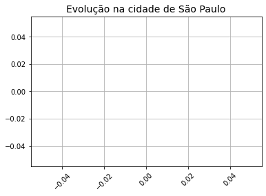
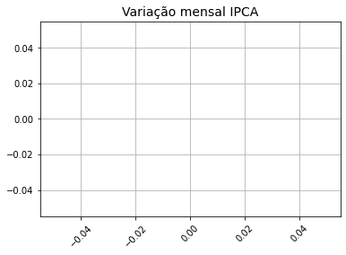

# Questão 1

* Considere a string x dada. Veja sua representação em utf-8 e latin-1. Compare o comprimento em bytes.
* Agora verifique o que acontece com a string y dada.

```python
# Espaço para trabalhar
x = 'Subiu a construção como se fosse máquina.'
y = 'ἀγορά'

x.encode('latin-1')
print(len(x.encode('latin-1')), len(x.encode()))
```
> 41 44


# Questão 2

* Considere a b-string x=b'computa\xe7\xe3o' que codifica a string 'computação' em latin-1. Encontre a b-string correspondente em utf-8.

```python
x = b'computa\xe7\xe3o'
x.decode('latin-1').encode('utf-8')
```
> b'computa\xc3\xa7\xc3\xa3o'


# Questão *3*

Considere o texto na url dada para um arquivo de texto codificado com iso-8859-1 (ansi ou latin-1).

* Baixe o arquivo.
* Converta a b-string obtida para string.
* Salve a string em dois arquivos, o primeiro na codifição original e o segundo em utf-8. Você pode usar o parâmetro encoding ao abrir o arquivo e salvar a string.
* Baixe os arquivos para o seu computador pessoal e analise.
* Agora faça o mesmo, abrindo os arquivos em modo binário e salvando b-strings.
* Baixe os arquivos para o seu computador pessoal e analise.

```python
import urllib
from google.colab import files
url = 'https://raw.githubusercontent.com/fazedo/testes/master/machado.txt'

with urllib.request.urlopen(url) as f:
    conteudo = f.read()  # Abre um b-string

conteudo_string = conteudo.decode('latin-1')

with open('machado_ansi.txt', 'w', encoding='latin-1') as f:
    f.write(conteudo_string)

with open('machado_utf8.txt', 'w') as f:
    f.write(conteudo_string)

files.download('machado_utf8.txt')
files.download('machado_ansi.txt')
```
> [machado_utf8.txt](Arquivos/machado_utf8.txt)  
> [machado_ansi.txt](Arquivos/machado_ansi.txt)

```python
# Em binário
with open('machado_ansi_2.txt', 'wb') as f:
    f.write(conteudo)

with open('machado_utf8_2.txt', 'wb') as f:
    f.write(conteudo.decode('latin-1').encode('utf-8'))

files.download('machado_utf8_2.txt')
files.download('machado_ansi_2.txt')
```
> [machado_utf8_2.txt](Arquivos/machado_utf8_2.txt)  
> [machado_ansi_2.txt](Arquivos/machado_ansi_2.txt)


# Questão 4

1. Veja a seguinte página da Secretaria de Saúde do Estado de São Paulo:
https://www.seade.gov.br/coronavirus/

2. Veja o repositório de dados no GitHub: https://github.com/seade-R/dados-covid-sp

3. Observe o seguinte arquivo csv: https://raw.githubusercontent.com/seade-R/dados-covid-sp/master/data/dados_covid_sp.csv

4. Recupere o conteúdo da url usando a urllib e decofique os caracteres. Como não há caracteres especiais, pode-se usar utf-8 ou latin-1. Mas é necessário converter b-string para string.

5. Use a função StreamIO da biblioteca io para produzir um objeto compatível com a função csv.reader

6. Crie a lista cabeçalho e a tabela com o conteúdo.

7. Conte quantos municípios diferentes estão listados.

8. Crie uma função chamada gera_dados(codigo) que recebe o codigo_ibge de um município e retorna duas listas. A primeira com as datas e a segundo com caso:
```python
def gera_dados(codigo_ibge):
    datas = []
    casos = []
    for linha in dados:
        if linha[5] == codigo_ibge:
            casos.append(...)
            datas.append(datetime.datetime(ano, mes, dia))
    return datas, casos
```
Esta função será chamada assim:
```python
datas, casos = gera_dados('3550308')
```
* Lembre que ano, mes e dia devem ser inteiros. Use a função int para converter string para inteiro.
* Lembre de converter o número de casos para inteiro

9. Trace um gráfico evolutivo

```python
import urllib
import csv
import io

url = 'https://raw.githubusercontent.com/seade-R/dados-covid-sp/master/data/dados_covid_sp.csv'

with urllib.request.urlopen(url) as f:
    conteudo = f.read().decode('latin-1') # Abre o arquivo como texto

arquivo = io.StringIO(conteudo)
iterador = csv.reader(arquivo, delimiter=';')
cabecalho = next(iterador)
dados  = [*iterador]
print(cabecalho)
```
> ['nome_munic', 'codigo_ibge', 'dia', 'mes', 'datahora', 'casos', 'casos_novos', 'casos_pc', 'casos_mm7d', 'obitos', 'obitos_novos', 'obitos_pc', 'obitos_mm7d', 'letalidade', 'nome_ra', 'cod_ra', 'nome_drs', 'cod_drs', 'pop', 'pop_60', 'area', 'map_leg', 'map_leg_s', 'latitude', 'longitude', 'semana_epidem']

```python
# Contando municípios diferentes.
municipios = {linha[5] for linha in dados}
print(len(municipios))
```
> 1042

```python
print(municipios)
```
> {'  151', ' 1889', ' 2925', ... , ' 2414', '13098', '  678'}

```python
for linha in dados:
    if linha[0] == 'sao paulo':
        print(linha)
```

```python
import datetime

def gera_dados(codigo_ibge):
    datas = []
    casos = []
    for linha in dados:
        if linha[5] == codigo_ibge:
            casos.append(int(linha[1]))
            datas.append(datetime.datetime(2020, int(linha[4]), int(linha[3])))
    return datas, casos
```

```python
import matplotlib.pyplot as plt

datas, casos = gera_dados('3550308')
fig, ax = plt.subplots()

ax.grid(True)
plt.xticks(rotation=45)
ax.plot(datas, casos, 'o-')

ax.set_title("Evolução na cidade de São Paulo", fontsize=14)
fig.patch.set_facecolor('white')
plt.show()
```
> 


# Questão 5

1. Entre na seguinte página do IBGE: https://www.ibge.gov.br/estatisticas/economicas/precos-e-custos/9256-indice-nacional-de-precos-ao-consumidor-amplo.html?=&t=series-historicas

2. Entenda do que se trata.

3. Escolha a opção exportar e faça o download dos dados em formato JSON.

4. Abra o arquivo em um editor de texto e explore a estrutura.

5. Suba o arquivo para o seu espaço no Google Colab.

6. Se o conteudo foi importado como dados, teste com o seguinte código:
```python
info = dados['valuesMap']['Brasil']```
for data, valor in serie.items():
    print(data, float(valor.replace(',', '.')))
```

7. Observe como as datas estão escritas e escreva uma função para converter as strings para datetime.

8. Trace o gráfico.

```python
from google.colab import files

arquivos = files.upload() # produz um dicionário com o nome do arquivo e seu conteúdo
lista_de_arquivos = list(arquivos)

print(lista_de_arquivos)
```

```python
import json

dados = json.loads(arquivos[lista_de_arquivos[-1]])
print(dados.keys())
print(dados)
```

```python
serie = dados['valuesMap']['Brasil']
print(serie)
```

```python
for data, valor in serie.items():
    print(data,  float(valor.replace(',', '.')))
```

```python
import datetime

def converte_data(data):
    ano = int(data[-4:])
    mes = data[:-5]
    dicionario = {'janeiro':1, 'fevereiro':2, 'março':3, 'abril':4, 'maio':5, 'junho':6,
     'julho':7, 'agosto':8, 'setembro':9, 'outubro':10, 'novembro':11,
     'dezembro':12}
    return datetime.datetime(ano, dicionario[mes], 1)

print(converte_data('julho 2020'))
```
> 2020-07-01 00:00:00

```python
datas = []
valores = []

for data, valor in serie.items():
    datas.append(converte_data(data))
    valores.append(float(valor.replace(',', '.')))
```

```python
import matplotlib.pyplot as plt

fig, ax = plt.subplots()

ax.grid(True)
plt.xticks(rotation=45)
ax.plot(datas, valores, '-')

ax.set_title("Variação mensal IPCA", fontsize=14)
fig.patch.set_facecolor('white')
plt.show()
```
> 
