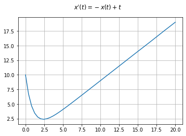
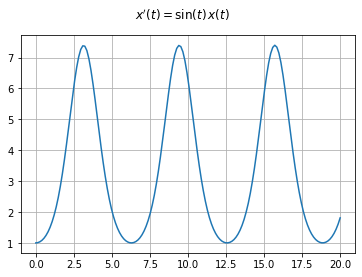
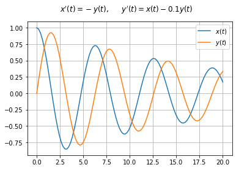
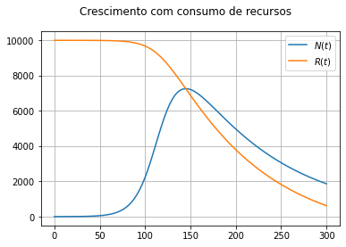
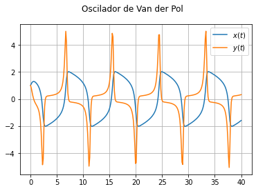

# Questão 1a

Uma grandeza evolui conforme o seguinte modelo:
$$y'(t) = \sin(y(t))$$
com $y(0)=1$.

Calcule o valor de $y(1)$ e de $y(10)$

```python
#@title Solução, para visulziar,clique com o botão direito, form, show code

from scipy.integrate import solve_ivp
import numpy as np

def funcao(t, y):
    return np.sin(y)

solucao = solve_ivp(funcao, [0, 10], [1], dense_output=True)
# [0, 10] = tempo inicial e final. # [1] = condição inicial.

# Para recuperar o valor no instante t, use solucao.sol(t)
print('y(1) = {}'.format(solucao.sol(1)[0]))
print('y(10) = {}'.format(solucao.sol(10)[0]))
```
> y(1) = 1.9562221906691104  
> y(10) = 3.141199788435012

```python
solucao.sol(10)
```


# Questão 1b

* Trace o gráfico da solução do problema anterior para t entre 0 e 10.

```python
# Espaço para solução.
```

```python
#@title Solução
import matplotlib.pyplot as plt

fig, ax = plt.subplots()

t = np.linspace(solucao.t[0], solucao.t[-1], 50)
y = solucao.sol(t)[0]
ax.plot(t, y)
ax.grid(True)
fig.patch.set_facecolor('white')
fig.suptitle("$y'(t) = \sin(y(t))$")
plt.show()
```
> 

```python
t = np.linspace(solucao.t[0], solucao.t[-1], 50)
solucao.t
```
> array([ 0.        ,  0.10353304,  1.13886349,  2.55480483,  3.97074618,  
>         5.36541889,  7.18113605,  9.50979783, 10.        ])


# Questão 2a

* Considere o problema de valor inicial dado por:
$$
x'(t) = -t*x(t)
$$
com $x(0)=10$.

* Calcule o valor de $x(1)$ e $x(2)$.

```python
def funcao(t, x):
    return -t*x

solucao = solve_ivp(funcao, [0, 2], [10], dense_output=True)
# [0, 2] = tempo inicial e final. # [10] = condição inicial.

# Para recuperar o valor no instante t, use solucao.sol(t)
print('x(1) = {}'.format(solucao.sol(1)[0]))
print('x(2) = {}'.format(solucao.sol(2)[0]))
```
> x(1) = 6.065268889981434  
> x(2) = 1.3548113886903383


# Questão 2b

* Trace o gráfico da solução do problema anterior para t entre 0 e 2.

```python
fig, ax = plt.subplots()

t = np.linspace(solucao.t[0], solucao.t[-1], 50)
y = solucao.sol(t)[0]
ax.plot(t, y)
ax.grid(True)
fig.patch.set_facecolor('white')
fig.suptitle("$x'(t) = -t~\!x(t)$")
plt.show()
```
> 


# Questão 3a

* Considere o problema de valor inicial dado por:
$$
x'(t) = -x(t) + t
$$
com $x(0)=10$.

* Calcule o valor de $x(1)$ e $x(2)$.

```python
def funcao(t, x):
    return -x + t

solucao = solve_ivp(funcao, [0, 20], [10], dense_output=True)
# [0, 2] = tempo inicial e final. # [10] = condição inicial.

# Para recuperar o valor no instante t, use solucao.sol(t)
print('y(1) = {}'.format(solucao.sol(1)[0]))
print('y(10) = {}'.format(solucao.sol(2)[0]))
```
> y(1) = 4.049253276619779  
> y(10) = 2.4900595507403107


# Questão 3b

* Trace o gráfico da solução do problema anterior para t entre 0 e 2.

```python
fig, ax = plt.subplots()

t = np.linspace(solucao.t[0], solucao.t[-1], 50)
y = solucao.sol(t)[0]
ax.plot(t, y)
ax.grid(True)
fig.patch.set_facecolor('white')
fig.suptitle("$x'(t) = -x(t)+t$")
plt.show()
```
> 


# Questão 4

* Considere o seguinte modelo:
$$x'(t) = \sin(t) ~\!x(t) $$
com $x(0)=1$.
* Trace o gráfico de $x(t)$ para t entre 0 e 20.

* Use t = np.linspace(solucao.t[0], solucao.t[-1], 150) para traçar 150 pontos.

```python
def funcao(t, x):
    return np.sin(t)*x

solucao = solve_ivp(funcao, [0, 20], [1], dense_output=True)
# [0, 20] = tempo inicial e final. # [1] = condição inicial.

fig, ax = plt.subplots()

t = np.linspace(solucao.t[0], solucao.t[-1], 150)
x = solucao.sol(t)[0]
ax.plot(t, x)

ax.grid(True)
fig.patch.set_facecolor('white')
fig.suptitle("$x'(t)= \sin(t)~\!x(t)$")
plt.show()
```
> 


# Questão 5

Considere um modelo para o oscilador linear amortecido dado por:
$$ \begin{eqnarray*}
x'(t)&=& -y(t)\\
y'(t)&=& x(t) - 0.1 y(t)
\end{eqnarray*}
$$

* Use $x(0)=1$ e $y(0)=0$.

* Trace o gráfico de $x(t)$ e $y(t)$ para t entre 0 e 20.

Obs. Use pelo menos 100 pontos para traçar no gráfico.

```python
def funcao(t, V):
    x, y = V
    return -y, x - 0.1*y

solucao = solve_ivp(funcao, [0, 20], [1, 0], dense_output=True)
# [0, 20] = tempo inicial e final. # [1, 0] = condição inicial.

fig, ax = plt.subplots()

t = np.linspace(solucao.t[0], solucao.t[-1], 100)
x = solucao.sol(t)[0]
y = solucao.sol(t)[1]
ax.plot(t, x)
ax.plot(t, y)

ax.grid(True)
ax.legend(['$x(t)$', '$y(t)$'])
fig.patch.set_facecolor('white')
fig.suptitle("$x'(t)= -y(t), ~~~~~y'(t)= x(t) - 0.1 y(t)$")
plt.show()
```
> 


#Questão 6

* Considere o modelo de crescimento sigmóide. Insira o fenômeno de consumo de recursos do meio considerando que o parâmetro $R$ não é mais constante, mas uma variável que descresce no tempo conforme o tamanho da populção $N(t)$:
$$
\begin{align}
N'(t)&= cN(t)(R(t)-N(t)) \\[0.2cm]
R'(t)&= -a N(t)
\end{align}
$$
onde é a constante que relaciona o consumo de recursos com o tamanho da população.

* Realize a simulação para os dados abaixo:
$$a=0.01, ~~~c = 0.000008,~~~ N(0)=1~~~\text{e}~~~ R(0)=10000$$

* Trace o gráfico com os resultados para t entre 0 e 200 dias.

```python
#@title Solução
def funcao(t, NR):
    N, R = NR
    return 8e-6*N*(R-N), -0.01*N # if R>0 else 0

solucao = solve_ivp(funcao, [0, 300], [1, 10_000], dense_output=True)

fig, ax = plt.subplots()

t = np.linspace(solucao.t[0], solucao.t[-1], 100)
N = solucao.sol(t)[0]
R = solucao.sol(t)[1]
ax.plot(t, N)
ax.plot(t, R)

ax.grid(True)
ax.legend(['$N(t)$', '$R(t)$'])
fig.patch.set_facecolor('white')
fig.suptitle("Crescimento com consumo de recursos")
plt.show()
```
> 


# Questão 7

* Considere as equações para o oscilador de Van der Pol:
$$\begin{eqnarray*}
x'(t) &=& y(t),\\
y'(t) &=& \mu(1-x(t)^2) y(t)-x(t).
\end{eqnarray*}$$

* Trace soluções para este problema com t entre 0 e 100.
$$ \mu=3, ~~~ x(0)=1 ~~~\text{e}~~~  y(0)=1.$$

* Dica: Use muitos pontos no traçado do gráfico.

```python
def funcao(t, xy):
    x, y = xy
    return y, 3*(1-x**2)*y - x

solucao = solve_ivp(funcao, [0, 40], [1, 1], dense_output=True)

fig, ax = plt.subplots()

t = np.linspace(solucao.t[0], solucao.t[-1], 300)
N = solucao.sol(t)[0]
R = solucao.sol(t)[1]
ax.plot(t, N)
ax.plot(t, R)

ax.grid(True)
ax.legend(['$x(t)$', '$y(t)$'])
fig.patch.set_facecolor('white')
fig.suptitle("Oscilador de Van der Pol")
plt.show()
```
> 
