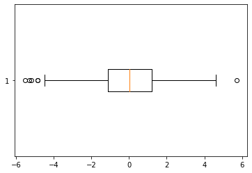
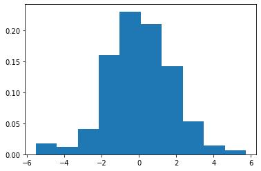
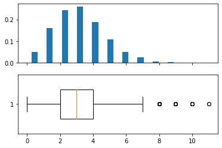
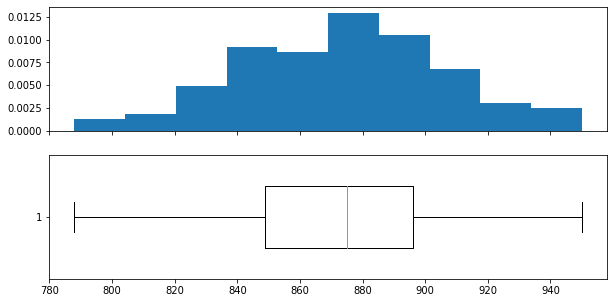

# Lista - Estatística descritiva e simulações

```python
# Bibliotecas
import numpy as np
import matplotlib.pyplot as plt

alea = np.random.default_rng(101) # Cria previsibilidade
```


# Questão 1

Calcule o sumário estatístico com média, desvio padrão e quartis dos seguintes dados:

```python
dados = np.random.logistic(size=300)
```

```python
#@title Resposta
Q = np.percentile(dados, [0, 25, 50, 75, 100])

for j in range(5):
    print(f'Q{j} = {Q[j]:>11.3f}')

print(f'Média = {np.mean(dados):>8.3f}')
print(f'Desvpad = {np.std(dados):>5.3f}')
```
> Q0 =      -5.541  
> Q1 =      -1.129  
> Q2 =       0.009  
> Q3 =       1.193  
> Q4 =       5.726  
> Média =    0.009  
> Desvpad = 1.776


# Questão 2

Obtenha os outliers dos dados da questão anterior.
```python
#@title Solução

IIQ = Q[3] - Q[1] ## Intervalo interquartil

for x in dados:
    if x < Q[2] - IIQ * 1.5:
        print(x)

    if x > Q[3] + IIQ * 1.5:
        print(x)
```
> -5.191281531672104  
> -4.486301529636007  
> -4.240307692283561  
> -5.541237612542813  
> -5.307803518331228  
> -3.6065154071902317  
> 5.726499943854691  
> -3.746926837606356  
> -4.869075895652838  
> -4.853987504434794


# Questão 3

Trace o boxplot
```python
#@title Solução

fig, ax = plt.subplots()

ax.boxplot(dados, vert=False)
fig.patch.set_facecolor('white')
plt.show()
```
> 


# Questão 4

Trace o histograma
```python
#@title Solução
fig, ax = plt.subplots()

ax.hist(dados, density=True)

fig.patch.set_facecolor('white')
plt.show()
```
> 


# Questão 5
Um baralho é formado por 52 cartas (13 cartas de cada naipe.). Construa uma lista com as 52 cartas, representadas por strings de dois caracteres.  
- O primeiro caractere pode ser A, 2, 3, 4, 5, 6, 7, 8, 9, 10, J, Q ou K.  
- O segundo é um caracter de '♠♥♦♣'. Exemplos: '5♠', '2♥', 'J♦' 'A♣'
- Embaralhe.
- Conte quantas vezes, uma carta é seguida de outra de mesmo número.

Exemplo: '2♠', '2♥' ou  'J♦', 'J♣'.

Observação:
- Uma sequência '5♠', '5♥', 5♣' conta como 2.
- Uma sequência '5♠', '5♥', '5♦' '5♣' conta como 3.

Observação: Seria mais eficar lidar com cartas numeradas de 0 a 51, mas é mais divertido assim.

```python
#Solução
import itertools as it

baralho = [x + y for x, y in it.product([*'A23456789JQK'] + ['10'], [*'♠♥♦♣'])]
alea.shuffle(baralho)


# print(baralho)
contador = 0

for i in range(52-1):
    if baralho[i][0]==baralho[i+1][0]:
        contador += 1

print(contador)
```
> 3

```python
[x + y for x, y in it.product([*'A23456789JQK'] + ['10'], [*'♠♥♦♣'])]
```
> ['A♠',  
>  'A♥',  
>  'A♦',  
> ...  
> '10♥',  
> '10♦',  
> '10♣']


# Questão 6
Refaça o problema anterior observando que não é necessário carregar a informação sobre o naipe e que as cartas podem ser identificadas por inteiros.
```python
#@title Solução

baralho = np.array([*range(0,13)] * 4)
alea.shuffle(baralho)

contador = 0
for i in range(52-1):
    if baralho[i]==baralho[i+1]:
        contador += 1 # contador = contador + 1

print(contador)
```
> 5

```python
baralho
```
> array([ 3,  7, 11, 12,  2,  7,  9,  4,  9, 11, 11,  1, 11,  8, 10, 10,  5,  
>         0,  0,  3,  9,  4,  2,  8,  6, 12,  9, 12,  5,  6,  5,  7,  7,  2,  
>         6,  3,  1,  8,  0,  5, 12,  2,  4,  4,  1,  6,  0,  3, 10,  1, 10,  
>         8])


# Questão 6
Considere o número de vezes que uma carta é seguida de outra de mesmo número em um baralho recém misturado.  
Esta pode ser vista como uma variável aleatória.

Faça uma simulação com várias amostras do baralho e crie o array de inteiros valores com os valores obtidos.  
Calcule sua média e desvio padrão.
```python
#Resposta
numero_de_simulacoes = 10000
valores = np.zeros(numero_de_simulacoes)

baralho = np.array([*range(0,13)]*4, dtype=int)

for k in range(numero_de_simulacoes):
    alea.shuffle(baralho)
    for i in range(52-1):
        if baralho[i]==baralho[i+1]:
            valores[k] += 1
  #  print(valores)

print(np.mean(valores), np.std(valores, ddof=1))
print(min(valores), np.max(valores))
```
> 2.9869 1.675413110522026  
> 0.0 11.0


# Questão 7

O código abaixo traça histograma e boxplot da variável valores. Interprete.

```python
fig, (ax1, ax2) = plt.subplots(2, 1, sharex=True)

ax1.hist(valores, density=True, bins = int(max(valores)-min(valores)+1), rwidth=.4)
ax2.boxplot(valores, vert=False, widths=.5)
fig.set_facecolor('white')
plt.show()
```
> 


# Questão 8

Carlos e Daniel estão colecionando os cromos do álbum da Ladybug. Os pais dos gêmeos deram um álbum para cada um. A estratégia adotada é a de comprar figurinhas até que falte apenas 80 lacunas na soma dos dois álbuns.

Os meninos sempre cedem suas repetidas para o irmão, mesmo que esse não tenha figurinhas para retribuir. Cada álbum tem 300 posições. As figurinhas são comercializadas com a mesma frequência.

Simule a situação, vendo como variável aleatória o número de figurinhas que deverão ser adquiridas até que o objetivo seja atingido.

Obtenha média e desvio padrão, trace histograma e boxplot.

```python
#Solução

# Vamos criar um array com um inteiro para cada um dos 300 (ou tamanho)
# possíveis cromos.
# Uma figurinha é repetida quando já há pelo menos 2 (ou n_albuns), senão
# é nova.

def preenche_album(tamanho=300, n_albuns=2, meta=520):  # Teste o comando help
    """Entradas:
            tamanho:  Número de cromos diferentes na coleção.
                      Padrão = 300
            n_albuns: Número de álbuns idênticos a preencher.

            meta:     número de cromos diferentes a serem encontrados até
                      parar de comprar.
                      Padrão = 520

        Retorna:
            Número de cromos adquiridos.

        OBS: Supõe variável alea definida."""


    colecao = np.zeros(tamanho, dtype=int)
    # Este array indica quantas figurinhas de cada número já compramos.
    # Quando a figurinha de número k é adquirida, colecao[k] é incrementado.
    n_diferentes = 0
    # Este inteiro indica quantas figurinhas diferentes
    # já foram adquiridas (cada álbum conta).
    # O loop para quando n_diferentes==meta.

    n_compradas = 0
    # Este inteiro indica quantas figurinhas já foram compradas no total.

    while (n_diferentes<meta):
        n_compradas += 1
        cromo = alea.integers(tamanho)

        if colecao[cromo]<n_albuns:  # Nova figurinha, oba!
            n_diferentes += 1

        colecao[cromo] += 1

    return n_compradas
```

```python
#Vamos calcular!

tamanho = 300
n_albuns = 2
meta = (tamanho - 40)*2
numero_de_simulacoes = 100

quantidades_compradas = np.zeros(numero_de_simulacoes)

for i in range(numero_de_simulacoes):
    quantidades_compradas[i] = preenche_album(tamanho, n_albuns, meta)


for limiar, nome in zip([0, 25, 50, 75, 100], ['Min', 'Q1', 'Q2', 'Q3', 'Max']):
    print(f'{nome:<5} = {np.percentile(quantidades_compradas, limiar):g}')

print(f'Média = {np.mean(quantidades_compradas):g}')
print(f'DesvP = {np.std(quantidades_compradas, ddof=1):g}')
print(f'IIQ   = {np.percentile(quantidades_compradas, 75)-np.percentile(quantidades_compradas, 25):g}')
```
> Min   = 788  
> Q1    = 849  
> Q2    = 875  
> Q3    = 896.25  
> Max   = 950  
> Média = 874.12  
> DesvP = 33.2059  
> IIQ   = 47.25

```python
#Gráfico
fig, (ax1, ax2) = plt.subplots(2, 1, sharex=True)

ax1.hist(quantidades_compradas, density=True, bins=int(np.sqrt(len(quantidades_compradas))))
ax2.boxplot(quantidades_compradas, vert=False, widths=.5)
fig.set_facecolor('white')
fig.set_size_inches(10,5)
plt.show()
```
> 
