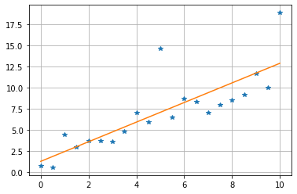
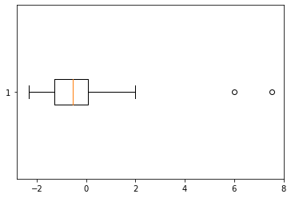
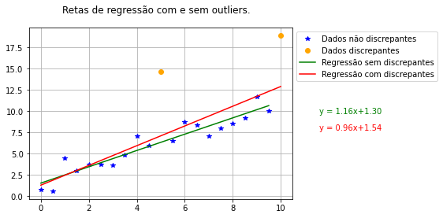

```python
import scipy.stats as st
import numpy as np
import matplotlib.pyplot as plt
```


# Questão 1.

Considere que pesquisadores tenham uma linguagem de programação preferida.  conforme a seguir:
* Python: 40%
* C++: 30%
* Java: 20%
* Outros: 10%

Escolhem-se aleatoreamente 10 pesquisadores para responder sobre sua linguagem preferida. Contam-se quantas vezes cada uma das linguagens é citada.
1. Qual a propabilidade de nenhum pesquisador que prefere Java ser escolhido?
2. Qual a probabilidade de se escolher no máximo 4 pesquisadores que preferem Python?
3. Qual a probabilidade de se escolher mais de 4 pesquisadores que preferem Python?
4. Qual a probabilidade de se escolher mais de 2 pesquisadores que preferem Java?

```python
#Solução do item 1.
p = 20/100  # Java
x = 0
n = 10
P = st.binom.pmf(x, n, p) # Probability mass function
print(f'1. P = {P}')
```
> 1. P = 0.1073741824

```python
#Solução do item 2.
p = 40/100  # Python
x = 4
n = 10
P = st.binom.cdf(x, n, p) # cumulative function
print(f'2. P = {P}')
```
> 2. P = 0.6331032576

```python
#Solução do item 3.

p = 40/100  # Python
x = 4
n = 10
P = st.binom.sf(x, n, p) # cumulative function
print(f'3. P = {P}')
```
> 3. P = 0.36689674240000003

```python
#@title Solução do item 4.

p = 20/100  # Java
x = 2
n = 10
P = st.binom.sf(x, n, p) # cumulative function
print(f'4. P = {P}')
```
> 4. P = 0.3222004736000005


# Questão 2.
O ilusionista Deren Brown pretende produzir um vídeo para o epsódio 'The System'   em que lança 10 vezes em sequência uma moeda e obtém cara 10 vezes. Qual a probabilidade de obter o resultado em até 100 tentativas (99 fracassos + 1 sucesso).  Dica: cada lançamento de 10 moedas é um evento independente.

```python
#Solução da questão 2.
# A probabilidade p de obter 10 caras em dez lançamentos  é 1/2**10 = 1/1024

p = 1/1024 # 1024 = 2**10
x = 99
r = 1
P = st.nbinom.cdf(x, r, p)
print(f'P = {P}')
```
> P = 0.09308265650895883


# Questão 3

Seja X uma variável aleatória normalmente distribuída com média 5 e desvio padrão 1. Calcule:

1. $P(X>4)$
2. $P(X<10)$
3. $P(3<X<6)$
4. $x$ tal que $P(X<x) = 0.05$

```python
#Solução do item 1.
P = st.norm.sf(4, scale=1, loc=5)
print(f'1. P = {P}')
```
> 1. P = 0.8413447460685429

```python
#@title Solução do item 2.

P = st.norm.cdf(10, scale=1, loc=5)
print(f'2. P = {P}')
```
> 2. P = 0.9999997133484281

```python
#Solução do item 3.
# Item 3.
P = st.norm.cdf(6, scale=1, loc=5) - st.norm.cdf(3, scale=1, loc=5)
print(f'3. P = {P}')
```
> 3. P = 0.8185946141203637

```python
#Solução do item 4.

x = st.norm.ppf(0.05, scale=1, loc=5)  
print(f'4. x = {x}')
```
> 4. x = 3.355146373048527


# Questão 4

Uma variável aleatória $T$ tem distribuição t de Student com $\nu=3$ graus de liberdade. Obtenha:
1. O desvio padrão $\sigma(T)$.
2. $P(T>1)$
3. $P(T<2)$
4. $P(-1<T<2)$
5. $t$ tal que $P(T>t)= 0.025$.

```python
#@title Solução do item 1

std = st.t.std(df=3)
print(f'1. Desvio padrão = {std}')
```
> 1. Desvio padrão = 1.7320508075688772

```python
#@title Solução do item 2

P = st.t.sf(1, df=3) # degrees of freedom
print(f'2. P = {P}')
```
> 2. P = 0.19550110947788527

```python
#@title Solução do item 3

# Item 3
P = st.t.cdf(2, df=3)
print(f'3. P = {P}')
```
> 3. P = 0.9303370157205785

```python
#@title Solução do item 4
P = st.t.cdf(2, df=3) - st.t.cdf(-1, df=3)
print(f'4. P = {P}')
```
>  P = 0.7348359062426932

```python
#@title Solução do item 5

x = st.t.isf(0.025, df=3)
print(f'5. x = {x}')
```
> 5. x = 3.1824463052842638


# Questão 5

Uma variável aleatória $F$ tem distribuição F de Snedecor  (scipy.stats.f) com $\nu_1=3$ e $\nu_2=5$. Obtenha:
1. A média $\mu(F)$
2. A variância $\sigma(F)$.
3. $P(F>1)$.
4. $f$ tal que $P(F>f)= 0.025$.

```python
#@title Solução do item 1.
media = st.f.mean(3, 5)
print(f'1. Média = {media}')
```
> 1. Média = 1.6666666666666667

```python
#@title Solução do item 2.

var = st.f.var(3, 5)
print(f'2. Variância = {var}')
```
> 2. Variância = 11.11111111111111

```python
#@title Solução do item 3.

P = st.f.sf(1, 3, 5)
print(f'3. P = {P}')
```
> 3. P = 0.46485478999363516

```python
#@title Solução do item 4.

f = st.f.isf(0.025, 3, 5)
print(f'4. f = {f}')
```
> 4. f = 7.763589482018546


# Questão 6

* Considere os pontos dados e calcule os coeficiente da reta $y = ax+ b$ que melhor aproxima os pontos pelo critério dos mínimos quadrados.

* Trace o gráfico com os pontos dados e a reta de regressão.

```python
# Dados:

x = np.linspace(0, 10, 21)
y = np.array([ 0.77,  0.59,  4.43,  2.95,  3.71,  3.69,  3.64,  4.8 ,  7.04,
        5.92, 14.64,  6.54,  8.72,  8.33,  7.1 ,  7.96,  8.59,  9.18, 11.71,
        10.04, 18.91])
```

```python
#Solução
a, b, r_value, p_value, std_err = st.linregress(x, y)

yest = a*x + b

fig, ax = plt.subplots()
ax.plot(x, y, '*')
ax.plot(x, yest, '-')

ax.grid()
plt.show()
print(f'a = {a}, b = {b}')
```
>   
> a = 1.1619220779220778, b = 1.2980086580086594


# Questão 6b

* Para os dados do problema anterior, calcule o array formado pela diferença entre os dados e o os valores estimados pela reta: $e_j = y_j - (ax_j + b)$.

* Trace o boxplot e verifique a existência de outliers.

* Identifique os outliers e construa arrays filtrados sem eles. Lembre de remover de x e y.

```python
#@title Traça boxplot

e = y - yest

fix, ax = plt.subplots()
ax.boxplot(e, vert=False)
plt.show()
```
>   

```python
#@title Filtra outliers

# Solução

Q1 = np.percentile(e, 25)
Q3 = np.percentile(e, 75)
limiar_de_outlier = Q3 + 1.5*(Q3-Q1)
n_outliers = e <= limiar_de_outlier # Gera um array de booleanos com os outliers
x_filtrado = x[n_outliers]
y_filtrado = y[n_outliers]
```

```python
e <= limiar_de_outlier
```
> array([ True,  True,  True,  True,  True,  True,  True,  True,  True,  
>         True, False,  True,  True,  True,  True,  True,  True,  True,  
>         True,  True, False])


# Questão 6c

* Faça uma nova regressão e encontre a reta $y = a_2x + b_2$ que melhor aproxima os pontos dados sem os outliers.

* Trace um gráfico com os pontos e ambas as retas.

```python
#@Solução

a2, b2, r_value, p_value, std_err = st.linregress(x_filtrado, y_filtrado)
yest2 = a2*x_filtrado + b2

fig, ax = plt.subplots()

ax.plot(x_filtrado, y_filtrado, '*', color='blue')
ax.plot(x[e>limiar_de_outlier], y[e>limiar_de_outlier], 'o', color='orange')

ax.plot(x_filtrado, yest2, '-', color='green')
ax.plot(x, yest, '-', color='red')

ax.legend(['Dados não discrepantes', 'Dados discrepantes',
           'Regressão sem discrepantes', 'Regressão com discrepantes'],
           loc='upper left', bbox_to_anchor=(1, 1))

ax.grid()
fig.suptitle('Retas de regressão com e sem outliers.')
fig.set_facecolor('white')
ax.text(1.1, 0.5, f'y = {a:.2f}x+{b:.2f}', transform=ax.transAxes, color='green')
ax.text(1.1, 0.4, f'y = {a2:.2f}x+{b2:.2f}', transform=ax.transAxes, color='red')
plt.show()

# print(f'a = {a}, b = {b}')
# print(f'a2 = {a2}, b2 = {b2}')
```
> 
