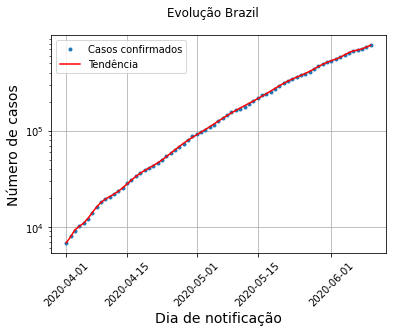

```python
import pandas as pd
import numpy as np
import datetime
import matplotlib.pyplot as plt
```


# Questão 1

* Considere a url dada abaixo usada em problemas anteriores, como no final do notebook sobre gráficos.
* Use a função read_csv para ler a tabela em um DataFrame chamado dados.

```python
# https://github.com/CSSEGISandData/COVID-19/blob/master/csse_covid_19_data/csse_covid_19_time_series/time_series_covid19_confirmed_global.csv
url = 'https://raw.githubusercontent.com/CSSEGISandData/COVID-19/master/csse_covid_19_data/csse_covid_19_time_series/time_series_covid19_confirmed_global.csv'
```

```python
#Solução
# https://github.com/CSSEGISandData/COVID-19/blob/master/csse_covid_19_data/csse_covid_19_time_series/time_series_covid19_confirmed_global.csv
url = 'https://raw.githubusercontent.com/CSSEGISandData/COVID-19/master/csse_covid_19_data/csse_covid_19_time_series/time_series_covid19_confirmed_global.csv'

dados = pd.read_csv(url)
```


# Questão 2
* Considere uma string com o nome do país e uma datetime.datetime inicial:
```python
pais = 'Brazil'
data_inicial = datetime.datetime(2020, 4, 1) # ano/mes/dia
```
* Usas os métodos de DataFrame para extrair os dados do país, somando todas as regiões. Construa a série total_casos cujos índices são as datas.

```python
#Solução

pais = 'Brazil'
data_inicial = datetime.datetime(2020, 4, 1) # ano/mes/dia

# Extrai dados do país escolhido e soma regiões.
total_casos = dados.loc[ dados['Country/Region']==pais ].iloc[:, 4:].sum()
```


# Questão 3
* Converta os índices para DateTime.
* Filtre a série, guardando apenas a partir de data_inicial.

```python
#Solução

# Converte datas de string para datetime
total_casos.index = [datetime.datetime.strptime(str_data, '%m/%d/%y') for str_data in total_casos.index]

# Filtra
total_casos = total_casos[ total_casos.index>=data_inicial ]
```

```python
datetime.datetime.strptime('01/04/20', '%d/%m/%y')
```
> datetime.datetime(2020, 4, 1, 0, 0)


# Questão 4
1. Use a função polyfit do numpy para ajustar um polinômio de grau 1 ao logaritmo natural (```np.log```) do número de casos.

```python
coeff = np.polyfit(x, y, 1, w=y)
```
* O parâmetro w é o peso que deve ser dado a cada ponto. Com isso queremos corrigir o efeito do logaritmo.
* x é um array de números.

2. Use a função polyval do numpy para estimar os valores usando o polinômio ajustado.
```python
yest = np.exp(np.polyval(coeff, x))
```

3. Experimente mudar o grau do polinômio.

```python
#Solução


# Calcula o logaritmo
y = np.log(total_casos)

# Cria um array de números para o ajuste
x = range(len(total_casos))

# Calcula os coeficientes
coeff = np.polyfit(x, y, deg=30, w=y) # deg = grau

# Avalia o polinômio

yest = np.exp(np.polyval(coeff, x))
```
> RankWarning: Polyfit may be poorly conditioned exec(code_obj, self.user_global_ns, self.user_ns)


# Questão 5

* Trace o gráfico, mostrando os dados observados em bolinhas azuis e a curva ajustada em linha vermelha.

```python
#Solução

fig, ax = plt.subplots()

ax.plot(total_casos.index, total_casos, '.')
ax.plot(total_casos.index, yest, 'red')

ax.legend(['Casos confirmados', 'Tendência'])

ax.set_yscale('log')

# Adiciona rótulo aos eixos
plt.xlabel("Dia de notificação", fontsize=14)
plt.ylabel("Número de casos", fontsize=14)

fig.set_facecolor('white')
plt.xticks(rotation=45)
ax.grid(True)
fig.suptitle(f'Evolução {pais}')
plt.show()
```
> 
